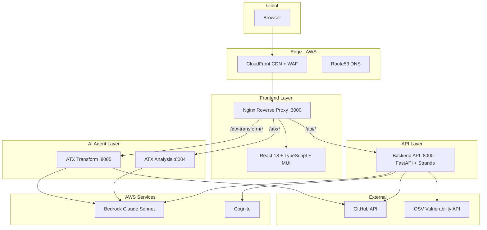
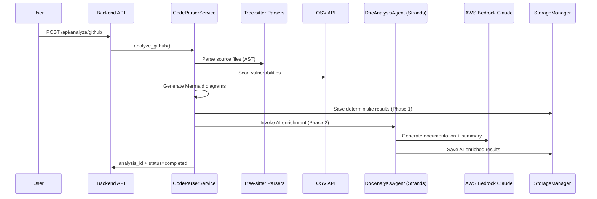

# Design Document

## Overview

Code Transformation Engine (formerly Code Insights Analyser) is a microservices-based platform of four containerized services communicating over Docker bridge networks, fronted by Nginx reverse proxy, and deployed to AWS ECS Fargate and/or AWS Bedrock AgentCore Runtime. Built on Software 3.0 principles, the system treats AI models as the compute engine, context windows as working memory, and prompts as the programming interface.

The architecture follows a hub-and-spoke pattern: the React frontend (served by Nginx) acts as the entry point, routing requests to specialized AI agents. Each agent is an independent FastAPI service with its own Docker container, autonomously executing multi-step tasks using tool-augmented reasoning. The backend orchestrates the agents over REST and SSE; agents reach their tools over MCP in-process. State is on the local filesystem and in process memory — see "State Management Strategy" in `#structure`.

## Architecture



### Network Topology

| Network | Members | Purpose |
|---------|---------|---------|
| `frontend-net` | frontend | Isolated SPA serving |
| `backend-net` | frontend, backend, both ATX agents | Service-to-service HTTP |

All services bind to `127.0.0.1` (no external exposure). Frontend bridges both networks for proxying.

### Service Registry

| Service | Port | Technology | Container Resources |
|---------|------|------------|-------------------|
| frontend | 3000 | React 18, Nginx | 512MB / 0.5 CPU |
| backend | 8000 | FastAPI, Tree-sitter, Strands | 2GB / 2.0 CPU |
| atx-analysis-agent | 8004 | FastAPI, Node.js 22, ATX CLI 3.9+ | 2GB / 2.0 CPU |
| atx-transform-agent | 8005 | FastAPI, Docker, Git | 2GB / 2.0 CPU |

**These four rows are the whole registry, and `docker-compose.yml` declares exactly these four
services.** Every build context that file names is a directory a task creates, so `docker compose up
-d --build` needs no service list.

**Seven rows were removed, on the *producing task withdrawn* ground rather than the *never existed*
one** — the distinction this document draws throughout (see the two "removed, and why" tables under
"Frontend Components"). They were real scope until the roadmap task carrying them was withdrawn from
`tasks.md`. They were retained for one pass after that, because `docker-compose.yml`, the Architecture
diagram, the nginx routing table and the volume-mapping table still resolved their names; those
referrers have since been removed, so the rows go with them.

| Removed row | Why |
|---|---|
| `design-doc-agent` — 8006 | Producing task withdrawn. Its compose service, its `/design-doc/` nginx prefix and its `design-doc-storage` volume are all gone; its interface subsection under "Agent Service Interfaces" is removed below |
| `kiro-cli-agent` — 8007 | Producing task withdrawn. Its compose service and its mount of `shared-repos` are gone; its interface subsection is removed below. The backend's Kiro CLI SSE proxy endpoint (Task 10) survives with no reachable upstream — recorded at Requirement 8 |
| `ant-to-maven-agent` — 8008 | Producing task withdrawn. Its compose service, its `/ant-to-maven/` nginx prefix and its `ant-to-maven-storage` volume are all gone |
| `eks-delivery-kiro` — 7681 | Producing task withdrawn. Its compose service and its `/containers/…` nginx prefix are gone; the page and terminal view that reached it were already removed from "Frontend Components" |
| `eks-delivery-claude` — 7682 | Producing task withdrawn. Same as above |
| `eks-design-kiro` — 7683 | Producing task withdrawn. Same as above |
| `eks-design-claude` — 7684 | Producing task withdrawn. Same as above |

Port 8080 (AgentCore Runtime) is aspirational on separate grounds — see "AgentCore Deployment
Architecture" and `tasks-agentcore.md`, which are outside this build.

## Components and Interfaces

### Frontend Components

**App Shell** (`App.tsx`)
- ThemeProvider with AWS palette (primary: `#232F3E`, secondary: `#FF9900`)
- AuthProvider + AuthGate wrapper handling 3 auth modes
- Navigation sidebar (280px) + main content area
- Nav sections: Main (Dashboard), Code Analyse (Code Analyse, Previous Analyses), AWS Transform (Transforms, ATX Analyse, ATX Transform)
- Conditional page rendering based on `selectedNavItem` state

**API Service** (`services/api.ts`)
- Axios instances with JWT interceptor (auto-attach Bearer token)
- 401 response interceptor (clear token + reload)
- SSE streaming via native Fetch API with AbortController
- Pattern: `streamX(params, onEvent): AbortController`

**Key Pages:**

| Page | Component | Backend Endpoint |
|------|-----------|-----------------|
| Dashboard | `Dashboard.tsx` | `GET /api/analyses` — quick action cards: New Analysis, View Results, ATX Analysis, ATX Transform |
| Code Analysis | `BedrockAnalysisPage.tsx` | `POST /api/analyze/upload`, `POST /api/analyze/github` |
| Analysis Results | `AnalysisResultsDisplay.tsx` | `GET /api/analysis/{id}/*` (8 endpoints) — **not in nav sidebar**, accessed only via "View" from Previous Analyses or after completing a new analysis |
| ATX Analysis | `AtxAnalysisPage.tsx` | `POST /atx/analyze`, `GET /atx/conversations` |
| ATX Transform | `AtxJavaTransformPage.tsx` | `POST /atx-transform/transform` |
| Transform Results | `AtxTransformPage.tsx` | `GET /atx-transform/diff/{id}`, `GET /atx-transform/diff-summary/{id}`, `GET /atx-transform/download/{id}` — **not in nav sidebar**, accessed via ATX Transform page after starting a transformation. The PR endpoint this row previously named (`POST /atx-transform/create-pr/{id}`) never existed under that path — the agent's route is `create-file-pr` — and the page calls no PR endpoint at all |
| Transformation Mgmt | `TransformationManagement.tsx` | `GET/POST/PUT/DELETE /api/transformations/definitions` |
| Previous Analyses | `PreviousAnalysesPage.tsx` | `GET /api/analyses`, `DELETE /api/analysis/{id}` |
| Login | `LoginPage.tsx` | `POST /api/auth/login`, `GET /api/auth/config` |
| Auth callback | `CallbackPage.tsx` | — (consumes the redirect from the hosted login, then hands off to `AuthContext`) |
Every row above is produced by a task in `tasks.md`. That is the standing requirement on this table, not an observation about it — see "Frontend Component Ownership and File Paths" below and Build Constraint 83.

**Three rows were removed from this table because no task produces them and no file for them has ever existed** — verified against the working tree and against every branch in git history. They are recorded here rather than deleted silently, because a plausible-looking row in an authoritative table is worse than an absent one:

| Removed row | Why |
|---|---|
| Transform History — `AtxTransformHistoryPage.tsx`, `GET /atx-transform/repos` | **The dangerous one.** No component, no task, and **no such endpoint on the transform agent** — the agent's real route is `GET /transformation-history`, specified under "ATX Transform Page Specification" and "Transformation Record Persistence". This row sat immediately beside the rows naming the transform agent's genuine endpoints, so `/repos` read as one more of them. A build following it wires a history view to a path no service serves and gets a 404 from a contract that looked specified — the worst shape a spec defect can take. Transformation history is rendered by `AtxJavaTransformPage.tsx`'s sidebar, not by a separate page |
| Ant-to-Maven — `AntToMavenPage.tsx`, `POST /ant-to-maven/convert` | No component and no task. The `ant-to-maven-agent` service that would host the endpoint is produced by no task either |
| Unit Tests — `UnitTestGenerator.tsx`, `POST /api/analysis/{id}/tests` | No component, no task, and no backend route. Unit-test generation is not a capability this build has |

**Seven further rows were removed for a different reason, and the distinction matters**: these components were real scope with a real producing task, and that task — the roadmap task carrying the whole optional page set — has since been **removed from `tasks.md`**. The component never existing and its producing task being withdrawn are different facts, and this table says which applies to each row. Build Constraint 83 makes the removal mandatory rather than tidy: a row naming a component no task produces is a contract with nothing behind it, and a rebuild reading the table implements it.

| Removed row | Why |
|---|---|
| Migration Design — `MigrationDesign.tsx`, `POST/GET /design-doc/api/design-jobs` | Producing task removed. The `design-doc-agent` that would serve the endpoint is also produced by no task |
| Container Agents — `ContainerAgentPortfolio.tsx` | Producing task removed. It was a navigation hub for the four EKS agents, which no task produces either |
| EKS Agents — `EksDeliveryAgentsPage.tsx`, WebSocket to ttyd (7681–7684) | Producing task removed. The four ttyd containers it connects to are produced by no task |
| IaC Generator — `IaCGeneratorPage.tsx` | Producing task removed. Its backend contract was never specified: `POST /api/iac/generate` was named here with no task behind it and does not exist |
| Logs — `LogsPage.tsx` | Producing task removed. It was a frontend-only log viewer reading `services/logStore.ts`, which Task 16 still creates |
| Prompts — `PromptsPage.tsx` | Producing task removed. Its backend contract was never specified either: `GET/PUT /prompts/{id}` plus versions and rollback were named here with no task behind them and no route exists. `backend/data/prompt_library.json` is still written by Task 2 and read by nothing |
| Help — `HelpRunbook.tsx` | Producing task removed. Static documentation, no endpoint |

Two component rows were removed from "Shared UI Components" below on the same second ground, and four on the first.

**Shared UI Components:**

| Component | Purpose |
|-----------|---------|
| `Navigation.tsx` | Left sidebar (280px), 3 sections: Main (Dashboard), Code Analyse (Code Analyse, Previous Analyses), AWS Transform (Transforms, ATX Analyse, ATX Transform) |
| `ProgressTracker.tsx` | Polls status, linear progress bar |
| `LoadingOverlay.tsx` | Spinner overlay for async operations |
| `ErrorBoundary.tsx` | Global error catching with fallback UI |
| `FileUpload.tsx` | Drag-and-drop ZIP upload (react-dropzone) |
| `GitHubInput.tsx` | URL + branch + PAT token input |
| `FileStatsChart.tsx` | Recharts pie/bar for language breakdown |
| `FolderTree.tsx` | MUI TreeView for directory structure |
| `DependencyGraph.tsx` | D3.js force-directed graph |
| `DependencyViewer.tsx` | Dependency list with CVE indicators |
| `DiagramViewer.tsx` | Mermaid diagram renderer |
| `DocumentationViewer.tsx` | SSE streaming markdown display |
| `LlmJudgePanel.tsx` | 5-dimension score cards + feedback |
| `EnhancedFileComparison.tsx` | Diff with line numbers + syntax, navigated by a vertical file listbox grouped by category (see "File Navigation for a Changed-File Collection") |
| `AtxDocumentationPanel.tsx` | ATX documentation browser — side list beside content; the layout `EnhancedFileComparison`'s file navigation mirrors, and one of the three consumers of the shared markdown link resolver (see "One Module, One Slug Rule") |
| `AgentLogViewer.tsx` | Agent execution log display |
| `AiLogDrawer.tsx` | Sliding drawer for AI operation logs |
| `RecentAnalysisTable.tsx` | Dashboard recent analyses table |

**Six components were removed from this table.** Four on the same terms as the never-existed page rows above — no task produces them, no file for them exists in the working tree, and none has ever existed on any branch in git history. `AtxFileComparison.tsx` in particular was verified absent from every commit — it is not a renamed or relocated file, so there is nothing to reconcile with `EnhancedFileComparison.tsx`, which is the one changed-file diff renderer. The last two were real scope whose producing task has since been removed from `tasks.md`; the "Why" column says which case each row is.

| Removed component | Why, and where the capability actually lives |
|---|---|
| `LLMAnalysisViewer.tsx` — "Per-file AI analysis results" | No task, no file. There is no per-file AI analysis capability: the backend has no `analyze_file` on any agent, so there is no data for this component to render |
| `AtxFileComparison.tsx` — "Side-by-side file diff" | No task, never existed on any branch. `EnhancedFileComparison.tsx` is the only diff renderer, and a second differently-shaped one would be the defect the uniqueness rule below forbids |
| `VersionManager.tsx` — "Version comparison and rollback" | No task, no file. No version comparison or rollback capability is specified anywhere in this build; `services/version_analyzer.py` extracts declared versions for the Upgrades tab and has no rollback surface |
| `VersionSummary.tsx` — "Version metadata display" | No task, no file. Same as above |
| `InteractiveDependencyGraph.tsx` — "@nivo/network enhanced visualization" | **Producing task removed.** Real scope until the roadmap task carrying it was withdrawn from `tasks.md`. `DependencyGraph.tsx` above is the one dependency visualization |
| `TerminalView.tsx` — "xterm.js + WebSocket to ttyd" | **Producing task removed.** The four ttyd containers it would have attached to are produced by no task either, so there is nothing for a terminal to connect to |

**Site Title (brand string):** the product's display name is exactly **`Code Analyse & Transform`**. Both places a user reads it MUST render that one string: the sidebar brand header in `Navigation.tsx` (above the nav sections listed in the table above) and the HTML document title in `frontend/index.html` — and therefore `seeds/frontend/index.html`, which is what Task 1 copies into place. The ampersand is literal: `&` in the JSX text node, `&amp;` in the `<title>`, both rendering as `Code Analyse & Transform`. Neither location may carry a name the other does not; a build that leaves them different, or that invents a title because none was specified, is the defect Build Constraint 79 names. A locator matching on this string is scoped by role, because it shares the prefix `Code Analyse` with a nav section and the suffix `Transform` with two nav items.

### Frontend Component Ownership and File Paths

Component location is part of the contract, not an implementation detail. Two copies of the same component in different directories are indistinguishable at review time, and only one of them is reachable through routing — the other silently becomes dead code along with everything it imports.

**Because these tables are a contract, every row in them must have a task behind it.** A component or endpoint named in the tables above with no task that produces it is not a forward-looking placeholder — it is an instruction a build will try to follow, and the more plausible it looks the more damage it does. A row with no task is removed and recorded in the "removed" tables above, stating whether the component never existed or whether its producing task was withdrawn, so the removal is auditable and the name does not quietly return. When a row's component is scoped by a task but its endpoint is not, the endpoint column says so explicitly rather than naming a route that no service serves.

| Rule | Detail |
|------|--------|
| Page components | Live in `frontend/src/pages/`. One file per routed page. |
| Reusable components | Live in `frontend/src/components/`. Visualizations, shared UI, and anything imported by more than one page. |
| Cross-directory imports | A page importing a component MUST use `../components/<Name>`. A component importing a sibling uses `./<Name>`. |
| Uniqueness | A component file name MUST be unique across the repository. Two files with the same name in `pages/` and `components/` is a defect, not a variant. |

**Analysis results page — exact ownership:**

- The analysis results page component lives at exactly `frontend/src/pages/AnalysisResultsDisplay.tsx`. There MUST be exactly one file with this name in the repository.
- It reads the analysis identifier from the route via `useParams()` (route `/results/:id`) — not from props, not from global state.
- It imports every visualization it renders as `../components/<Name>`: `../components/DependencyGraph`, `../components/DiagramViewer`, `../components/FileStatsChart`, `../components/FolderTree`, `../components/DependencyViewer`. Using `./<Name>` from `pages/` resolves to a nonexistent module or, worse, to a duplicate copy that routing does not use.

A task instruction that names a directory inconsistent with these rules — for example asking for the results page under `components/` — is a spec defect and MUST be corrected against this section rather than followed. Build Constraint 15 (no placeholder text in rendered UI) is the symptom this rule prevents: an unreachable duplicate leaves the placeholder copy wired to the route.

### ATX Transform Page Specification

The `AtxJavaTransformPage.tsx` (route: `/atx-transform`) follows the same pattern as the ATX Analysis page — SSE streaming console with conversation management. Title: "ATX Transform" (not "Java Transformation").

**Layout:**
1. **Header**: "ATX Transform" title + description
2. **New Transformation form**: Repository URL, branch, transformation type dropdown (loaded from `/api/transformations/definitions`), "Start Transform" button
3. **SSE Console**: Terminal-style output box showing streaming ATX CLI output (same component as ATX Analysis)
4. **Conversation list** (left panel or below): Previous transformations with status, clickable to reconnect/view output

**Behavior:**
- "Start Transform" sends `POST /atx-transform/transform` which returns immediately with `{ repo_id, status: "running" }`. The frontend then connects to `GET /atx-transform/conversations/{repo_id}/stream` to receive live SSE output from the ATX CLI process.
- The Transform Agent runs the ATX CLI via `subprocess.Popen` (streaming, not `subprocess.run`) and writes de-noised stdout/stderr to a log file at `{storage_path}/{repo_id}/logs/output.log` with timestamps.
- Clicking a previous transformation reconnects to its stream via `GET /atx-transform/conversations/{repo_id}/stream` — replays stored logs first, then tails live if still running.
- Transformation type dropdown populated from `/atx-transform/transformations` (both custom + AWS managed)
- **The agent supplies the default `-g` configuration, not the frontend.** For definitions known to require `additionalPlanContext` (today only `AWS/java-version-upgrade`), the transform agent fills it in when the request carries none. The frontend MAY send `configuration` and a caller-supplied value always wins; it MUST NOT be the only thing standing between a definition and a usable invocation. See "Transformation Configuration Defaults (`-g additionalPlanContext`)" — the previous placement of this obligation in the frontend was wrong, not merely unimplemented.
- History shows actual transformations run by this agent (not a placeholder table). History is loaded from `GET /atx-transform/transformation-history`.

**API endpoints used:**
- `POST /atx-transform/transform` → starts background transformation (body: `{ repo_url, branch, transformation_type, configuration? }`). Returns immediately with `{ repo_id, status: "running" }`. NOTE: uses `repo_url` not `repository_url`.
- `GET /atx-transform/conversations/{id}/stream` → SSE stream: replays stored (de-noised) log lines as `output` payloads, then tails live, then emits a terminal event. Payload shapes and termination follow "ATX Agent Streaming and Reconnect Contract" — the discriminator is `type` in the `data:` payload, never the SSE `event:` name. Frontend connects here after POST /transform returns.
- `GET /atx-transform/transformation-history` → List executed transformation records (sidebar history)
- `GET /atx-transform/transformations` → List available transformation definitions (used by dropdown on Transformations page)
- `GET /atx-transform/diff/{repo_id}`, `GET /atx-transform/diff-summary/{repo_id}` → Changed files and change counts for the results page
- `GET /atx-transform/download/{repo_id}` → Streamed zip of the whole transformed tree

**Key differences from ATX Analysis:**
- Uses ATX Transform Agent (port 8005) not ATX Analysis Agent (port 8004)
- Transformation type selector instead of analysis type
- Goal is code transformation (produces file diffs), not just documentation

**Results, download and record durability are specified elsewhere.** This subsection describes the console page's layout and streaming behaviour only. The diff payload shape, the summary fields, the download contract, how a finished transformation is *reached* from the history sidebar, and how records survive a restart are defined once in **"Transform Results Surface and Transformation Record Persistence"** and MUST NOT be restated here. Describing the results page's layout without its contracts is what let the page ship unreachable, with a payload the renderer could not consume, and with a record index that emptied on restart.

**Transform Agent Streaming Architecture:**

The payload contract, terminal-event shapes, replay flagging, and tail-loop termination rule are defined once in **"ATX Agent Streaming and Reconnect Contract"** (Payload Discriminator — Platform-Wide, and Stream Termination). This subsection describes only what is specific to the transform agent and MUST NOT restate the contract in different words — an earlier "Same contract as ATX Analysis stream" note was unverifiable as written and the stream diverged from the contract behind it.

1. **Log file persistence**: The ATX CLI runs via `subprocess.Popen` (not `subprocess.run`). stdout and stderr are captured line-by-line, **de-noised at write time** (see Console Content Rules — De-noising applies to both ATX agents), and written to `{storage_path}/{repo_id}/logs/output.log` with ISO timestamps: `[2026-08-03T11:38:55.899505+00:00] line content`. `output.log` therefore holds de-noised lines only, and is the durable record the stream tails.

2. **Process tracking**: A `running_processes` dict maps `repo_id → subprocess.Popen`, used for cancellation and liveness inspection. It is **not** the stream's termination signal — see rule 3.

3. **Stream endpoint** (`GET /conversations/{repo_id}/stream`):
   - If transformation record not found → 404
   - Replays every stored line from `output.log` as `{"type": "output", "data": <stored line>, "replay": true}` — channel `output` because this is CLI stdout, `data` (not `line`) carrying the timestamp prefix verbatim
   - Then tails for new content (poll every 0.5s), emitting the same payload shape **without** the `replay` key
   - Loop condition is the **record's persisted status** (`status == "running"`), not `is_running()`. Keying on process liveness terminates during the pre-launch clone window; see Stream Termination
   - Terminates on `{"type": "complete", "status": <status>}`, or `{"type": "error", "message": <reason>}` when the record's status is `error`/`failed`
   - An already-finished transformation therefore yields stored lines plus the terminal event and closes

4. **Frontend connection flow**:
   - User clicks "Start Transform" → `POST /transform` returns `{ repo_id }`
   - Frontend immediately calls `streamTransformConversation(repo_id)` → connects to SSE
   - User clicks sidebar item → same `streamTransformConversation(repo_id)` call
   - On 404 (old record without logs) → shows "Stream replay not available" gracefully

### Transformation Identifier Resolution and Validation

**Every ATX transformation failed** with an AWS `ValidationException` on the `resource` parameter:

```
ValidationException ... Value at 'resource' failed to satisfy constraint:
Member must satisfy regular expression pattern:
(AWS/)?(?=.{1,64}$)[A-Za-z0-9]+(?:[._-][A-Za-z0-9]+)*$|^arn:aws:transform-custom:[a-z0-9-]{1,20}:\d{12}:package/(AWS/)?(?=.{1,64}$)[A-Za-z0-9]+(?:[._-][A-Za-z0-9]+)*
```

`resource` is the value handed to `atx custom def exec -n`, i.e. `transformation_type` verbatim. The dropdown was bound to `value={t.name}` — the **display label** `Java Version Upgrade` — and its spaces cannot satisfy that pattern. The cause was descriptive, not just a mis-typed binding: the section above described the dropdown as "populated from `/atx-transform/transformations`" and never distinguished a display label from a machine identifier, so there was nothing for the binding to be checked against.

#### The Identifier Field Differs by Source

This is the subtle part, and the reason a blanket `value={t.id}` would have been just as wrong:

| Source | `id` | `name` | CLI identifier is |
|---|---|---|---|
| AWS-managed (`data/aws_managed_transformations.json`) | `AWS/java-version-upgrade` — the CLI identifier | `Java Version Upgrade` — display label | `id` |
| Custom (written by the backend's definition CRUD) | a local `uuid4` the ATX control plane has never heard of | the registered ATX definition name | `name` |

Submitting `id` everywhere would have replaced the `ValidationException` with a "definition not found" failure for every custom definition. And a `uuid4` **satisfies** the resource pattern — hyphen-joined alphanumerics — so pattern validity alone cannot tell the two shapes apart. The record's `type` is what does.

#### Resolution Belongs at the Aggregating Boundary

`GET /atx-transform/transformations` annotates every entry with **`atx_definition_name`**, resolved per source (`resolve_definition_name`): `name` for `type == "custom"`, otherwise `id` falling back to `name`. Resolution happens at the only place that knows where each record came from, so no consumer has to infer which field holds the identifier.

`atx_definition_name` is `null` when the record has no usable identifier — for example a custom definition whose registered name contains spaces, which therefore cannot be executed at all. That is **surfaced as an unselectable option**, never repaired by substituting a value that would fail later.

#### Custom Definition Files Hold a List, Not a Record

The backend's definition CRUD writes one `definitions.json` containing a JSON **array**. Loading did `custom.append(json.loads(f.read_text()))`, appending the whole array as a single element, so `GET /transformations` returned 13 dicts plus one list and the dropdown rendered a single blank row with `undefined` `key` and `value`. Custom transformations were unselectable for that reason alone, independently of the identifier bug.

Loading therefore MUST flatten list-valued files one level, and MUST skip non-object entries and unreadable/invalid files with a warning rather than propagating them into the catalog.

#### Fail Fast on the Identifier

`TransformRequest.transformation_type` validates against the service's `resource` pattern in a Pydantic field validator, so a bad value is an immediate **422 naming the rejected value and both accepted forms**. Previously the caller got a 200 and a `repo_id`, and the failure appeared minutes later as an opaque AWS exception in the tail of `output.log` — no usable signal at the call site. This is a value constraint on an already-declared field; it changes no field names (Property 12 is unaffected).

Both documented alternatives are accepted:
- the short definition name — optional `AWS/` prefix, then alphanumeric segments joined by single `.`, `_` or `-`, at most 64 characters after the prefix;
- the package ARN `arn:aws:transform-custom:<region>:<12-digit-account>:package/<definition-name>`.

Matching uses **`fullmatch`, not `match`**: the service's own alternatives are unevenly anchored, and Python's `$` matches before a final newline, so `match` would admit `"AWS/java-version-upgrade\n"`.

#### The UI Shows the Label and Submits the Identifier

Both halves matter. Each dropdown option renders `t.name` (`Java Version Upgrade`) and carries `atxDefinitionName(t)` as its value, so the request body carries `AWS/java-version-upgrade`. The frontend fallback to `id` applies to AWS-managed records only — for `type == "custom"` a missing `atx_definition_name` yields `null` and a disabled option, because a custom record's `id` is a uuid the CLI does not know.

**The generalizable rule:** a display label and a machine identifier are different fields, and a selector MUST submit the identifier while displaying the label. Where a catalog aggregates multiple sources, *which field holds the identifier can differ per source* — so resolve it once at the aggregating boundary and publish the resolved value, rather than re-deriving it in each consumer.

#### Properties

##### Property 26: Identifier Validation Accepts Exactly the Documented Forms
*For any* string, `transformation_type` is accepted by the request model if and only if it is a valid short definition name (optional `AWS/` prefix, alphanumeric segments joined by single `.`, `_` or `-`, at most 64 characters after the prefix) or a `arn:aws:transform-custom:<region>:<account>:package/<name>` package ARN; anything else — a display label containing spaces, an empty string, a trailing newline — is rejected with a 422 that names the rejected value. This is the regression pin for the `ValidationException`: it MUST fail against a request model that carries no value constraint on the field.

**Validates: Requirements 5, 13**

##### Property 27: Resolution Never Yields a Custom Record's Local Id
*For any* transformation definition record, the resolved `atx_definition_name` is either an identifier satisfying the ATX `resource` pattern or `null`, and *for any* record with `type == "custom"` the resolved value is never that record's `id` — even when the `id` happens to satisfy the pattern, as a `uuid4` does.

**Validates: Requirements 5, 6**

##### Property 28: The Catalog Is Flat, One Entry Per Definition
*For any* set of custom definition files — each holding a single object, a list of objects, a mix of objects and non-objects, or invalid JSON — `GET /transformations` returns a flat list whose every element is an object carrying an `atx_definition_name` key, with exactly one entry per AWS-managed definition plus one per well-formed custom definition, and no nested list or non-object element.

**Validates: Requirements 5, 6**

##### Property 29: An Unusable Identifier Is Unselectable, Not Submitted
*For any* catalog entry whose resolved identifier is absent, the selector renders that entry's display label as a **disabled** option and no submission carries its value; and *for any* selectable entry, the value submitted as `transformation_type` is the resolved identifier while the text shown to the user is the display label.

**Validates: Requirements 5, 13**

#### Example and Integration Tests

Deliberately **not** property-based — each is a single state:

- **Display label is rejected by name (example)**: `POST /transform` with `transformation_type: "Java Version Upgrade"` returns 422 whose message contains the rejected value and both accepted forms — the exact call that previously returned 200 and failed later in `output.log`.
- **Nested list renders no blank row (example)**: a `definitions.json` holding an array produces one dropdown option per definition and zero options with an empty `key` or `value`.
- **Unreadable file is skipped, not fatal (example)**: a malformed `.json` alongside a valid one yields the valid definitions and a warning, not a 500.

### Transformation Configuration Defaults (`-g additionalPlanContext`)

`-n` decides *which* definition runs; `-g` decides whether it can run at all. Every `AWS/java-version-upgrade` run died at CLI startup:

```
Running this transformation in non-interactive mode requires the --configuration (or -g) input
provided with the "additionalPlanContext" section populated.
This is needed to specify the target language version of the transformation.
```

The plumbing was complete and correct — `TransformRequest.configuration` reaches the background task, and `build_atx_command` appends `["-g", configuration]` whenever a value is present. **Nothing ever supplied one.** This document is the reason: the page section above obliged the *frontend* to "provide default `-g` configuration for known transformation types", `AtxJavaTransformPage.tsx` carried zero references to `configuration`, and the acceptance suite's Test 15 scenario 4 asserted the resulting CLI error as **correct behaviour**. The design required a default and the suite pinned its absence green — the contradiction survived precisely because something was passing. Build Constraint 78 records that lesson.

**The default belongs to the agent, not the frontend.** A frontend default leaves every direct `POST /transform` caller broken, including the `curl` invocations in this platform's own acceptance tests, and makes the CLI's most consequential argument a property of one page rather than of the endpoint. The agent is the only place that sees every request.

| Rule | Detail |
|------|--------|
| Precedence | A caller-supplied non-empty `configuration` **always wins**, verbatim. The default applies only in its absence, and is **never** merged with, appended to, or used to patch a caller's value |
| Absence | Where neither a caller value nor a registered default exists, **no `-g` argument is passed** — the CLI's own error is the correct outcome, not something to paper over |
| Matching | On the **resolved definition identifier**, by **exact equality**, never by substring or prefix: `AWS/java-version-upgrade` and a hypothetical `AWS/java-version-upgrade-preview` are different definitions with different correct targets. Because `TransformRequest`'s validator admits the package-ARN form, the definition name MUST first be resolved out of `arn:aws:transform-custom:<region>:<account>:package/<name>` and matched on that |
| Visibility | The default is **recorded and visible, never silent** — see below |
| Coverage | `AWS/java-version-upgrade` → Java 21. **Deliberately nothing else** — see below |

**Visibility is part of the contract.** Silently rewriting the argument that decides a transformation's target version is the failure Build Constraint 77 names: manufacturing certainty the request did not carry. Two obligations, both required:

- The transformation record carries the **effective** `configuration` and a **`configuration_source`** field naming where that value came from (`"request"` or `"agent-default"`). A field naming the source, rather than a boolean, so a third origin — a catalog declaration, a UI prompt — can be added without changing the meaning of the existing values. **The axis the field measures is *who supplied the value*** — the request, the agent, and later the catalog or the user — which is what fixes the spelling of the default's value at `"agent-default"`: it says the value was hardcoded in the agent, which is exactly what this stopgap is, so when the durable fix moves the declaration into the catalog its successor reads `"catalog-default"` and the two are distinguishable in a record. `"definition_default"` would not have distinguished them, since both are per-definition. The name is deliberate and matches the shipped constants (`SOURCE_REQUEST`, `SOURCE_AGENT_DEFAULT` in `services/plan_context_defaults.py`); it is not to be "corrected" back.
- A line stating that a default was applied **and what it was** is written into the transformation log through the **same de-noised write path as the rest of `output.log`** (`services/transform_service.py`, `StdoutFilter` at write time, same `[ISO timestamp] ` prefix). It therefore appears in the console the user is already watching, and replay matches live by construction — the property "ATX Agent Streaming and Reconnect Contract" already rests on. A notice written anywhere else would appear live and vanish on reconnect, or vice versa.

**The other version-upgrade definitions deliberately have no default.** `AWS/nodejs-version-upgrade`, `AWS/python-version-upgrade` and the rest still fail with the CLI's message until a target version is chosen for each. That is the honest state: the correct target for those is not established here, and a guessed version is a **plausible wrong answer** rather than a missing one — it would run to completion and produce a migration nobody asked for. An absent default announces itself at startup in one line; a wrong one is discovered in the diff.

#### Stopgap, and the Durable Fix

**This lookup table is a stopgap and is recorded as one, not presented as the design.** A hardcoded map from definition identifier to configuration string lives in the agent because there is nowhere better today — and the reason there is nowhere better is the durable fix's first half:

1. **The catalog declares the requirement.** `data/aws_managed_transformations.json` carries **no** field stating which definitions require `additionalPlanContext`, so **nothing downstream can tell which transformations need it** — which is precisely why neither a UI prompt nor a boundary validator was possible, and why a lookup table in the agent was the only available answer. The catalog gains that declaration (and, where one is known, a suggested value), published through `GET /transformations` alongside `atx_definition_name`, resolved at the same aggregating boundary and for the same reason.
2. **The UI then requires the value rather than defaulting it.** With the requirement declared, the transformation form renders a prefilled, editable input for definitions that need one, and `TransformRequest` rejects a request that omits it with a **422 naming the requirement** — the same fail-fast shape already used for `transformation_type` (Build Constraint 58, "Fail Fast on the Identifier"), and for the same reason: a value a downstream service constrains is validated at the boundary, not discovered minutes later in a log tail.

**Requiring the value is better than defaulting it**, because the target version is a user decision — Java 21 is a reasonable default and still not the answer for a team pinned to 17. The default exists to make the definition executable at all, not to make the choice.

#### Properties

##### Property 52: The Effective Configuration Is the Caller's, Else the Definition's Default, and the Record Says Which
*For any* transform request and *any* transformation definition, the configuration handed to the CLI is the request's `configuration` whenever it carries a non-empty one — verbatim, never merged with or appended to a default — and otherwise the default registered for the resolved definition identifier if one exists, matched by exact equality on the definition name after extracting it from the package-ARN form; where neither exists, no `-g` argument is passed at all; and in all three cases the persisted record carries the effective configuration together with a `configuration_source` naming which case held — `"request"` for a caller value, `"agent-default"` for the registered default, and `null` where no `-g` was passed. This is the regression pin for the silent absence: it MUST fail against an agent that passes no `-g` for `AWS/java-version-upgrade`, and against one that supplies a default without recording it.

**Validates: Requirements 5, 13**

#### Example and Integration Tests

Deliberately **not** property-based — each is a single state:

- **A defaulted definition starts (integration, one case)**: `POST /transform` with `AWS/java-version-upgrade` and no `configuration` gets past CLI startup without the `additionalPlanContext` error, and the console states that a default was applied and names it. The regression pin for the failure — it MUST fail against an agent with no default.
- **A definition with no default still fails by name (integration, one case)**: `AWS/nodejs-version-upgrade` with no `configuration` surfaces the CLI's configuration error and a `failed` status. The error surface is coverage in its own right and is not given up in exchange for the positive case.
- **A caller value is not overwritten (example)**: a request carrying `configuration` records that value with `configuration_source: "request"`, for a definition that has a default and one that does not.

### Transformation Catalog Sources of Truth

The Transformation Management page's **AWS Managed tab was empty for every user**, and nothing raised an error. `TransformationManagement.tsx` loaded the backend's custom-definition CRUD collection (`GET /api/transformations/definitions`) and partitioned it into the two tabs with `type === 'aws-managed'`. No AWS-managed record is ever written to that collection — the 13 AWS-managed definitions exist only in the transform agent's `data/aws_managed_transformations.json`, published by `GET /atx-transform/transformations` and already annotated with `atx_definition_name` (see "Transformation Identifier Resolution and Validation"). The filter was correct and the source was wrong, so the partition was **empty by construction**: a correct predicate over a collection that never holds the records it selects.

**A read-only catalog and a mutable collection are different sources of truth.** A view reads the source that *owns* the records it displays, and each tab therefore loads from a different endpoint:

| Tab | Source | Ownership | Actions |
|---|---|---|---|
| Custom | `GET/POST/PUT/DELETE /api/transformations/definitions` (backend) | The backend owns these records — the CRUD collection creates, edits and deletes them | Full CRUD, publish |
| AWS Managed | `GET /atx-transform/transformations` (transform agent) | Nobody owns them here — a read-only catalog shipped with the agent | None. Cards are read-only |

The agent catalog aggregates AWS-managed **and** custom definitions (it is the same list the transformation-type dropdown consumes), so the AWS Managed tab presents its AWS-managed entries only. Custom entries in that catalog are the same records the Custom tab already owns and MUST NOT be duplicated into the AWS Managed tab.

**AWS-managed card contents.** Each card surfaces `source → target` and the resolved `atx_definition_name`, because a definition's whole purpose is the migration it performs and the identifier is what a transformation is actually started with. An entry whose resolved identifier is absent is marked **not executable** on the card — the same posture as the unselectable dropdown option, for the same reason: a record that cannot be executed is stated as such rather than presented as usable.

**The two loads are independent.** A single shared `try`/`catch` previously wrapped both and set both lists to `[]` on any failure, so an unreachable transform agent was indistinguishable from "no AWS-managed definitions available" — the ambiguous-empty-state failure mode Build Constraint 50 forbids, arriving through a different door. Each source is fetched, guarded and reported on its own: a failure on one leaves the other's list intact, and each tab's empty state names whether it is **absence** ("no definitions") or **failure** ("could not be loaded", naming the source).

#### Properties

##### Property 34: Each Tab Lists Exactly Its Own Source
*For any* state of the backend definition collection and *any* state of the agent catalog, the Custom tab lists exactly the collection's records and the AWS Managed tab lists exactly the catalog's AWS-managed entries; no record appears in both tabs; and the AWS Managed tab is empty if and only if the catalog carries no AWS-managed entries. This is the regression pin for the empty-by-construction partition: it MUST fail against a page that derives both tabs by filtering the CRUD collection.

**Validates: Requirements 6**

##### Property 35: One Source Failing Does Not Empty the Other
*For any* combination of outcomes of the two loads — both succeeding, either failing, both failing — each tab reflects only its own source's outcome: a succeeding load renders its records regardless of the other's failure, and a failing load renders an empty state that identifies it as a failure and names the source, distinct from the empty state shown when the source returned no records. This is the regression pin for the shared `catch`: it MUST fail against a single handler that sets both lists to `[]`.

**Validates: Requirements 6, 13**

#### Example and Integration Tests

Deliberately **not** property-based — each is a single state:

- **AWS Managed tab is populated (example)**: with the agent catalog serving its 13 AWS-managed definitions, the tab renders 13 read-only cards, each showing `source → target` and a resolved identifier. The regression pin at the page level — it MUST fail against a tab sourced from the CRUD collection.
- **An unexecutable AWS-managed entry is marked (example)**: a catalog entry with `atx_definition_name: null` renders a card marked not executable, and offers no action that would submit it.
- **Agent down, Custom tab intact (example)**: with `GET /atx-transform/transformations` failing, the Custom tab still renders its records and the AWS Managed tab reports a load failure naming the agent — not "none available".

### Transform Results Surface and Transformation Record Persistence

A completed transformation's output had no reachable surface. One feature request — "a page that highlights what changed, plus a download of the transformed code" — turned out to sit on top of four separate defects, and all four trace to the same gap in this document: the section above described the results page's *layout* and never its *contracts*.

| Fault | Symptom | Why it was invisible |
|---|---|---|
| Unreachable page | `AtxTransformPage` was routed at `/transform-results/:id`; repo-wide, nothing navigated there — the only other mentions of the route were in spec text | A dead route raises no error. It renders correctly for anyone who types the URL |
| Mismatched diff contract | Every file tab showed "unknown" with zero lines | `as` casts plus `?? 'unknown'` / `?? []` converted a shape mismatch into plausible-looking empty output |
| No download | Nothing but the diff view, so a truncated diff was the only access to the result | Never specified, so never missed |
| In-memory record index | After a restart, `GET /transformation-history` was empty and `/diff`, `/diff-summary`, `/download`, `/pr-preview`, `/create-file-pr` all 404'd — with every tree still on disk | Nobody restarts the agent mid-review during development |

**A routed page nothing links to is dead code** — the same failure mode Build Constraint 15 exists to catch, one level up: not a placeholder inside a rendered view, but a whole view no user path reaches. And the results surface is the *point* of a finished transformation, so its absence from the navigation graph is a functional gap, not a cosmetic one.

#### Reachability

A completed transformation in the history sidebar of `AtxJavaTransformPage` navigates to `/transform-results/{repo_id}`.

| History row status | Row click | Secondary action |
|---|---|---|
| `completed` | Results page — changed files plus the download | Explicit "replay console" action, so the console stays one click away |
| anything else | Replays the console | — |

A non-completed transformation has no diff to render, so sending it to the results page would substitute an empty view for the output it does have. Both destinations remain available for a completed one because the console is where a failure's *reason* lives even when the transformation reports success.

#### Diff Payload Contract (`GET /diff/{repo_id}`)

One entry per **changed** file:

```json
{
  "filename": "src/main/java/App.java",
  "status": "added | modified | deleted",
  "lines": [
    {"type": "added | removed | unchanged", "content": "...", "old_line_number": 12, "new_line_number": 13}
  ],
  "truncated": true
}
```

Top level: `{repo_id, files: [...], truncated, omitted_files}`. `truncated` appears on a file only when that file's lines were capped.

**This is what the renderer consumes.** `EnhancedFileComparison` keys its tab strip on `filename` and its rows on `lines[]`. The previous payload was `{path, status, before, after, diff}`, so `filename` was always `undefined` and `lines` was never an array — every file rendered as "unknown" with zero rows, silently, because the page's normalisation casts the response and defaults the missing fields.

| Decision | Rationale |
|---|---|
| Lines paired **server-side** | `difflib.SequenceMatcher` opcodes produce the pairing and the line numbering. Parsing unified-diff text in TypeScript would put the numbering authority on the side that has neither file |
| `replace` emits removed-then-added | A modified file therefore always yields both `removed` and `added` lines |
| Unchanged **lines** retained | The renderer collapses runs of them into "show N unchanged lines" and needs them to do it |
| Unchanged **files** excluded | They are the bulk of any repository and there is nothing to render for them |
| `status` retained anyway | The summary counts unchanged files even though the payload omits them |
| `before`/`after`/`diff` removed | Three copies of the same bytes, redundant once `lines[]` exists |

**Summary contract (`GET /diff-summary/{repo_id}`)** emits `changed_files`, `additions` and `deletions` alongside `total_files` and the per-status counts. Two header fields were wrong for the same reason — nothing said what the summary emitted:

- the header read `additions`/`deletions`, which the summary never produced, so it rendered "undefined additions";
- it used `total_files` as "files changed", but that counts every file the comparison walked — a 5-file change in a 49-file repository reported 49.

Line counts are computed **uncapped**, so a truncated view never understates the size of the real change.

**Bounds.** Rendering a diff is a review surface, not a bulk export:

| Bound | Value | Behaviour past the bound |
|---|---|---|
| Lines per file | 2,000 | File truncated, flagged `truncated: true` |
| Lines per response | 20,000 | Further files stay in the tab strip with empty `lines[]` and `truncated: true` |
| Changed files | 300 | Further files omitted and counted in `omitted_files` |
| Bytes read per file | 500,000 | File content replaced with a size notice |

**How the per-response budget is spent.** The 20,000-line budget is charged the **full length of each file's `lines[]`, unchanged lines included** — not the file's count of changed lines. That follows directly from the "unchanged lines retained" decision above: a modified file emits its whole paired body so the renderer can collapse runs of unchanged lines, so a three-line edit inside a 1,900-line file spends **1,900** of the budget, not three. Stating the value without the accounting specifies almost nothing: a build that charges only `added`/`removed` rows satisfies Properties 30 and 37 in full and still returns a materially different response for the same repository — twenty large files with small edits fit comfortably under one reading and exhaust the budget under the other. The accounting is part of the contract.

**What runs out first, and why that is not a per-file judgement.** Entries are emitted in **ascending relative-path order** — the union of the two trees sorted as POSIX paths — and the budget is consumed in that same order. The two facts compose into a consequence worth stating rather than leaving to be discovered: the files that lose their content to the response cap are the ones **late in the alphabet**, and they lose it because of how long the *earlier* files were, not because of anything about themselves. An entry present with empty `lines[]` and `truncated: true` is therefore not a file the comparison failed on, and the page MUST NOT present it as one. Per-file ordering MUST NOT be re-sorted by size, change count or category to make the cap fall somewhere more flattering: ordering is stable and reproducible for a given pair of trees, which is what lets a reader compare two runs of the same repository and what keeps the truncation explicable. Grouping in the navigation is a view concern (see "File Navigation for a Changed-File Collection") and does not reorder the payload.

The two truncation outcomes stay distinguishable, because they mean different things: an entry **retained with empty `lines[]`** hit the response line cap and its content is recoverable from the download, while a file **counted in `omitted_files`** is past the 300-file cap and is not in the payload at all. Collapsing them into one flag would leave a reader unable to tell "this file's diff is too far down the response" from "this file is not listed".

Truncation is acceptable **because** the complete tree is losslessly available from the download. That is the justification for the caps, not an aside — without the download, capping the diff would be hiding the result. The download being the page's only action does not weaken that justification; it is what the caps rest on entirely.

#### Output Composition — Source Changes Versus Generated Documentation

A transformation produces two distinct kinds of output, and the results view could not tell them apart. A run of `AWS/comprehensive-codebase-analysis` reported 32 changed files and every one of them was a generated document: `original/` held 49 files, `repo/` held 81, the 49 shared paths were **byte-identical**, and all 32 additions were `ATXDocumentation/*.md`. Nothing was dropped and the diff was correct — the view simply gave the reader no way to distinguish that from "my source changes are missing". A cross-check run had 5 modified source files with 16 additions and 7 deletions, so the pipeline does surface source edits; the defect was entirely in what the result stated about itself.

**A result composed of distinct kinds of output states each kind's count separately, including zeros.** Otherwise a complete result of one kind reads as a missing result of another, and the reader cannot tell a correct run from a broken one.

Classification is additive, computed where the trees are already walked, and changes no existing field's meaning:

| Field | Location | Contract |
|---|---|---|
| `category` | Every entry of `GET /diff` | `"source"` or `"documentation"` — every entry carries one |
| `source_files_changed` | `GET /diff-summary` | Count of changed files classified `source`. **Always present, including `0`** |
| `documentation_files_changed` | `GET /diff-summary` | Count of changed files classified `documentation`. **Always present, including `0`** |
| `changed_by_category` | `GET /diff-summary` | Per class: `files`, `additions`, `deletions` |

Classification rules, applied in this order:

| Rule | Class | Rationale |
|---|---|---|
| Any path component equals `ATXDocumentation` | documentation | The tree the ATX CLI writes its generated documents into. Matched on **any** component, not just a prefix, because the tree can be nested under the project path |
| An **added** markdown file (`.md`, `.markdown`) anywhere | documentation | A markdown file the repository did not have was written by the run |
| A **modified** markdown file | source | Editing a README the repository already had is a change to the repository, not a generated artefact |
| Everything else | source | Default — an unclassifiable change is a change to the code |

**Nothing is filtered.** Both classes stay in the diff payload and stay viewable; `category` is a label on the output, not a gate over it. Hiding generated documents would trade one unreadable result for another, and the documents are the *point* of a documentation-only run. `changed_files`, `additions`, `deletions`, `total_files` and the per-status counts keep their existing meanings exactly, so the header that reads them is unaffected.

**What the page states.** Both counts, always, unconditionally — a source-only run reports `0 documentation files` and a documentation-only run reports `0 source files`, so neither number is ever absent by inference. When source is zero and documentation is not, the page states plainly that the run generated documentation and made no source changes. That sentence is the fix: it is the fact the previous view withheld.

#### File Navigation for a Changed-File Collection

`EnhancedFileComparison` navigated files with a horizontal MUI `<Tabs>` strip. That works for the three-or-four-file case it was built against; a real run produces dozens, so the strip scrolled sideways and truncated the filenames — which are the only thing distinguishing one entry from another. **Navigation over a collection whose size is not known in advance is a list, not a horizontal tab strip.**

The shape matches `AtxDocumentationPanel`'s existing side-list-beside-content layout — the same problem already solved once in this codebase, and a second differently-shaped answer to it would be a defect rather than a variant:

| Element | Contract |
|---|---|
| Layout | Vertical list on the right, diff on the left. Stacked (list above content) below the `md` breakpoint |
| Grouping | Grouped by `category`, each group headed with its own count |
| Labels | Full relative path, not a basename — the path is what distinguishes `src/main/App.java` from `src/test/App.java` |
| Per-entry state | The entry's `status`, and whether that file was truncated |
| Semantics | `role="listbox"` on the container, `role="option"` on entries, `aria-selected` on the current one |
| Keyboard | Roving tabindex — exactly one entry is focusable at a time; Up/Down move selection, Home/End jump to the ends |

#### Diff Row Rendering — Long Lines Wrap

Navigating *between* files and rendering the lines *within* one are separate contracts, so they are stated separately. The row renderer clipped: `whiteSpace: 'pre'` with `overflow: hidden` and `textOverflow: 'ellipsis'`, which means everything past the pane width was **unreachable** — not scrollable, not selectable, not copyable. A diff view exists to show line content, and an ellipsis on a long line withholds exactly that. Same family as Build Constraint 67: a value the reader cannot see must say why, rather than presenting a plausible-looking partial as the whole. Here the partial is worse than a blank, because it looks complete.

| Rule | Contract |
|---|---|
| Wrapping | A line longer than the pane **wraps** to the pane's width. Clipping with `overflow: hidden` + `textOverflow: 'ellipsis'` is forbidden, and horizontal scrolling of the diff pane is not the answer either — the row is the unit being read |
| Leading whitespace | **Preserved.** Indentation is meaningful in code, so wrapping MUST NOT collapse or normalise it. The whitespace mode therefore preserves runs of spaces and tabs while still permitting line breaks |
| Unbreakable tokens | A single token longer than the pane **still wraps.** Minified sources, base64 blobs, data URIs and long URLs contain no break opportunity, so breaking only at spaces leaves them clipped — the exact case the fix exists for |
| Line numbers | Align to the **first** visual line of a wrapped row, not centred across it and not repeated per visual line |
| Row background | The per-type background (added/removed/unchanged) covers the row's **full wrapped height**, so a wrapped row reads as one row |

The last two rules are where a correct wrap still looks broken. The gutters and the row backgrounds were sized against the assumption that every row is exactly one line tall; wrapping invalidates that assumption, so a fixed row height leaves numbers drifting out of alignment and colour bands ending mid-row. Fixed per-row heights MUST NOT be reintroduced to restore the appearance.

#### Download Contract (`GET /download/{repo_id}`)

Streams the **whole** transformed tree as a zip. The diff view is the review surface; this is the artefact.

**This is the results surface's only action.** The page offers no PR affordance — no button, no dialog, no preview — so the download is the sole route from a finished transformation to its transformed code, and the page's own contract is therefore: render the diff, state the counts, offer the download. PR creation remains an agent capability over `POST /create-file-pr/{repo_id}` for a direct API caller (see "Agent Service Interfaces"), and the frontend carries no client method for it, because a client method with no caller is Build Constraint 65's defect. Being the only action makes the download's justification *stronger* than when it sat beside a PR flow: nothing else on the page reaches the result.

| Property | Detail |
|---|---|
| Source | `<storage>/<repo_id>/repo` — the post-transform tree. `original/` is the diff baseline and is never the artefact |
| Exclusions | `.git` only. `.gitignore` is repository content and is kept |
| Streamed, not buffered | `zipfile` writes into an unseekable sink that is drained after each 64KB read. Because the sink reports `seekable() is False`, `zipfile` emits data descriptors instead of rewinding to patch local headers, so nothing larger than one buffer is ever held. **The response therefore carries no `Content-Length` and arrives chunked** — that is the observable proof it streams |
| Size cap | 500MB uncompressed, measured by walking the tree **before** a byte is streamed. Over-cap is a **413 naming the limit**, not an OOM and not a silently truncated archive that opens cleanly and is missing files |
| Path safety | `repo_id` validated before any filesystem access; the resolved tree asserted to sit under the storage root; symlinks resolving outside the tree skipped, not followed |
| Availability | Offered even when the diff has nothing to show — a documentation-only transformation produces output worth having |

The cap is checked ahead of streaming for a specific reason: once headers are sent the response is committed, so a limit discovered mid-stream can only be expressed as a broken archive. For the same reason the endpoint pulls the generator's first chunk eagerly, so `TreeMissingError` and `TreeTooLargeError` become a 404 and a 413 rather than an exception behind an already-sent 200.

#### Transformation Record Persistence

Records lived in a module-level list. A restart emptied the index while every tree stayed on disk, and because `/diff`, `/diff-summary`, `/download`, `/pr-preview` and `/create-file-pr` all gate on the record existing, every completed transformation became permanently 404 with its data sitting right there. **The inputs survived; the index did not.**

The record is now `<storage>/<repo_id>/metadata.json` — one record per unit of work, beside its own trees:

```
<storage>/<repo_id>/metadata.json   ← the record
<storage>/<repo_id>/repo/           ← post-transform working tree (download source)
<storage>/<repo_id>/original/       ← pristine checkout (diff baseline)
<storage>/<repo_id>/logs/output.log ← de-noised CLI output (stream source)
```

This **deliberately mirrors** `atx-analysis-agent`'s per-conversation `metadata.json` plus scan-based listing, specified in full under **"Conversation Record Persistence (ATX Analysis Agent)"** — which is the authority for the shared mechanics both agents implement: atomic `os.replace` writes rather than `write_text`, whole-identifier validation ahead of path construction, the payload rule that keeps scratch directories out of the listing, repair-on-read backfill, and ordering on `created_at` rather than the directory name. What follows here is the transform agent's *differences* from that shape — its own field names, its own trees, and the PR flow's refusal of a backfilled record — and MUST NOT restate the shared mechanics in different words. The two ATX agents MUST NOT diverge on how durable state works; a second, differently-shaped persistence design is a defect, not a variant.

**No in-memory cache, by design.** The stream's tail loop polls the *persisted* status every 0.5s (see "ATX Agent Streaming and Reconnect Contract"). A cache that missed the `running` → `completed` write would hang that stream forever; one that expired early would terminate it during the pre-launch clone window — the exact bug that keying the loop on process liveness caused. Every read therefore hits the file, and every write is atomic (temp file + `os.replace`), so a poll landing mid-write reads either the old record or the new one and never a truncated one. A ~200-byte read twice a second is not worth buying a staleness class of bug for.

| Operation | Behaviour |
|---|---|
| `POST /transform` | Persists the record **before** responding, and returns **503** if storage is unwritable. Accepting a transformation whose record cannot exist recreates the unreachability bug |
| `GET /transformation-history` | Rebuilt by scanning storage, newest first by `created_at` — filesystem iteration order is not chronological and a `uuid4` prefix does not sort. Response shape unchanged: `{"records": [{repo_id, status, created_at, repo_url}]}` (Build Constraint 33) |
| Every `/{repo_id}` route | Reads the record from disk, so a record found before a restart is found identically after one |
| Status mutations | Read-modify-write against disk, so the background task's `completed` is visible to the next poll — including across a restart |

**Backfill — repair on read, idempotent.** Same precedent as `ensure_artifacts_collected`: a transformation predating record persistence has trees but no `metadata.json`, and the reconstruction is persisted so the repair is paid for once.

| Field | Source on a backfilled record |
|---|---|
| `repo_id` | Directory name |
| `created_at` | Directory mtime, flagged `created_at_source: "filesystem"` |
| `has_transformed_tree`, `has_original` | Presence of `repo/` and `original/` |
| `status` | `unknown` — the real status was never written down |
| `backfilled` | `true` |
| `repo_url`, `branch`, `transformation_type` | Explicitly `null`. **Never guessed** — they only ever existed in the request body |

Present-but-null distinguishes "unknown" from "not applicable". The PR flow refuses a backfilled record with a **400 explaining why** rather than inventing a remote to push a branch to; the download and the diff work normally, because both derive from the trees.

**Listing rules.**

- A directory with neither readable metadata nor a `repo/` tree is **not listed**. There is no diff, no archive and no URL to open a PR against — a row whose every action 404s is worse than no row.
- A directory that *has* metadata is **always listed**, tree or not. A run that failed before cloning is real history, and its recorded status and error explain the absent tree.

**One new state came with persistence.** A record left `running` by a restart now *survives*, with a status nothing will ever update — so the stream would poll it forever. Reconciliation uses a liveness-only registry, marked in the request path so it also covers the pre-launch clone window: a `running` record with nothing tracked in this process is the remains of a killed run, so it is reconciled to `interrupted` and the stream emits a terminal event. This is keyed on **tracking**, never on `is_running()`, and is the same shape as the analysis agent's reconciliation (Build Constraint 49).

**Known defect — `status` is derived from the CLI's exit code, and the two can disagree.** A live `AWS/java-version-upgrade` run against `Deenadayaalan/task-manager` exited **0** while its own log reported `FAILURE` and closed with `## OVERALL STATUS: INCOMPLETE`. The record derived from that exit code reads `status: "completed", exit_code: 0` for a run the CLI itself considers failed. Everything downstream reads the field and repeats the claim: the history sidebar's status chip and the results page both present a failed transformation as a successful one. That is the class Build Constraint 75 is about — two outcomes demanding different responses sharing one value, so the caller cannot tell them apart. **No fix is specified here**, because how status should be derived is undecided: the exit code, the log's own verdict, or both, and what a record should say when they disagree.

**`repo_id` validation lives in one shared module** (`services/repo_id.py`), used by both the record store and the download service. Two regexes for one rule would be two chances to diverge — the spirit of Build Constraint 53.

#### Properties

##### Property 30: The Diff Payload Carries What the Renderer Consumes
*For any* pair of original and transformed trees, every entry in `GET /diff` carries a non-empty `filename` and a `lines` **array** whose elements each carry `type ∈ {added, removed, unchanged}`, `content`, and the line-number fields; no entry in the payload has status `unchanged`, while `GET /diff-summary` counts every file walked — so `changed_files` equals the number of payload entries plus `omitted_files`, `unchanged` accounts for the difference from `total_files`, and `additions`/`deletions` are computed uncapped and so are never smaller than the line types present in a truncated payload. A modified file yields both `added` and `removed` lines. This is the regression pin for the mismatch: it MUST fail against a payload keyed on `path` with `before`/`after`/`diff`.

**Validates: Requirements 5, 13**

##### Property 31: A Download Reproduces the Tree on Disk, and Nothing Else
*For any* transformed tree within the size cap, the streamed archive extracts to exactly the tree's files and contents — one archive member per file under `<storage>/<repo_id>/repo`, byte-identical, `.git` excluded and `.gitignore` retained — and *for any* malformed `repo_id` or symlink resolving outside the tree, no content from outside that tree appears in the archive and the request is refused rather than followed. A tree over the cap yields a 413 naming the limit, never a partial archive.

**Validates: Requirements 5, 15**

##### Property 32: A Record and All Its Endpoints Survive a Restart
*For any* transformation record, discarding all process state and re-reading through a fresh agent yields the same record, the same `GET /transformation-history` entry, and the same non-404 outcome from `/diff`, `/diff-summary` and `/download` as before — history ordered newest-first by `created_at` regardless of filesystem iteration order. This is the regression pin for the in-memory index: it MUST fail against records held in a module-level variable.

**Validates: Requirements 5, 13**

##### Property 33: Backfill Recovers What Is Derivable and Marks the Rest Unknown
*For any* storage directory holding a transformed tree but no metadata, the reconstructed record carries the `repo_id` from the directory name, a `created_at` flagged as filesystem-derived, accurate `has_transformed_tree`/`has_original`, `status: "unknown"`, `backfilled: true`, and `repo_url`/`branch`/`transformation_type` present and `null` — never a fabricated value; *for any* number of subsequent reads the record is unchanged; and *for any* directory with neither metadata nor a tree, no record is listed.

**Validates: Requirements 5, 13**

##### Property 36: Every Diff Entry Is Classified, and Nothing Is Filtered
*For any* pair of original and transformed trees, every entry of `GET /diff` carries a `category` of `"source"` or `"documentation"`; an entry is `documentation` exactly when its path has a component equal to `ATXDocumentation` or it is an **added** markdown file, a **modified** markdown file outside such a tree is `source`, and everything else is `source`; and the set of entries is unchanged by classification — no entry is omitted, reordered or altered on account of its category.

**Validates: Requirements 5, 13**

##### Property 37: Per-Category Counts Are Always Present and Reconcile
*For any* diff, `GET /diff-summary` carries `source_files_changed` and `documentation_files_changed` as numbers — present including when they are `0` — whose sum equals `changed_files`, and `changed_by_category` carries `files`, `additions` and `deletions` per class whose per-class `files` match those counts and whose additions and deletions sum to the summary's uncapped `additions` and `deletions`. This is the regression pin for the indistinguishable documentation-only run: it MUST fail against a summary that reports only a total.

**Validates: Requirements 5, 13**

##### Property 38: File Navigation Covers the Whole Collection and Is Keyboard-Navigable
*For any* set of changed files — one, dozens, or the capped maximum — the navigation renders exactly one option per entry labelled with that entry's **full relative path**, grouped by category with a count per group, with exactly one option focusable at a time and Up/Down/Home/End moving the selection; the selected option's diff is the one rendered. This is the regression pin for the horizontal tab strip: it MUST fail against navigation labelled by basename or one that drops entries past the visible width.

**Validates: Requirements 5, 13**

##### Property 51: A Rendered Diff Row Contains Its Whole Line
*For any* line content — short, longer than the pane, carrying runs of leading whitespace, or consisting of one unbroken token of arbitrary length — the rendered row's text content is that line's content **in full**: no character is discarded by the renderer, no ellipsis or other elision marker stands in for a suffix, and leading whitespace appears as written. This is the regression pin for the clipped row: it MUST fail against a renderer using `overflow: hidden` with `textOverflow: 'ellipsis'`, which drops the remainder while leaving the row looking complete.

**Validates: Requirements 5, 13**

#### Example and Integration Tests

Deliberately **not** property-based — each is a single state:

- **A documentation-only run says so (example)**: a summary with `source_files_changed: 0` and `documentation_files_changed: 32` renders both counts and states that the run generated documentation and made no source changes — never a bare "32 files changed" that reads as missing source edits.
- **A source-only run states a zero (example)**: a summary with 5 source files and no documentation renders `0` for documentation rather than omitting the count.
- **A completed transformation is reachable (example)**: clicking a `completed` history row navigates to `/transform-results/{repo_id}`; a non-completed row replays the console instead; and a completed row still exposes a console action. The regression pin for the dead route — it MUST fail against a page nothing navigates to.
- **The header reports the change, not the repository (example)**: a summary with `total_files: 49` and `changed_files: 5` renders "5 files changed" with numeric additions and deletions, never "undefined".
- **Download is offered with an empty diff (example)**: a transformation whose diff has no entries still renders an enabled download action.
- **Over-cap download is refused by name (example)**: a tree past the 500MB cap yields a 413 whose message names the limit, and the page surfaces that message rather than a generic failure.
- **The archive response is chunked (integration, one case)**: a download carries no `Content-Length` and arrives in multiple chunks — the observable evidence the tree is streamed rather than assembled in memory.
- **Unwritable storage refuses the transformation (example)**: `POST /transform` against a read-only storage path returns 503 naming the path, and no unrecorded background work is started.
- **A backfilled record refuses a PR (example)**: `POST /create-file-pr` on a record with no `repo_url` returns 400 explaining the record was recovered from storage, while `GET /download` on the same record succeeds. Exercised **at the API level only** — no UI path reaches this endpoint, so there is no page state to assert; the endpoint's behaviour is the whole test.
- **An interrupted run terminates its stream (integration, one case)**: a record left `running` with nothing tracked is reconciled to `interrupted` and the stream emits a terminal event instead of tailing indefinitely.

### Analysis Results Tab Specifications

The `AnalysisResultsDisplay.tsx` component renders 8 tabs, each lazy-loading data from a specific backend endpoint. Each tab MUST use the appropriate visualization component — never display raw JSON or plain text when a visual component exists.

| Tab | Endpoint | Response Envelope Key | Data Type | Rendering Component |
|-----|----------|----------------------|-----------|-------------------|
| Summary | `GET /api/analysis/{id}/summary` | (none — top-level object) | `Record<string, unknown>` | Key-value pairs display |
| Files | `GET /api/analysis/{id}/file-stats` | `.file_stats` | `FileTypeStat[]` | MUI Table with extension chips |
| Folders | `GET /api/analysis/{id}/folder-structure` | `.folder_structure` | `FolderNode` | Recursive tree with 📁/📄 icons |
| Dependencies | `GET /api/analysis/{id}/dependencies` | `.dependencies` | `Dependency[]` | MUI Table with vulnerability chips |
| Dep Graph | `GET /api/analysis/{id}/dependency-graph` | `.dependency_graph` | `DependencyGraph` | `DependencyGraph.tsx` (D3.js force-directed SVG) |
| Upgrades | `GET /api/analysis/{id}/upgrade-recommendations` | `.upgrade_recommendations` | `UpgradeRecommendation[]` | MUI Table (current → recommended) |
| Diagrams | `GET /api/analysis/{id}/diagrams` | `.diagrams` | `Record<string, {mermaid_code: string}>` | `DiagramViewer.tsx` (Mermaid renderer) |
| Documentation | `GET /api/analysis/{id}/documentation` | (none — top-level object) | `{documentation: string, ai_enrichment_status: string}` | `ReactMarkdown` + `remarkGfm` |

#### Tab Rendering Rules

1. **Dep Graph tab**: MUST render an interactive D3.js force-directed graph using `DependencyGraph.tsx` component. The backend serves relationships under `links`, not `edges` (see Build Constraint 31 and the `dependency_graph` shape note in Build Constraint 30), so the consumer MUST normalise with `data.edges ?? data.links ?? []` before passing the graph down, and MUST report the **normalised** relationship count in the summary line above the graph. Reading `edges` alone yields a truthful-looking "0 edges" against a populated graph. Nodes are passed through unchanged. Container height: 500px.

2. **Diagrams tab**: MUST render Mermaid diagrams visually using `DiagramViewer.tsx` component. The backend returns `{ class_diagram: {mermaid_code: string}, sequence_diagram: {mermaid_code: string}, integration_diagram: {mermaid_code: string} }` — each diagram is an **object wrapping** its Mermaid source, not a bare string. `DiagramViewer` expects `Record<string, string>`, so the tab MUST transform at the boundary: for each key, take `value.mermaid_code` when the value is an object, and tolerate a plain string value for forward/backward compatibility. Keys are preserved as-is (`class_diagram`, `sequence_diagram`, `integration_diagram`) and used as toggle labels. Show toggle buttons for switching between diagram types.

3. **Documentation tab**: MUST render AI-generated documentation as markdown using `ReactMarkdown` with `remarkGfm`, through the **shared markdown components** described in "Generated Markdown Link Resolution" — not a local copy. Heading ids follow GitHub's slug rule and are derived from the heading's flattened text; every link is classified as external, same-document, cross-document or unresolvable, and only a known destination renders navigable. Same-document links use `preventDefault()` + `scrollIntoView()` rather than browser navigation, which causes SPA 404s. This tab renders a single document, so it supplies no collection and cross-document resolution is unavailable — relative links are therefore unresolvable and render as such, never as external anchors.

4. **Summary tab**: Display key-value pairs from the analysis metadata. Keys are formatted (snake_case → Title Case). Object values are rendered as formatted JSON. String/number values displayed directly.

5. **Files tab**: MUI Table with columns: Extension (as Chip), Count, Total Lines (formatted with locale), Total Size (KB). Defensive guard: `if (!Array.isArray(data)) return fallback`.

6. **Folders tab**: Recursive rendering with indentation (depth × 16px margin). Directory icons (📁) and file icons (📄). Max height 400px with overflow scroll. Defensive guard: `if (!data?.name) return fallback`.

7. **Dependencies tab**: MUI Table with columns: Name, Version (monospace), Ecosystem (Chip), Vulnerabilities (red Chip if >0, green "None" otherwise). Sticky header, max height 400px. Defensive guard: `if (!Array.isArray(data)) return fallback`.

8. **Upgrades tab**: MUI Table with columns: Package, Ecosystem (Chip), Current Version, Recommended Version (green), Reason. Package reads **`name`** — not `package_name`, which the backend has never produced — and Ecosystem reads `ecosystem`, which was produced all along and missing from the interface, so no row could be attributed to a manifest. A record whose current version is undeterminable renders its explanatory note, never a blank cell. Defensive guard: `if (!Array.isArray(data)) return fallback`. An empty array renders "No upgrades recommended"; a failed request renders a load failure naming it — the two states are distinct strings. See "Upgrade Recommendation Production".

#### Defensive Type Guards (Required)

Every tab component MUST include a type guard at the top of its render function:
- Array-expecting tabs: `if (!Array.isArray(data)) return <Typography color="text.secondary">No {tabName} available.</Typography>;`
- Object-expecting tabs: `if (!data || !data.expectedKey) return <Typography color="text.secondary">No {tabName} available.</Typography>;`
- This prevents runtime crashes if the API response shape changes or unwrapping fails.

#### Component Import Pattern

Due to naming conflicts between the `DependencyGraph` type (from `../types`) and the `DependencyGraph` component (from `../components/DependencyGraph`), use aliased imports. The results page lives in `pages/`, so visualization components are reached with `../components/` — never `./` (see "Frontend Component Ownership and File Paths"):
```typescript
import type { DependencyGraph as DependencyGraphData } from '../types';
import { DependencyGraph as DependencyGraphViz } from '../components/DependencyGraph';
import { DiagramViewer } from '../components/DiagramViewer';
```

#### DiagramViewer Render Contract

`DiagramViewer` renders Mermaid asynchronously (dynamic `import('mermaid')` then `mermaid.render`), which creates a window in which the DOM holds the *previous* diagram type's SVG while the toggle already reports the new one. That window is observable and must not be silently passable:

- The rendered SVG and the diagram type it belongs to MUST be stored as a **single unit** (one state object, e.g. `{ type, svg }`), never as two independent pieces of state.
- That unit MUST be cleared (`{ type: '', svg: '' }`) at the start of every render, before the async work begins, so stale markup is never presented as the current type.
- An in-flight render MUST be cancellable; a settled result for a superseded type MUST be discarded.
- The render container MUST expose:

  | Attribute | Meaning |
  |-----------|---------|
  | `data-testid="diagram-render-area"` | Stable hook for tests |
  | `data-diagram-type` | Type currently **selected** in the toggle |
  | `data-rendered-type` | Type whose SVG has **settled** into the DOM (empty while rendering) |

- Tests MUST wait for `data-rendered-type` to equal `data-diagram-type` before asserting on SVG content. Without this, a strengthened assertion can pass against known-broken data because the previous type's SVG is still in the DOM — an observed failure mode, not a hypothetical one.
- Mermaid parse failures render an inline error message for the failing type and leave the remaining types selectable.

#### Summary Tab and Documentation Tab Architecture (with_code branch)

Key architectural decisions for how the Summary and Documentation tabs source and render data:

**Summary Tab (Tab 0):**
- Loads from `GET /api/analysis/{id}/summary` which returns the FULL stored analysis object
- Renders TWO parts:
  1. **AI Summary** (if `ai_summary` field exists): rendered as markdown via ReactMarkdown at the top of the tab
  2. **Stats Grid**: Total Files, Total Lines, Total Size, Languages count, Dependencies count — structured cards/chips below the AI summary
  3. **Metadata**: analysis_id, source_type, source_url, completed_at
- The AI summary is the executive narrative generated by Bedrock using the `analysis-summary` prompt.
- **Every non-`completed` status is surfaced**, never absorbed into "the stats grid is all there is": `failed` as an error carrying the recorded `ai_enrichment_error`, `skipped` as informational, `degraded` as a warning, and an **unrecognised** value as a warning naming it. Both failure states state that the deterministic code-analysis results are complete and unaffected. See "AI Enrichment Status Semantics" → Consumer requirements.

**Documentation Tab (Tab 7):**
- Loads from `GET /api/analysis/{id}/documentation` which returns `{documentation: string, ai_enrichment_status: string}`
- Status-aware rendering:
  - If `documentation` is non-empty: render via ReactMarkdown with slugified heading IDs and hash-link handling (BC-6)
  - If `ai_enrichment_status === "degraded"`: render the documentation **beneath a warning Alert** stating it was generated without the analysis context and does not describe the analysed codebase, with a prompt to re-run enrichment (see "AI Enrichment Status Semantics")
  - If `ai_enrichment_status === "failed"`: show an error Alert carrying `ai_enrichment_error`, plus the note that the deterministic results are unaffected. It MUST NOT fall through to "No AI documentation available yet" — an attempted call that errored is a different fact from an analysis that has no documentation, and that fallthrough is what let a Bedrock read timeout read as an ordinary empty state
  - If `ai_enrichment_status === "skipped"`: show Alert "AI documentation generation was skipped (Bedrock unavailable)"
  - If the status is present but **unrecognised**: show a warning Alert naming the value. A status the consumer does not know is not a success
  - If no data and no status: show "No AI documentation available yet"
- This is the long-form documentation generated by the `documentation-generation` prompt
- Does NOT show Mermaid diagrams (those are in Tab 6: Diagrams)

**Backend Endpoint Design:**
- `GET /summary` returns the full stored analysis result (not just a sub-object) — this gives the frontend access to `ai_summary`, `file_stats`, `dependencies`, `source_type`, etc. in one call
- `GET /documentation` is a dedicated lightweight endpoint returning just `{documentation, ai_enrichment_status}` — separate from the summary to allow lazy-loading

### Backend Components

**Middleware Stack** (applied in order):
1. `slowapi` rate limiter → 60 req/min per IP
2. `AuditLogMiddleware` → structured request logging
3. `AuthMiddleware` → JWT validation (Cognito RS256 / Local HS256)
4. `CORSMiddleware` → origin-restricted CORS

**Parser System (Typed Dataclass Pattern):**
- All parsers return `ParseResult` dataclass (not raw dicts):
  ```python
  @dataclass
  class ClassInfo:
      name: str
      line_number: int
      methods: list[str] = field(default_factory=list)
      parent_classes: list[str] = field(default_factory=list)

  @dataclass
  class MethodInfo:
      name: str
      line_number: int
      parameters: list[str] = field(default_factory=list)
      return_type: str | None = None
      class_name: str | None = None

  @dataclass
  class ParseResult:
      classes: list[ClassInfo]
      methods: list[MethodInfo]
      imports: list[str]
      complexity: int
      language: str
      line_count: int
  ```
- `BaseParser` abstract class defines: `parse(source_code, filename) → ParseResult`, `extract_classes(tree) → list[ClassInfo]`, `extract_methods(tree) → list[MethodInfo]`, `extract_imports(tree) → list[str]`, `calculate_complexity(tree) → int`
- `extract_imports` MUST return **module specifiers only** — the thing being imported, not the statement that imports it, and never an operator or punctuation:

  | Source | Required output | Not |
  |--------|-----------------|-----|
  | `import * as angular from 'angular';` | `angular` | the whole statement text |
  | `import java.util.List;` | `java.util.List` | `import java.util.List;` |
  | `import java.util.*;` | `java.util.*` | `*` |
  | `from services import handler` | `services` | `=`, `import`, or a bare symbol |

  Observed violations: the TypeScript/JavaScript parser returned entire import statements, and the Ab Initio parser returned a bare `=`. Identifier sanitisation (below) makes such output *safe*, but it cannot make it *useful* — the diagram label becomes a statement fragment. Both ends of the contract are required.
- `ParserManager` routes files by extension to language-specific parsers
- Parsers: `JavaParser`, `PythonParser`, `JavaScriptParser`, `CSharpParser`, `CParser`, `AbInitioParser`
- `MermaidParser` consumes `list[ParseResult]` and generates class/sequence/integration diagrams using typed field access (`cls.methods`, `cls.parent_classes`, `method.class_name`, `method.parameters`), routing every emitted identifier through the shared sanitiser (see "Mermaid Diagram Generation Contract")
- `DiagramGenerator` orchestrates MermaidParser, returns `DiagramSet` dataclass with per-diagram try/except (graceful fallback on generation failure) **and validates each generated diagram before returning it** — see "Mermaid Diagram Generation Contract"

**Agent System (Strands):**
- `DocAnalysisAgent` — documentation generation with 3 tools
- `LLMJudge` — quality evaluation with 3 tools
- `KiroSpecsAgent` — spec generation with 3 tools + MCP

**MCP Servers:**
- Internal: `StaticAnalysisServer` (9 tools, in-process for agents)

**An external stdio MCP server bullet was here and is removed** — *producing task withdrawn*. It named `CodeAssessorMCPServer`, claiming 11 tools exposed over stdio transport for consumption by external AI agents (Claude Desktop and the like); no task in `tasks.md` produces it and nothing replaced it, so the internal in-process `StaticAnalysisServer` above — produced by Task 9 — is the only MCP server this build ships. Neither the 11-tool list nor the stdio framing was ever specified anywhere in this document, so the server is **unspecified**, not a contract: a rebuild MUST NOT invent the tool set or the transport to satisfy the bullet. Requirement 12 asserts the capability and is marked `[PARTIAL]`, with this criterion `[NO TASK]`, for exactly this reason. `agentcore-readiness.md` still names `CodeAssessorMCPServer` as deployable to AgentCore; that file is a future-phase document deliberately left intact, and its mention is not a producing instruction for this build.

**An A2A Protocol subsection was here and is removed** — *producing task withdrawn*. It sketched JSON-RPC 2.0 over HTTP + SSE, a `submitted → working → completed/failed` task lifecycle, and Agent Cards at `/.well-known/agent.json`; the task that scoped `backend/agents/a2a_protocol.py` has been removed from `tasks.md` and nothing replaced it, so the backend orchestrates the agents over plain REST and SSE. The Agent Card path was named by no task even when A2A had one, and its schema was never specified — a card advertising capabilities no agent exposes is worse than no discovery at all, so treat the path as **unspecified**, not as a contract. Requirement 12 asserts the capability and is marked `[PARTIAL]` for exactly this reason. If A2A is wanted, it needs a task, and the card's schema and its serving services need specifying first.

### Mermaid Diagram Generation Contract

Mermaid source is generated by interpolating parsed identifiers into diagram text. Raw parser output is not a valid Mermaid identifier: wildcard imports, generics, `::`, `~`, constructor forms like `<init>`, and whole import statements all appear in it. Interpolating them directly produced diagrams such as `java_module --> *` (from `import java.util.*`), a bare `=` node, and node ids containing entire import statements — all of which parse-fail in the browser. The rules below are therefore part of the generation contract, not a rendering nicety.

#### Identifier Sanitisation

All three generators (class, sequence, integration) MUST route **every** emitted identifier through a **single shared helper**. Duplicated per-generator sanitisation is a defect — class and sequence identifiers come from parsed class and method names, which carry generics (`List<User>`), `::`, `~`, and `<init>`, so they need the same treatment as imports.

| Rule | Behaviour |
|------|-----------|
| Output alphabet | Result MUST match `^[A-Za-z_][A-Za-z0-9_]*$`, **or** be the empty string |
| Empty string | Means "skip this node" — the caller emits nothing rather than emitting something malformed |
| Character mapping | Every character outside `[A-Za-z0-9_]` becomes `_`; runs of `_` collapse to one; leading and trailing `_` are stripped |
| Leading digit | Prefix a letter (e.g. `2fa` → `n_2fa`) |
| Reserved words | Never emitted as a bare id — suffix them (e.g. `class` → `class_node`) |
| Wildcard imports | Resolve through the package path: `java.util.*` → `java_util_all`. Never a bare `*` |
| Unresolvable input | An import that sanitises to nothing is skipped entirely, never emitted malformed |

Reserved set, compared **case-insensitively**: `graph`, `subgraph`, `end`, `class`, `classDef`, `style`, `click`, `linkStyle`, `direction`, `default`, `flowchart`, `classDiagram`, `sequenceDiagram`, `participant`, `note`, `state`.

#### Labels

Sanitisation destroys readability, so the human-readable original MUST be preserved as a quoted label alongside the safe id:

```
safeId["original.import.name"]
```

Inside labels, escape `#` → `#35;` and then `"` → `#quot;` (order matters — escaping `#` first prevents the inserted entities from being re-escaped). Whitespace is collapsed to single spaces. Label *contents* are free text and are exempt from identifier rules.

#### Size Cap

The integration diagram MUST cap the number of emitted dependency edges at a bounded limit (~150) so large repositories stay renderable. When the cap is hit, generation stops adding edges and emits a truncation note node (e.g. `diagram_truncated["... truncated at 150 dependencies"]`) so the diagram states plainly that it is partial.

#### Validation Before Return

`DiagramGenerator` MUST validate each generated diagram **before returning it** — catching Python exceptions during generation is not sufficient. Generation that completes successfully but produces invalid Mermaid passes silently through the backend, through storage, and fails only in the browser, where the user sees a broken tab and the logs show nothing.

The check is deliberately cheap and structural, not a full grammar parse. A diagram is invalid when any of the following holds:

| Check | Invalid when |
|-------|--------------|
| Non-empty | Output is empty or whitespace only |
| Directive | First non-blank line does not start with `classDiagram`, `sequenceDiagram`, `graph`, or `flowchart` |
| Body | There is no non-blank line beyond the directive line |
| Bare `*` | A `*` appears outside a label |
| Reserved bare ids | In flowcharts, a reserved word appears as a bare token outside a label |

Label contents (quoted segments and `[...]` segments) MUST be excluded from inspection before these checks run, otherwise legitimate labels such as `["java.util.*"]` are flagged.

On failure: log at **WARNING** naming the diagram type and the reason, and return a **syntactically valid placeholder** diagram that describes the failure, for example:

```
graph TD
    diagram_unavailable["class diagram unavailable: invalid output (bare '*' in node id)"]
```

Broken Mermaid MUST never reach the frontend. Each diagram type is validated independently — one invalid diagram does not suppress the other two.

### Upgrade Recommendation Production

The Upgrades tab produced **one row, with an empty Package cell**, for every analysis. Three independent faults stacked to that single symptom, and each has a general rule behind it.

#### The Field Names the Frontend Consumes

The backend persists each recommendation as `{"name", "current_version", "recommended_version", "ecosystem", "reason"}`. The TypeScript interface declared `package_name`, and the renderer read `rec.package_name` — `undefined` on every record, so the Package column rendered blank while the rest of the row rendered fine. `ecosystem` was produced by the backend and **absent from the interface entirely**, so no row could be attributed to the manifest it came from.

Resolved on the **frontend** side, deliberately: stored analyses on disk already carry `name`, so renaming the backend field would blank the Package cell of every existing record — trading a live defect for a historical one. The interface and the renderer move to the produced names, and the table gains an **Ecosystem** column so a recommendation states which manifest it belongs to.

| Field | Column | Note |
|---|---|---|
| `name` | Package | **Not** `package_name`. Recorded in Build Constraint 31's list of known backend→frontend mappings, beside `links`→`edges` on `dependency_graph`. That list no longer carries `node.name`→`GraphNode.label`: `_build_dependency_graph` emits `label` directly on every node, so the mapping described a disagreement that does not exist and implementing it would blank every graph node's label |
| `current_version` | Current Version | May be undeterminable — see below |
| `recommended_version` | Recommended Version | |
| `ecosystem` | Ecosystem | Produced all along; the column is new |
| `reason` | Reason | Names the source of the recommendation |

#### Declared Versions Must Be Normalised Before Comparison

**A comparison of externally-declared versions requires normalising the declared form first and comparing component-wise.** What manifests declare is not a version; it is a constraint expression, a range, a placeholder, or a parser's stand-in for "not stated". The shipped code did neither step:

- `_is_already_latest` took **the first integer found anywhere in each string** (`re.search(r"(\d+)")`) and compared those. So `log4j-core@2.14.1` was declared already current against a 2.21 target — both first integers are `2` — and the Log4Shell rule therefore **never fired for any 2.x version**, which is every version it exists to catch.
- `_is_very_old` used `re.match(r"(\d+)\.(\d+)")`, which cannot match a string beginning with `^` or `~`. Since npm declarations overwhelmingly begin with one of those, the npm branch of that heuristic was **structurally unreachable** — not wrong at the edges, never executed.

Normalisation MUST handle every declared form the parsers actually produce:

| Declared form | Example | Normalised |
|---|---|---|
| npm caret / tilde | `^4.18.2`, `~1.2.3` | `4.18.2`, `1.2.3` |
| npm comparator range | `>=2.0.0 <3.0.0` | The lower bound, `2.0.0` |
| Wildcard | `1.x`, `2.*` | `1`, `2` — comparison uses the components present |
| `v` prefix | `v3.1.0` | `3.1.0` |
| Maven range | `[1.0,2.0)` | The lower bound, `1.0` |
| Pre-release suffix | `2.0.0-rc1`, `1.5.0.RELEASE` | `2.0.0`, `1.5.0`, suffix retained for ordering below release |
| Property placeholder | `${spring.version}` | **Undeterminable** — unresolved at parse time |
| Parser placeholder | `unknown`, `""` | **Undeterminable** |

Comparison is **component-wise** over the normalised numeric components, shorter component lists compared against the prefix of longer ones. Where either side is undeterminable the answer is **undefined** — never "current" and never "old". `^0.21.4` against `0.22.0` is a real upgrade and first-integer comparison gets it wrong in the other direction; both errors come from the same missing step.

#### Recommendation Sources, Prioritised

`EnhancedDependencyAnalyzer` implements OSV scanning across 8 ecosystems and **nothing in the repository referenced it**. The vulnerability scan was never wired into the pipeline, so the tab's only input was a hardcoded five-entry curated table. **Code that is produced but never called is not implemented** — an unreferenced advisory scanner sitting beside a hardcoded table is the design defect here, not a spare part, and wiring a component into its pipeline is part of building it.

A CVE with a published fixed version is the strongest recommendation available: it is specific to the package, sourced externally, and carries its own justification. Sources are therefore prioritised, and **at most one row is emitted per dependency**:

| Priority | Source | Yields |
|---|---|---|
| 1 | OSV advisory with a released fix | The fixed version, reason naming the advisory |
| 2 | Curated rule | The rule's target version and reason |
| 3 | Pre-1.0 heuristic | A conservative recommendation for a dependency still below 1.0 |

**Reading a fix out of an advisory.** OSV publishes fixes as `affected[].ranges[].events[].fixed`, and the entries MUST be **filtered to the queried package** — advisories also list repackaged mirrors and forks whose version numbers are not comparable to the queried package's, so an unfiltered read can recommend a version that does not exist for the dependency in hand. An advisory carrying only `last_affected` and no `fixed` event has **no released fix**, and yields no recommendation: `angular@1.8.3` carries 10 advisories and is end-of-life, so it correctly produces no row. Reporting a vulnerability with no upgrade as an upgrade recommendation would be a recommendation the reader cannot act on.

**Degradation.** OSV is a network dependency of an otherwise offline pipeline. A network failure degrades to an **empty scan** — the analysis completes with the remaining sources — and the scan is gated behind a setting so an air-gapped deployment can disable it outright rather than absorb the timeouts.

#### Undeterminable Values Are Labelled, Never Blank

A recommendation whose current version cannot be determined carries an explicit note saying why — for example `not declared (inherited from parent POM or dependency management)` — rather than an empty cell. **A blank cell meaning "unknown" is indistinguishable from a rendering fault**, which is exactly how the `package_name` mismatch survived: the column looked broken and the state looked identical to the state it was in when it *was* broken.

For the same reason, the tab's empty states are distinct facts: **"no upgrades recommended"** (the scan ran and found nothing to recommend) MUST be distinguishable from **"could not be loaded"** (the request failed). One message covering both is the ambiguous-empty-state failure mode Build Constraint 50 forbids.

#### Properties

##### Property 39: Declared-Version Comparison Is Total, Component-Wise, and Admits "Undefined"
*For any* pair of declared version strings — caret and tilde forms, comparator ranges, wildcards, `v` prefixes, Maven ranges, pre-release suffixes, unresolved `${...}` placeholders, `unknown`, and the empty string — the comparison returns a verdict only when **both** sides normalise, and returns undefined otherwise; where both normalise the verdict is the component-wise ordering of the normalised components. This is the regression pin for both faults: it MUST fail against a first-integer comparison, which declares `2.14.1` current against `2.21`, and against a `re.match` that cannot read a leading `^`.

**Validates: Requirements 2**

##### Property 40: At Most One Recommendation Per Dependency, From the Highest-Priority Source Available
*For any* dependency set and *any* set of OSV advisories, the recommendations carry at most one entry per dependency; that entry's source is the highest-priority source that produced one (advisory fix, then curated rule, then pre-1.0 heuristic); a fixed version is read only from `fixed` events belonging to the **queried** package; an advisory with no `fixed` event yields no entry; and *for any* scan failure the result is an empty scan with the analysis still completing and the remaining sources still applied.

**Validates: Requirements 2**

##### Property 41: Every Recommendation Carries the Consumed Fields, and Unknown Values Are Named
*For any* recommendation produced by the pipeline, the record carries `name`, `current_version`, `recommended_version`, `ecosystem` and `reason`, and where the current version is undeterminable the record carries a note stating why — so *for any* recommendation the rendered row has no blank cell whose emptiness could be read as a rendering fault. This is the regression pin for the field-name mismatch: it MUST fail against a consumer reading `package_name`.

**Validates: Requirements 2, 13**

#### Example and Integration Tests

Deliberately **not** property-based — each is a single state:

- **Log4Shell fires (example)**: `log4j-core@2.14.1` against a 2.21 target yields a recommendation. The regression pin at the rule level — it MUST fail against first-integer comparison.
- **An EOL package with no fix yields no row (example)**: `angular@1.8.3` with its 10 advisories, none carrying a `fixed` event, produces no recommendation and no error.
- **The scanner is reached (example)**: running the pipeline over a manifest with a known-vulnerable dependency invokes the OSV scan — the regression pin for an analyzer nothing referenced.
- **Empty is distinguishable from failed (example)**: an empty `upgrade_recommendations` array renders "no upgrades recommended", and a failed request renders a load failure; the two strings differ.

### Agent Request Body Contracts

Field names for every POST endpoint the frontend calls are listed here, in one place. Previously they were scattered through prose in the per-agent sections, so there was nowhere to *check* a name — an agent's Pydantic model declared `repo_url` while this design, Build Constraint 8, and the acceptance-test curl commands all said `repository_url`, and the mismatch reached production as a 422 on the ATX Code Analysis page.

| Endpoint | Required | Optional |
|----------|----------|----------|
| `POST /api/analyze/github` (backend) | `repo_url` | `branch`, `pat_token` |
| `POST /atx/analyze` (ATX Analysis, 8004) | `repository_url` | `branch`, `analysis_type`, `conversation_id`, `pat_token` |
| `POST /atx-transform/transform` (ATX Transform, 8005) | `repo_url`, `transformation_type` | `branch`, `configuration` |

The backend field is `repo_url`, matching `backend/models.py::GithubAnalysisRequest`. It is not `url`.

**The `repository_url` / `repo_url` split between the two ATX agents is a real asymmetry in the published contract, not a typo.** ATX Analysis takes `repository_url`; ATX Transform takes `repo_url`. It MUST NOT be "tidied up" by unifying the two — the frontend, the agent models, and the acceptance tests are all written against the asymmetric names, and renaming either side without simultaneously updating every caller silently breaks whichever caller was missed. See Build Constraint 8.

**Agent request models reject undeclared fields.** Every agent request model sets Pydantic `extra="forbid"`. A caller sending a stale or misspelled field name gets a 422 naming the offending field, rather than having it silently discarded. Silent discard is precisely how a required field ends up missing: the stale name is ignored, the required name is absent, and the only signal is a validation error that names the *required* field with no hint about what was actually sent.

### Agent Service Interfaces

**ATX Analysis Agent** (Port 8004):
- `POST /analyze` → SSE stream of CLI output. Request body: `{ repository_url, branch, analysis_type, conversation_id?, pat_token? }`. Runs `atx custom def exec -n <definition> -p <repo> -x -t`. Returns 409 if conversation already running. **First SSE event is always `{"type": "init", "conversation_id": "..."}` so the frontend can track the session for cancel.** The analysis runs as a background worker and the ATX conversation log (agent reasoning, tool calls) is streamed live *while the process is still running*, not after it exits; artifacts are collected into the docs directory on completion. See "ATX Agent Streaming and Reconnect Contract" for the event channels and reconnect rules.
- `POST /cancel/{id}` → three outcomes, and **all three are part of the contract**. "SIGKILL process" described only the first and would send a build to a 404 for the second, which is the case that actually matters:

  | Condition | Response |
  |---|---|
  | A process is tracked for this conversation | SIGKILL it. **200** `{"status": "cancelled", "conversation_id": ...}` |
  | No record on disk | **404** `{"detail": "Conversation not found: <id>"}` |
  | Record says `running` but nothing is tracked in this process | Reconcile it: persist `status: "interrupted"` with `completed_at` and a reason, then **200** `{"status": "interrupted", "conversation_id": ...}` |
  | Record exists and is already terminal | **404** `{"detail": "No running analysis found for: <id>"}` — there is nothing to cancel |

  The third row is the restart case and it is **200, not 404**. Process liveness is in-memory, so an agent restart leaves records saying `running` that nothing will ever update. Answering 404 there makes a stranded conversation indistinguishable from an id that never existed, and — worse — leaves the record `running` forever, so the stream's tail loop polls a status that can no longer change and the console never terminates. The persisted record, not the process table, is the authority on whether there is anything to act on (Build Constraint 49). Cancel is therefore also the reconciliation point: it *writes* the terminal status the killed run never got to write. See "Conversation Record Persistence (ATX Analysis Agent)" for `mark_interrupted`, and note the transform agent carries the mirror of this behaviour.
- `GET /conversations/{id}/stream` → SSE stream: replays stored logs (with `replay: true`), then tails live output if process is still running. Use this for reconnecting to a running analysis or viewing completed analysis output.
- `GET /conversations` → list all
- `GET /conversations/{id}/docs` → `{ docs, status }` — the documentation files (populated from ATX artifacts after analysis completes) alongside the conversation's status, so an empty list can be explained rather than guessed at. Collection is retried on read when `docs/` is empty. See "ATX Artifact Collection and Documentation Serving".
- `GET /browse`, `GET /file` → file access

**Repository Preparation — remote URLs MUST be cloned before the CLI runs:**

`atx custom def exec ... -p <project_path>` expects a **local project directory**. This requirement was absent from the design, and the implementation shipped accordingly: the agent accepted a GitHub URL and passed it straight to `-p`, with no clone step anywhere in the service, so the CLI was pointed at a URL with nothing on disk.

| Rule | Detail |
|------|--------|
| Accepted input | `POST /analyze` accepts either a local path or a remote `https`/`http` URL in `repository_url` |
| Clone target | A remote URL MUST be cloned to `<storage_path>/<conversation_id>/repo` before the CLI is started; the resulting **local path** is what is passed to `-p` |
| Clone shape | Shallow clone (`--depth 1`) honouring `branch`; `pat_token` injected as basic-auth userinfo for private repositories; the token redacted from any error surfaced to logs or clients |
| Local paths | Validated (exists, is a directory) and passed through unchanged — no clone |

This mirrors the existing ATX Transform clone behaviour. The two ATX agents fetch repositories the same way and MUST NOT diverge in how they do it.

**SSRF posture** matches the backend GitHub handler (`backend/services/github_handler.py`):

- `https` and `http` schemes only.
- Private, loopback, and link-local hosts rejected (`10.`, `172.16-31.`, `192.168.`, `169.254.`, `127.`, `0.`, `localhost`, `::1`).
- A URL with no path rejected.
- SSH (`git@…`) URLs rejected explicitly — no keys exist in the container, so a clone attempt would hang or fail obscurely rather than fail clearly.

**Ordering — this interacts with Build Constraint 26.** The `init` SSE event MUST still be the first thing on the wire, so the work splits either side of it:

1. URL and contract validation happen **synchronously in the handler**, before the stream opens. Bad input is an HTTP 400, not a mid-stream error the frontend has to parse out of an event.
2. The clone happens **inside the stream generator, after `init` is emitted**. Clone failure is reported as an SSE `error` event, not an HTTP status — by then the response has already been committed as a stream.

**ATX CLI Requirements:**
- Node.js 22+ and AWS Transform CLI (`atx`) must be installed in the container
- Install via: `curl -fsSL https://transform-cli.awsstatic.com/install.sh | bash`
- Full installation directory must be preserved (not just the entry binary) — use `/opt/atx/` with symlink to `/usr/local/bin/atx`
- The install MUST NOT be made conditional or swallowed, and the health signal MUST verify the binary — see "Runtime Prerequisite Verification — the ATX CLI" and Build Constraint 22
- Analysis types map to AWS managed definitions: `code-assessment` → `AWS/comprehensive-codebase-analysis`
- SSE streaming protocol: First event is always `type: "init"` with `conversation_id` for frontend tracking (cancel). Subsequent events are `log` (conversation log lines — the primary console content) and `output` (de-noised CLI stdout — secondary), terminated by `complete` or `error`. ATX artifacts are collected into `docs/` on completion. Channels and payloads are defined in "ATX Agent Streaming and Reconnect Contract".
- ATX conversation log detection: Agent monitors stdout for `"Conversation log: <path>"` line and starts tailing that file immediately, concurrently with the running process — see "ATX Agent Streaming and Reconnect Contract" (Console Content Rules).
- Concurrency guard: reject with 409 if a process is already running for the same conversation

**ATX Transform Agent** (Port 8005):
- `POST /transform` → start transformation (returns immediately, runs in background via BackgroundTasks). Request body: `{ repo_url, branch, transformation_type, configuration? }`. The `configuration` field is the ATX CLI `-g` value and provides context many transformations require in non-interactive mode (e.g. `"additionalPlanContext=The target Java version is Java 21"`). **Where it is absent, the agent supplies the default registered for the resolved definition — today `AWS/java-version-upgrade` → Java 21, and deliberately no other definition** — records the effective value plus a `configuration_source` of `"request"` or `"agent-default"`, and writes a line naming the applied default into `output.log` so it reaches the console. A caller-supplied value always wins and is never merged with a default; where neither exists no `-g` is passed and the CLI's own startup error is the outcome. See "Transformation Configuration Defaults (`-g additionalPlanContext`)". Returns `{ repo_id, status, error? }`.
- `GET /conversations/{repo_id}/stream` → SSE stream: replays stored (de-noised) transformation log lines as `{"type": "output", "data": <line>, "replay": true}`, then tails live with the same shape minus `replay`, then emits a terminal `complete` (with `status`) or `error` (with `message`). Loop condition is the record's persisted status, not process liveness. Payloads and termination are governed by "ATX Agent Streaming and Reconnect Contract" — `type` in the `data:` payload is the only discriminator; the SSE `event:` name is not part of the contract. Used for reconnecting to a running transformation or viewing completed output.
- `GET /transformation-history` → list executed transformation records (execution history with status, repo_url, timestamps)
- `GET /transformations` → list available transformation definitions (static catalog: AWS managed + custom)
- `GET /diff/{repo_id}` → line-by-line diff for a completed transformation
- `POST /create-file-pr/{repo_id}` → GitHub PR creation. **API-only capability with no UI caller** — the results page offers no PR action and the frontend carries no client method for this route, so the only caller is a direct API client. This is deliberate and recorded here so the absent button is not read as a regression; it is the inverse of Build Constraint 60, which forbids a *route* with no inbound link. An endpoint whose callers are external is a published capability, not dead code, and MUST NOT be removed on the grounds that the UI stopped calling it
- `GET /pr-preview/{repo_id}` → PR preview before creation. API-only on the same terms
- `GET /branches` → list branches for a repository

**Two further subsections were removed from this section**, on the *producing task withdrawn* ground recorded in the "Service Registry" removal table: the **Design Doc Agent** (port 8006, five `/api/design-jobs*` endpoints) and the **Kiro CLI Agent** (port 8007, `POST /spec/generate` and `POST /spec/generate-batch`). Neither service is declared by `docker-compose.yml`, reachable through `nginx.conf`, or produced by any task, so an endpoint list for either is a contract with nothing behind it — Build Constraint 83. The backend's Kiro CLI SSE proxy endpoint (Task 10) still exists and now has no upstream to reach; Requirement 8 records that as `[PARTIAL]`.

### Conversation Record Persistence (ATX Analysis Agent)

This section exists because two other places in this build justify their own design by pointing at it — "Transformation Record Persistence" says the transform agent's record store "deliberately mirrors" this one, and Task 13 repeats the claim — and until now there was nothing here to point at. A forward reference to an unwritten section specifies nothing: a build reads "mirrors the analysis agent's" and has to invent both sides.

Everything the analysis agent knows about a conversation is on disk, one record per unit of work beside its own trees:

```
<storage_path>/<conversation_id>/metadata.json   ← the record
<storage_path>/<conversation_id>/events.jsonl    ← durable record of every emitted event
<storage_path>/<conversation_id>/repo/           ← cloned project tree (what the CLI got as -p)
<storage_path>/<conversation_id>/docs/           ← collected ATX documentation
<storage_path>/<conversation_id>/output.log      ← raw CLI stdout
```

**There is no in-memory cache of record state, and that is a design choice.** Every consumer that gates on a conversation existing — `/conversations`, `/conversations/{id}/stream`, `/docs`, `/logs`, `/cancel` — reads the record from disk, so what is found before a restart is found identically after one. The stream's tail loop polls the *persisted* status: a cache that missed a terminal transition would hang that poller forever, and one that expired early would terminate it before the record existed. The only in-memory structure is the liveness registry the cancel path consults, and it is liveness only — never the source of a status.

| Operation | Behaviour |
|---|---|
| `POST /analyze` | Persists the record before the work starts; the id is validated first, so an unsafe id never reaches the filesystem |
| `GET /conversations` | Rebuilt by **scanning storage** every call. Response shape `{"conversations": [{conversation_id, status, created_at}]}` — the key is `conversation_id`, never `id` |
| Every `/{conversation_id}/*` route | Resolves the directory from disk, so a conversation found before a restart is found identically after one |
| Status mutations | Read-modify-write against disk, so a status written by the background worker is visible to the next poll of the stream's tail loop — including across a restart |

**Every write of `metadata.json` is atomic, and `write_text` is not sufficient.** Content goes to a temp file in the same directory and is moved into place with `os.replace`, which is atomic on POSIX. This is not defensive habit: readers *poll* this file — the stream's tail loop, `/docs` for its status, the listing scan — so a partially written file is genuinely observable, and a plain `write_text` meant a concurrent read could parse-fail and silently degrade a real `completed` status to `unknown`. A failed write raises rather than being swallowed; losing a record quietly is the failure this store exists to prevent, and a temp file left behind by a failure is removed before the error propagates.

**Identifier safety is one shared rule, not a check per consumer.** `conversation_id` arrives from the URL on every `/conversations/{id}/*` route and from the request body of `POST /analyze`, and it becomes a path. The rule lives in one module (`services/conversation_id.py`) with one pattern — `^[A-Za-z0-9][A-Za-z0-9_-]{0,63}$` — so the record store, the command service and the file browser cannot drift on what counts as safe. Validation is on the **whole identifier before a path is built**, and the resolved directory is additionally confirmed under the storage root with a path relationship (`is_relative_to`), never a string prefix: `str(resolved).startswith(str(root))` accepts a sibling directory whose name merely shares the root's prefix, and two of the three ad-hoc checks this replaced were exactly that. Resolving a directory and *creating* it are separate operations — a read must not have the side effect of bringing a directory into existence.

#### What Gets Listed, and Why an Empty `docs/` Is Not Payload

Listing is a scan, so the rule that decides which directories are conversations is the whole contract:

| Directory state | Listed? |
|---|---|
| Readable `metadata.json` | **Always**, payload or not. A run that failed during repository preparation is real history, and its recorded status and error explain the absent tree |
| No readable metadata, but conversation payload present | **Yes**, via backfill (below) |
| Neither readable metadata nor payload | **No** |

Payload means one of: `events.jsonl` exists as a file, `output.log` exists as a file, `repo/` exists as a directory, or `docs/` exists **and contains at least one file**.

**That last clause is load-bearing and is the subtle one.** An empty `docs/` is deliberately *not* payload, because artifact collection runs on **read** (`ensure_artifacts_collected`, see "Collection Is Retryable, Not Once-Only") and an unconditional `mkdir` there would give every directory it was pointed at a payload marker. `docs/` is therefore created only when there is something to put in it — the mkdir happens per destination file, not up front — and the payload test requires a file rather than the directory. Get either half wrong and probing an arbitrary directory promotes it into the listing. The live symptom: `<storage>/repos` is scratch space for cloned projects, not a conversation, and it appeared as a row whose every action was empty or a 404 — no stream, no logs, no documents. The two halves have to agree; a rebuild that keeps the unconditional mkdir and the file-based payload test still lists scratch directories, because collection had already created `docs/` and written into it.

#### Backfill — Repair on Read, Idempotent

A conversation stranded by a restart has trees on disk but no readable `metadata.json`. Reading it reconstructs what the filesystem can support and **persists the reconstruction**, so the scan cost is paid once — the same "repair on read, idempotent" precedent as artifact collection. Failing to persist is not fatal: read-only storage still yields a usable record, it just gets rebuilt on the next read.

| Field | Source on a backfilled record |
|---|---|
| `conversation_id` | Directory name |
| `created_at` | Directory mtime, flagged `created_at_source: "filesystem"` |
| `status` | `unknown` — the real status was never written down |
| `backfilled` | `true` |
| `has_repo`, `has_events`, `has_docs` | Presence of `repo/`, `events.jsonl`, `docs/` |
| `repo_path` | `<storage>/<conversation_id>/repo` when that tree exists, else `null` |
| `repository_url`, `branch`, `analysis_type`, `conversation_log` | Explicitly `null`. **Never guessed** |

**`repo_path` recovery is why backfill is worth doing at all, not a bookkeeping nicety.** The clone always lands at `<storage>/<conversation_id>/repo`, and that path is what the CLI was handed as `-p` — which is where the `ATXDocumentation/` tree was written. Recovering it is what lets artifact collection, retried on the next read of `/docs`, actually find the documents. A backfilled record without `repo_path` is a row that lists nothing and can never be repaired.

The four `null` fields are `null` and **present**, not absent. They only ever existed in the `POST /analyze` request body (`repository_url`, `branch`, `analysis_type`) or on CLI stdout (`conversation_log`), so nothing on disk can supply them. Present-but-null distinguishes "unknown" from "not applicable" — an absent key lets a consumer read it as either.

#### Ordering Is by `created_at`, Not by Directory Name

The listing is newest first, sorted on `created_at`. Filesystem iteration order is not chronological, so *some* sort is required — but the sort key must not be the directory name. Production ids happen to embed a sortable timestamp (`atx_<YYYYmmdd>_<HHMMSS>_<8 hex>`), which makes name-ordering look correct in every normal case; a client may supply its **own** `conversation_id` via `POST /analyze`, so ordering on the name is ordering on a value the caller controls. A caller-chosen id starting with `a` would then pin itself to the top or bottom of every user's history. Records missing `created_at` sort last rather than crashing the comparison.

#### Reconciling a Restart-Stranded `running`

Liveness is in-memory, so a record that says `running` while nothing is tracked in this process can only be the remains of a killed run — it will never report a terminal status of its own. `mark_interrupted` writes `status: "interrupted"` with a `completed_at` and a reason naming the restart, read-modify-write against disk so the reconciliation is itself durable. That lets the stream emit a terminal event instead of tailing a status that can no longer change, and it is what `POST /cancel/{id}` returns 200 `interrupted` for rather than 404. The transform agent carries the mirror of this.

### ATX Agent Streaming and Reconnect Contract

Both ATX agents stream the same way: **run the work in the background, persist every emitted event, and have every reader tail that record.** This section is the contract for that shape. It exists because the design previously specified no streaming model at all, and two user-facing defects followed directly from the gap:

1. Refreshing the ATX Analysis page lost a running analysis and left the console on `Waiting for events...` indefinitely — the analysis ran *inside* the SSE generator, so a client disconnect killed it, and there was no reconnect endpoint (ATX Transform had one; Analysis was never given the equivalent).
2. The console showed raw CLI stdout — spinner frames, ANSI escapes, box-drawing banners — while the useful ATX conversation log was read only *after* the process exited and dumped in one lump.
3. The ATX Transform console stayed "in progress" forever after a run ended, because the stream put its discriminator in the SSE `event:` name — which the shared client discards — so the frontend's terminal-event branch was unreachable. The design asserted "same contract as ATX Analysis stream" without ever saying what the contract required, so a discriminator-less payload shipped unchallenged.
4. A freshly started transformation's stream terminated immediately with `{"type": "complete", "status": "running"}`, because its tail loop asked whether a subprocess was alive rather than whether the job had finished.

**A second, differently-shaped streaming design in one of the two ATX agents is a defect, not a variant.** So is a stream that satisfies the shape of this contract in prose but not in payload — hence the shapes below are written out literally.

#### Architecture

| Element | Contract |
|---------|----------|
| Work lifetime | `POST /analyze` starts a **background worker task**, then tails the durable record. The worker is not tied to the HTTP response, so a client disconnect (page refresh) MUST NOT stop a running analysis |
| Producers | Two concurrent producers — a stdout reader and a conversation-log tailer — feed **one** `asyncio.Queue` |
| Consumer | A single consumer drains that queue and appends each event to `events.jsonl` |
| Ordering guarantee | FIFO on one queue: neither producer can stall the other, and persisted order is exactly emitted order |
| Single read path | Live streaming (`POST /analyze`) and reconnect (`GET /conversations/{id}/stream`) read the **same** `events.jsonl`, so replayed and live views are identical *by construction* rather than by keeping two code paths in agreement |

#### Event Channels

| Channel | Role |
|---------|------|
| `init` | First event, carries `conversation_id` (Build Constraint 26). Persisted as event one, so replay also sees it first |
| `log` | A line of the ATX conversation log. **Primary console content**, streamed live while the analysis is still running |
| `output` | A line of de-noised ATX CLI stdout. Secondary, but retained: real failures and the `Conversation log:` path appear *only* here, so discarding stdout would trade a noise problem for a silent-failure problem |
| `complete` / `error` | Terminal. Every stream MUST end on one of these |

#### Payload Discriminator — Platform-Wide

**The discriminator lives in the JSON `data:` payload as `type`. It MUST NOT live in the SSE `event:` name.** The shared frontend client `streamSSE` parses only the `data:` payload and **discards `event:` lines**, so a name-only discriminator cannot reach any consumer — the event is delivered but arrives untyped, and every consumer branch keyed on it is silently dead. Therefore:

- Every payload on every SSE stream in the platform carries `type`, matching a member of the `SSEEvent` union (see "SSE Event Protocol").
- Producers emit on the **default `message` event name**. Named SSE events are not part of the contract.
- Consumers MUST NOT read the `event:` name. A consumer that appears to work only because it reads the name is relying on behaviour the shared client does not provide.

This is not an ATX-specific rule; it applies to every SSE producer here (the backend AI endpoints and both ATX agents). It is stated because the ATX Transform stream shipped `{"line": ..., "replay": ...}` with the discriminator only in `event: message` / `event: complete` / `event: error`. `AtxJavaTransformPage` branches on `event.type === 'complete' || event.type === 'error'`, which was never true, so `isRunning` never cleared — the console read "in progress" forever after the run ended and the history refresh hanging off that branch never fired. Same class of defect as the `repo_url`/`repository_url` 422, made silent by an `as SSEEvent` cast that asserted a shape nobody produced.

**Transform channel mapping.** Transform log lines are:

```json
{"type": "output", "data": "[2026-08-03T11:38:55.899505+00:00] line content", "replay": true}
```

- Channel is **`output`, not `log`**, because the transform agent captures **CLI stdout**. `log` is reserved for the ATX conversation log, which the transform agent does not produce.
- Field is **`data`, not `line`** — `output` and `log` both carry their content in `data` across both agents.
- The stored `[ISO timestamp] content` prefix is carried through **inside `data`**, verbatim. That prefix is the documented `output.log` format and is useful in the transform console.

**Replay flag.** `replay` is present as `true` only on payloads read back out of storage. Live payloads **omit the key entirely** rather than sending `replay: false`, matching the optional union member (`replay?: boolean`) and the analysis agent.

#### Stream Termination

| Rule | Detail |
|------|--------|
| Terminal event required | Every stream MUST end on a terminal event. This is what clears the client's in-progress state; without it the console stays "running" indefinitely regardless of what the backend did |
| Success shape | `{"type": "complete", "status": <status>}` |
| Failure shape | `{"type": "error", "message": <human-readable reason>}` |
| `error` requires `message` | The `error` union member **requires** `message`. A bare `status` does not satisfy it — which is why renaming a field alone would not have fixed the transform defect; the failure terminal had to be reshaped, not relabelled |

**A stream's tail loop keys on the record's persisted status, not on in-memory process liveness.** Process liveness answers "is a subprocess executing right now". A stream terminates on "has this job finished". Those are different questions, and the window where they disagree is real: between `POST /transform` returning and the ATX CLI actually launching, the background task is still cloning, so nothing is registered in the process map and `is_running()` is `False`. A loop written as `while is_running(id)` therefore fell straight through and emitted `{"type": "complete", "status": "running"}` immediately — clearing the UI's in-progress state before any work had happened, and reporting a terminal event whose own payload contradicted it. The loop condition MUST be the persisted status (`while status == "running"`), which the background worker sets to `completed` / `failed` / `error` including on exception. A terminal event whose `status` is still `running` is by definition a defect.

#### Console Content Rules

- The conversation-log tailer starts as soon as the `Conversation log: <path>` line is detected on stdout. It **MUST NOT wait for process exit** — reading the log after exit is the original defect.
- The tailer continues until the process has exited **and** a further pass yields nothing, so the tail of the log is not truncated by a race with exit.
- The log path is written to `metadata.json` the moment it is parsed, not at the end, so a reconnect mid-run can locate the file.
- stdout de-noising: strip ANSI escapes; honour `\r` overwrites by keeping the last segment written to the line; drop lines whose visible content is only spinner frames (the whole Braille block, U+2800–U+28FF), box-drawing/block/geometric characters, or blank.
- The CLI repaints a progress block (a spinner line plus `⋮` continuation lines) many times per second, and because stdout is read in universal-newline mode every repaint arrives as new lines. A **short memory of recently emitted progress lines** collapses the repaint cycle to one event per state change. Any non-progress line clears that memory, so genuinely repeated content (two identical `ERROR:` lines) is never suppressed.
- Bordered lines that carry text (`│ Region: us-east-1 │`) are content and are kept — only pure decoration is dropped. Box-drawing inside conversation-log content is agent-authored diagram output and MUST NOT be filtered.

**De-noising applies to both ATX agents.** Same CLI, same noise — the transform console is not exempt.

- The transform agent filters at **write time**: `output.log` holds only de-noised lines. That file is the durable record the stream tails, so replay and live views are identical *by construction*, the same guarantee the analysis agent gets from its single `events.jsonl` read path.
- Read-time filtering is rejected: the de-noiser is stateful (it carries a short memory of recently emitted progress lines), so filtering on read would require rebuilding that memory on **every poll pass of every reconnecting client**, and would additionally have to strip and re-attach the `[timestamp] ` prefix to recover the raw line for `\r`-overwrite handling.
- The two agents ship as **separate containers with separate dependency closures**, so a shared import across the package boundary is not available and the de-noiser is necessarily **duplicated** — `atx-transform-agent/services/stdout_filter.py` alongside its counterpart in the analysis agent's command service. The contract is that the two copies stay **recognisably identical**: change one, change both. A divergence between them is the same class of defect as a second, differently-shaped streaming design.

#### `GET /conversations/{id}/stream`

| Rule | Detail |
|------|--------|
| Unknown id | 404, matching ATX Transform |
| Replay | Every persisted event first, flagged `"replay": true`, then live output if still running, then the terminal event |
| Stale `running` reconciliation | Process and task registries are in-memory. If `metadata.json` says `running` but no work is tracked for that id, the agent restarted and the analysis is dead: mark it `interrupted` and emit a terminal event. **MUST NOT tail forever** — an eternal wait reproduces the same empty-console symptom from the other direction |
| Record integrity | Reads MUST NOT consume a partially written trailing line, so the byte offset never lands mid-record |

#### Frontend Contract

- On mount, restore the previously viewed conversation (falling back to a running one) and attach to its stream, so a refresh restores the console instead of showing an empty state.
- Attaching works for finished conversations too — they replay only.
- Cancel remains available for a reconnected running conversation.
- If the stream is unavailable (404, network, agent down), surface that explicitly. **An indefinite empty placeholder is the defect being fixed and MUST NOT be the failure mode.**

#### Properties

##### Property 14: Conversation Log Streams Before Process Exit
*For any* conversation log content written while the ATX process is still alive, the emitted event record contains those lines as `log` events **before** the terminal event, and the first `log` event is emitted while the process has not yet exited. This is the regression pin: it MUST fail against an implementation that reads the log after exit.

**Validates: Requirements 4**

##### Property 15: De-noising Drops Decoration and Preserves Content
*For any* stdout line sequence, the de-noiser emits nothing for lines whose visible content is only ANSI escapes, spinner frames, box-drawing banners, or whitespace; emits every line carrying readable text — including bordered lines with text, and including a line identical to one emitted earlier when a non-progress line intervened; and collapses a repeated progress-block repaint to one event per state change.

**Validates: Requirements 4**

##### Property 16: Replay Is the Emitted Stream, Verbatim and In Order
*For any* sequence of emitted events, attaching to `GET /conversations/{id}/stream` yields exactly those events, in the same order, with `init` first and each replayed event carrying `replay: true` — the payload otherwise unchanged.

**Validates: Requirements 4**

##### Property 17: Partial Records Are Never Consumed
*For any* event record and *any* byte-length truncation of its trailing line, the reader returns only complete events and an offset positioned at a record boundary, so a subsequent read of the completed line yields that event exactly once.

**Validates: Requirements 4**

##### Property 18: Every Payload Is Self-Describing
*For all* payloads emitted on *any* SSE stream, the decoded `data:` JSON carries a `type` field matching a member of the `SSEEvent` union, and the stream is fully consumable by a reader that discards `event:` names entirely — decoding the `data:` payloads alone yields the complete typed event sequence.

**Validates: Requirements 4**

##### Property 19: Terminal Events Are Well-Formed
*For any* stream run to completion, the last payload is terminal, and a `complete` terminal carries a `status` while an `error` terminal carries a non-empty `message`. An `error` payload lacking `message`, or a terminal payload absent altogether, fails the property.

**Validates: Requirements 4**

##### Property 20: Replay Is Flagged, Live Is Not
*For any* stream attach, every payload read back out of storage carries `replay: true`, and every payload produced live omits the `replay` key entirely — no payload carries `replay: false`.

**Validates: Requirements 4**

##### Property 21: A Stream Outlives Its Job
*For any* job accepted but not yet finished — including the window after acceptance but before its subprocess has launched — the stream MUST NOT emit a terminal event, and *for any* terminal event actually emitted, the job's persisted status is not `running`. This is the regression pin for the tail loop: it MUST fail against a loop keyed on in-memory process liveness, which terminates immediately during the pre-launch window and reports `{"type": "complete", "status": "running"}`.

**Validates: Requirements 4**

#### Example and Integration Tests

Deliberately **not** property-based — the input space is a single state, so iteration adds nothing:

- **Stale `running` terminates (example)**: metadata says `running` with nothing tracked → the stream marks the conversation `interrupted` and yields a terminal `error` event rather than hanging. Asserting only that an event arrives is insufficient; the test MUST assert the stream *closes*.
- **Unknown id (example)**: `GET /conversations/{id}/stream` for an id with no storage directory returns 404, matching ATX Transform.
- **Disconnect does not cancel (integration, one case)**: abandon the `POST /analyze` response mid-run, then reconnect and observe the analysis reach a terminal event.
- **Frontend restore (example)**: mounting with a remembered conversation id attaches and renders replayed events; a stream that fails to attach renders an explicit error, never an indefinite placeholder.

### ATX Artifact Collection and Documentation Serving

The ATX Documentation tab showed nothing for every completed analysis. This design said only that artifacts are "collected from ATX artifacts" and never said **where the CLI writes them**, so the implementation guessed two directories, both wrong, and `docs/` was empty on every run. Three separate faults followed from the one gap, all confirmed in-container:

1. Collection looked in `<storage>/<id>/artifacts` and `<storage>/<id>/ATXDocumentation`. The CLI writes to neither.
2. `list_docs` returned `{name, path, size}` — no content, and no path a client could hand to a reader.
3. The tab rendered `String(doc.content ?? JSON.stringify(doc, null, 2))` in a `pre-wrap` Typography, so it printed a metadata JSON blob, and would have printed raw markdown even given content.

#### Where the CLI Actually Writes

Verified against a real completed run of `AWS/comprehensive-codebase-analysis` (32 markdown files):

| Location | Contents |
|----------|----------|
| `<repo_path>/ATXDocumentation/` | **Inside the project path passed to `-p`** — the cloned repo, *not* the process cwd. `README.md`, `project-overview.md`, `technical-debt-report.md`, and the subtrees `architecture/`, `behavior/`, `reference/`, `analysis/`, `technical-debt/`, `migration/`, `diagrams/{architecture,structural,behavioral}/`, `specialized/` |
| `<run_dir>/ATXDocumentation/` | A mirror under the CLI's own run directory `~/.aws/atx/custom/<run_id>/` |
| `<run_dir>/artifacts/` | `git_instructions.md`, `validation_summary.md`, `tasks.json`, `worklog.log` |

**The run directory is derived, not parsed.** `Path(metadata["conversation_log"]).parent.parent` — the `Conversation log:` line is already parsed off stdout and persisted by the stdout reader (see "Console Content Rules"). That recorded path is reused. A second stdout-parsing mechanism for information already captured MUST NOT be added.

**Candidate order** — documentation directories ahead of `artifacts/`, so documentation wins a filename collision:

1. `<storage>/ATXDocumentation`
2. `<repo_path>/ATXDocumentation`
3. `<run_dir>/ATXDocumentation`
4. `<storage>/artifacts`
5. `<run_dir>/artifacts`

The two original candidates are **retained**. They cost one `exists()` each and cover a future CLI that does write relative to cwd. The first source to provide a given relative path wins, so the mirrored tree does not produce duplicate entries.

**Durability caveat.** `/app/.aws` is container filesystem, not a mounted volume, so the run-directory mirror does not survive a rebuild. The `<repo_path>` copy does, because storage is a volume. This is why multiple candidates matter rather than picking whichever one happened to work during development — after a rebuild, collection succeeds via `repo_path` alone.

#### Copy In, Never Serve In Place

| Rule | Detail |
|------|--------|
| Copy target | Artifacts live outside the storage root, so they are **copied into** the conversation's `docs/` directory rather than served where the CLI left them. Everything the API serves then still resolves under the storage root, and `GET /file` keeps its path-traversal protection and 10MB cap unchanged |
| Structure | Relative structure below each source directory is preserved |
| Filtering | Document suffixes only (`.md`, `.markdown`, `.txt`, `.json`, `.csv`, `.yaml`, `.yml`, `.html`); symlinks skipped |
| Per-file cap | Matches the cap the reader will serve. Collecting something `GET /file` would refuse is pointless |

#### Collection Is Retryable, Not Once-Only

Collection originally ran exactly once, at worker exit. An agent restart mid-run lost the documents **permanently**, even though the CLI's output was still sitting on disk with nothing left to copy it in.

`ensure_artifacts_collected` retries when `docs/` is empty and is a no-op once populated. That also let an already-completed conversation be repaired without re-running a 25-minute analysis.

**The general rule: a one-shot side effect at the end of a long job is lost to any restart.** Make it idempotent and re-runnable on read.

#### Serving

- `list_docs` emits `storage_path` (`<id>/docs/<rel>`) — the path a client passes straight to `GET /file`. No parallel reader with its own security posture.
- The `/docs` response is `{"docs": [...], "status": <conversation status>}`, so an empty list can be **explained** rather than guessed at.
- Collection is retried on read before the listing is built (see above), so a conversation whose documents were stranded by a restart repairs itself on the first tab open.

#### Rendering

- Documents are markdown and MUST render as markdown, via `ReactMarkdown` + `remarkGfm`, through the **shared markdown components** of "Generated Markdown Link Resolution" — the same module the analysis-results Documentation tab uses, so ATX documentation and AI documentation render identically. This panel *has* a collection, so it supplies the loaded documents and the open document's path and cross-document resolution is available: the generated `README.md` indexes its siblings by relative path, and those links MUST navigate within the panel rather than open a URL the SPA cannot serve.
- **Document metadata MUST NOT be rendered in place of document content.** A `JSON.stringify(doc)` fallback in a documentation view is worse than an honest empty state: it looks like output, so nobody reports it as missing.

**Empty states are distinct facts.** "Still running", "completed but produced no documentation", "ended as `<status>` before producing documentation", and "could not load the list" are four different things, and a reader MUST be able to tell which one applies. One catch-all message covering both absence and failure is the ambiguous-empty-state failure mode Build Constraint 50 forbids. An empty document is reported as empty **by name**, not as a missing one.

#### Properties

##### Property 22: Collection Finds Documents Where the CLI Writes Them, and Is Idempotent
*For any* conversation whose CLI output landed in any of the recognised locations — inside the project path passed to `-p`, under the derived run directory, or under the storage root — collection copies those documents into `docs/`, and *for any* number of subsequent collection calls the resulting `docs/` tree is unchanged and no file is copied twice. This is the regression pin for both faults: it MUST fail against collection that looks only under the storage root, and against collection that runs only once at worker exit.

**Validates: Requirements 4**

##### Property 23: Mirrored Trees Yield One Entry Per Relative Path
*For any* set of source directories containing the same relative paths — the `ATXDocumentation` tree and its run-directory mirror being the real case — the listing contains exactly one entry per distinct relative path, and where a path appears in both a documentation directory and an `artifacts/` directory, the served copy is the documentation one.

**Validates: Requirements 4**

##### Property 24: Every Listed Document Is Readable Through `GET /file`
*For any* document in the `/docs` listing, its `storage_path` resolves to an existing file **under the storage root**, and passing that value unchanged to `GET /file` returns that document's content — no path escapes the storage root, and no listed document is unreadable by the endpoint the listing points at.

**Validates: Requirements 4, 15**

##### Property 25: A Run That Produced Nothing Collects Nothing and Says So
*For any* conversation with no CLI output in any candidate location, collection copies no files, the `/docs` response is an empty list carrying the conversation's actual status, and the rendered empty state distinguishes still-running from completed-with-no-documentation from ended-as-`<status>`. A single catch-all empty message fails the property.

**Validates: Requirements 4**

#### Example and Integration Tests

Deliberately **not** property-based — each is a single state, so iteration adds nothing:

- **Traversal rejection (example)**: a `storage_path`-shaped value crafted to climb out of the storage root is rejected by `GET /file`, unchanged from the pre-existing protection.
- **Status accompanies an empty list (example)**: `/docs` for a conversation with no documents returns the empty list *and* the status, so the client has the fact it needs to pick an empty state.
- **Backfill repairs a stranded conversation (integration, one case)**: a completed conversation with CLI output on disk and an empty `docs/` is populated by the first `/docs` read, without re-running the analysis.
- **Markdown renders as markdown (example)**: a document containing headings, a table, and a link renders as markup, not as literal text; and a listing entry never reaches the content pane as JSON.

### Generated Markdown Link Resolution

**Every internal link in generated documentation was dead.** The markdown `a` handler intercepted only an `href` starting with `#`; everything else fell through to `target="_blank"`. The ATX CLI's 32-document tree has a `README.md` that indexes its siblings **by relative path across subdirectories**, so each of those links opened a new tab at a URL the SPA cannot serve. The documents were already loaded and already addressable through their `storage_path` — the links were simply never wired to them.

**Internal links in generated content are resolved against what the application actually holds**, and rendered navigable only when the destination is known to exist. Resolution lives in **one shared module** and classifies every link into exactly one of four outcomes:

| Outcome | Condition | Rendering |
|---|---|---|
| External | Scheme is `http`, `https`, `mailto` or `tel` | Anchor with `target="_blank" rel="noopener noreferrer"` |
| Same-document | `href` is a bare `#fragment` | `preventDefault()` + scroll to the heading with that id |
| Cross-document | Resolves to a document in the collection, optionally with a `#fragment` | Selects that document in the panel; scrolls to the fragment if present |
| Unresolvable | Anything else — a relative path with no matching document, an ambiguous match, or an unrecognised scheme | Non-navigating element carrying an accessible explanation that **names the target** |

An unresolvable link is stated as unfollowable rather than opened as a URL nothing serves. **A dead tab and a click that silently does nothing both misrepresent the state** — the first claims a destination exists, the second claims the link is fine and the app is broken.

#### Resolution Is Relative to the Containing Document

This is the crux of the defect and the part that is easy to get subtly wrong: relative paths resolve against **the open document's own directory**, not the collection root. `architecture/dependencies.md`, `components.md` and `patterns.md` all link `system-overview.md` **bare**, and resolving against the collection root finds nothing for any of them — including for the two that happen to sit at the root, because the root copy is `architecture/system-overview.md`.

| Rule | Behaviour |
|---|---|
| Base | The directory of the document currently open |
| `./` and `../` | Normalised against that base |
| Above the root | A path that climbs above the collection root is **refused** — unresolvable, never clamped to the root |

#### Fragments on Cross-Document Links

A trailing `#fragment` on a cross-document link does two things: it selects the document **and** scrolls to the anchor. The scroll MUST happen **after the new document's markup has committed** — the heading does not exist in the tick the link is clicked, so scrolling synchronously scrolls to nothing and looks identical to a broken anchor.

#### Tolerances

Generated links are written by a model against a tree it wrote itself, so near-misses are routine and cheap to absorb:

| Tolerance | Example |
|---|---|
| Percent-encoding | `getting%20started.md` matches `getting started.md` |
| Missing extension | `components` matches `components.md` |
| Directory-style | `architecture/` matches `architecture/index.md` or `architecture/README.md` |
| Case | `System-Overview.md` matches `system-overview.md` |

**Exact matches are tried across all candidate forms before any case-insensitive match.** An ambiguous case-insensitive match — two documents differing only in case — is **unresolvable**, not guessed: picking one of two plausible destinations is worse than saying the link cannot be followed, because the reader cannot tell it went to the wrong place.

#### One Module, One Slug Rule

**Three divergent copies** of the markdown components existed — the analysis-results Documentation tab, the ATX documentation panel, and the streaming documentation viewer — with **three different slug rules**. They share the entire contract and differ on exactly one axis: whether a relative link has a collection to resolve against. That is an **option**, not a second implementation. The shared module takes the collection (and the open document's path) as optional inputs; with neither, cross-document resolution is simply unavailable and relative links are unresolvable.

**The slug rule matches GitHub's.** Generated tables of contents assume GitHub's rule, because that is what the models writing them were trained on. GitHub **deletes punctuation, then maps each remaining space to a hyphen**, so `Installation & Setup` becomes `installation--setup` — two hyphens, from the two spaces either side of the deleted `&`. A rule that collapses punctuation runs to a single hyphen yields `installation-setup`, and every such ToC entry silently leads nowhere.

Measured across 11 real analyses: 34 ToC anchor links, **14 resolving before, 15 after**. The residual failures are a content defect no slug rule can fix — numbered headings (`## 1. Overview`) against unnumbered anchors (`#overview`) — and those now render **visibly unfollowable** instead of looking like working links, which is the actual improvement in that number.

Two further requirements on heading ids:

- The id is derived from the heading's **flattened text**, not `String(children)`. A heading containing a code span or a bold run yields `[object Object]` under `String(children)`, so the id bears no relation to the heading and no anchor can ever match it.
- Heading scanning for anchor validation **skips fenced code blocks**. Generated documents are full of `# Install dependencies` shell comments, and treating those as headings would advertise anchors that do not exist.

#### In-Panel Navigation

Following a cross-document link updates the panel's side-list selection so the list and the content stay in step, and offers a route back to the document navigated from. Following an index link into a subdocument with **no way back** is its own dead end — the link works and the reader is stranded.

#### Properties

##### Property 42: Every Link Gets Exactly One Outcome, and Only Known Destinations Are Navigable
*For any* `href` and *any* document collection, resolution yields exactly one of external, same-document, cross-document or unresolvable; a cross-document outcome is produced only when the resolved path names a document **present in the collection**; `http`/`https`/`mailto`/`tel` render with `target="_blank" rel="noopener noreferrer"` while any other scheme is not rendered navigable; and an unresolvable link renders as a non-navigating element whose accessible text names the target. This is the regression pin: it MUST fail against a handler that intercepts only `#` hrefs and sends everything else to `target="_blank"`.

**Validates: Requirements 3, 13**

##### Property 43: Relative Paths Resolve Against the Containing Document
*For any* document at any depth in the collection and *any* relative `href`, resolution is performed against **that document's directory** — so a bare sibling name resolves for a document in a subdirectory exactly as it does at the root — with `./` and `../` normalised, and *for any* path that climbs above the collection root the outcome is unresolvable rather than a clamped root-relative path.

**Validates: Requirements 3**

##### Property 44: Exact Matches Win, and Ambiguity Is Unresolvable
*For any* collection and *any* `href`, if any candidate form of that href (percent-decoded, extension-appended, directory-index) matches a document exactly, that document is the outcome; a case-insensitive match is considered only when no exact match exists on **any** candidate form; and *for any* href whose case-insensitive match is satisfied by more than one document, the outcome is unresolvable rather than one of the candidates.

**Validates: Requirements 3**

##### Property 45: Heading Ids Follow GitHub's Rule and Come From Flattened Text
*For any* heading content — plain text, text containing punctuation, text containing code spans or bold runs, and text with repeated or leading/trailing spaces — the generated id is derived from the heading's flattened text with punctuation deleted and each remaining space mapped to one hyphen, so `Installation & Setup` yields `installation--setup`; no id contains `[object Object]`; and *for any* document, heading scanning for anchor validation ignores headings that appear inside fenced code blocks.

**Validates: Requirements 3**

##### Property 46: A Cross-Document Fragment Selects the Document and Then Scrolls
*For any* cross-document link carrying a `#fragment`, following it selects the target document and scrolls to that fragment **after** the target document's markup has rendered — so the scroll is attempted against markup that contains the heading, never against the previous document's markup — and the side-list selection reflects the newly opened document.

**Validates: Requirements 3, 13**

#### Example and Integration Tests

Deliberately **not** property-based — each is a single state:

- **The ATX index is followable (integration, one case)**: the generated `README.md`'s links to its siblings all resolve to documents in the collection, and none renders as an external anchor. The regression pin against the real 32-document tree.
- **A subdirectory sibling link resolves (example)**: `architecture/dependencies.md` linking bare `system-overview.md` opens `architecture/system-overview.md`.
- **An unresolvable link is visibly unfollowable (example)**: a ToC entry pointing at `#1-overview` against a heading `## 1. Overview` renders as a non-navigating element naming the target, not as a working link.
- **There is one module (smoke)**: exactly one link-resolution module exists and every markdown surface imports it — the regression pin for three copies with three slug rules.

### Nginx Reverse Proxy Routing

| Location | Upstream | Behavior |
|----------|----------|----------|
| `/` | static files | Serve React SPA, fallback to index.html |
| `/api/` | backend:8000 | Pass-through (backend serves /api/* natively) |
| `/health` | backend:8000 | Direct proxy |
| `/atx/` | atx-analysis:8004 | `rewrite ^/atx/(.*) /$1 break;` — strip prefix |
| `/atx-transform/` | atx-transform:8005 | `rewrite ^/atx-transform/(.*) /$1 break;` — strip prefix |

Uses Docker DNS resolver (`127.0.0.11`) with variable-based `proxy_pass`.

**Three rows were removed** — `/design-doc/` → design-doc:8006, `/ant-to-maven/` → ant-to-maven:8008, and `/containers/…` → the four ttyd agents (with the `$connection_upgrade` WebSocket map that served only those four). *Producing task withdrawn*: each named an upstream no task produces and `docker-compose.yml` no longer declares, so the prefix could only resolve to a name Docker DNS cannot answer — while still being a path the SPA could not own. The table above is now the whole set, which shortens the list Build Constraint 62 requires every new route to be checked against.

#### Known Defect — `/atx-transform` Is Both an SPA Route and a Proxy Prefix (unresolved)

`/atx-transform` is the React route for `AtxJavaTransformPage` **and** the proxy prefix for the transform agent. Nginx resolves `/atx-transform` against the `/atx-transform/` location by issuing a 301 to the trailing-slash form, which then proxies to the agent with the prefix stripped. The user gets `{"detail":"Not Found"}` from the agent instead of the application.

| Path into the page | Result |
|---|---|
| In-app navigation (client-side routing, no request to Nginx) | Works — which is why this has gone unnoticed |
| Direct navigation, bookmark, or reload on `/atx-transform` | 301 → `/atx-transform/` → proxied to the agent → `{"detail":"Not Found"}` |
| `/transform-results/:id` | Unaffected — it shares no prefix with any proxy location |

This is **not currently fixed**. The shape of the fix: **an SPA route and a proxy prefix MUST NOT share a path.** One of the two has to move — either the page's route or the agent's proxy prefix — and whichever moves, every consumer of the moved path moves with it (the frontend API client's base path if the prefix changes, the navigation targets and any bookmarked links if the route changes). Adding an exact-match `location = /atx-transform` that serves the SPA would mask the symptom for that one path while leaving the collision in place for any future sub-path, so it is not the fix.

The generalizable rule: every reverse-proxy prefix is a path the SPA can no longer own, and any new SPA route MUST be checked against the proxy location table above before it is added.

## Data Models

### Analysis Result (stored as JSON)

```typescript
interface AnalysisResult {
  analysis_id: string;          // "{source}_{YYYYMMDD_HHMMSS}"
  source_type: "upload" | "github";
  source_url?: string;
  branch_name?: string;
  filename?: string;
  file_stats: FileTypeStat[];   // [{extension, count, total_lines, total_size}]
  folder_structure: FolderNode; // {name, type, children[], size?}
  dependencies: Dependency[];   // [{name, version, ecosystem, source_file}]
  dependency_graph: {
    nodes: GraphNode[];         // [{id, label, type, metadata}]
    edges: GraphEdge[];         // [{source, target, type}]
  };
  upgrade_recommendations: Recommendation[]; // [{name, current_version, recommended_version, ecosystem, reason}] — `name`, never `package_name`
  diagrams: {
    class_diagram: string;      // Mermaid source
    sequence_diagram: string;
    integration_diagram: string;
  };
  completed_at: string;         // ISO timestamp
}

/** Fields returned by GET /api/analyses list endpoint.
 *  StorageManager.list_analyses() MUST populate all these fields from stored data. */
interface AnalysisListItem {
  analysis_id: string;           // From stored analysis
  source_type: 'upload' | 'github';  // From stored source_type field
  source_url?: string;           // From stored source_url (github only)
  created_at: string;            // From stored completed_at or file timestamp
  status: string;                // Derived: "completed" if completed_at exists, else "processing"
}
```

### SSE Event Protocol

`type` is the discriminator and it lives **in the `data:` payload**, on every event, on every stream — never in the SSE `event:` name, which the shared `streamSSE` client discards. Producers emit on the default `message` event name. See "ATX Agent Streaming and Reconnect Contract" → Payload Discriminator — Platform-Wide. `replay?` is present as `true` only on stored payloads replayed back; live payloads omit the key.

```typescript
type SSEEvent =
  | { type: "init"; conversation_id: string; replay?: boolean }
  | { type: "progress"; message: string; percentage: number }
  | { type: "content"; text: string }
  | { type: "log"; data: string; replay?: boolean }      // ATX agents only — conversation log, primary console content
  | { type: "output"; data: string; replay?: boolean }   // ATX agents only — de-noised CLI stdout, secondary
  | { type: "info"; text: string }
  | { type: "tool_use"; tool: string; input: unknown }
  | { type: "tool_result"; tool: string; output: unknown }
  | { type: "complete"; conversation_id?: string; status?: string; replay?: boolean }
  | { type: "cancelled"; conversation_id: string }
  | { type: "error"; message: string; replay?: boolean };
```

### Design Job

The multi-stage design pipeline this model served was withdrawn with its producing task, but the block below survives deliberately as the shape specification for `frontend/src/types/designDoc.ts`, which Task 17 still creates and Requirement 7 still points at — do not delete it without also removing that type file from Task 17.

```typescript
interface DesignJob {
  id: string;
  status: "PROCESSING" | "COMPLETED" | "NEEDS_REVIEW" | "FAILED";
  progress: number;             // 0-100
  current_stage: number;        // 1-5
  inputs: {
    assessment_report: object;
    code_analysis: string;
  };
  outputs: {
    checklist?: string;         // Stage 2 markdown
    architecture?: string;      // Stage 3 markdown
    diagram?: string;           // Stage 3 draw.io XML
    migration_strategy?: string;// Stage 4 markdown
  };
  versions: Record<string, VersionEntry[]>;
  created_at: string;
  updated_at: string;
}
```

### Authentication Token

```typescript
// Local JWT payload (HS256)
interface LocalJWTPayload {
  sub: string;          // username
  role: "admin" | "user";
  exp: number;          // expiry timestamp
  iat: number;          // issued at
}

// Cognito JWT validated via JWKS (RS256)
interface CognitoJWTPayload {
  sub: string;          // Cognito user ID
  "cognito:username": string;
  "cognito:groups"?: string[];
  exp: number;
  iss: string;          // Cognito issuer URL
}
```

### Docker Volume Mapping

| Volume | Mount Points | Access Pattern |
|--------|-------------|----------------|
| `backend-data` | backend:/app/temp | Analysis JSON storage |
| `shared-repos` | backend:/app/shared_repos | Cloned repositories |
| `atx-analysis-storage` | atx-analysis:/app/storage | ATX conversation data |
| `atx-java-transform-storage` | atx-transform:/app/storage | Transform results |
| `transformation-definitions` | backend:/app/shared/transformation_def (rw), atx-transform:/app/shared/transformation_def (ro) | Custom ATX definitions |

Every volume above is mounted by at least one service `docker-compose.yml` declares. **Two rows were removed** — `design-doc-storage` (design-doc:/app/storage) and `ant-to-maven-storage` (ant-to-maven:/app/storage) — on the *producing task withdrawn* ground: their only mounts were withdrawn services, so nothing mounts them. `shared-repos` is **kept** even though its `kiro-cli:/app/repos` mount is gone with that service, because `backend` mounts it; and `transformation-definitions` keeps its rw/ro asymmetry, which Property 5 (Volume Access Control) pins.

## LLM-Integrated Analysis Pipeline

### Pipeline Architecture

The analysis pipeline has two phases:

1. **Deterministic Phase** (existing) — Tree-sitter parsing, dependency extraction, vulnerability scanning, Mermaid diagram generation. Produces structured JSON data.
2. **AI Enrichment Phase** (new) — Passes the structured data to Bedrock Claude via Strands agents to generate rich documentation, architecture insights, and modernization recommendations.



### Phase 2: AI Enrichment Flow

After the deterministic phase completes (file stats, dependencies, diagrams stored), the pipeline invokes the AI enrichment phase:

1. **Load context** — Read the stored deterministic results (file_stats, dependencies, folder_structure, diagrams)
2. **Generate AI Documentation** — Call Bedrock with the `documentation-generation` prompt, passing code structure as context
3. **Generate AI Summary** — Call Bedrock with the `analysis-summary` prompt, requesting an executive overview with recommendations
4. **Store enriched results** — Record `ai_documentation` and `ai_summary` **as each call returns**, not once at the end of the phase (see "Incremental Persistence of Enrichment Output")

The AI enrichment runs as a background task within the same analysis flow (not as a separate user action). The analysis isn't marked `completed` until both phases finish.

Both model calls are made through a bedrock-runtime client carrying an explicit timeout and an explicit retry policy — Error Handling → "Bedrock Invocation Timeouts Are Sized From Measured Latency" and "Retryable and Non-Retryable Bedrock Failures" are the authority on both, and on what a failure records.

#### Incremental Persistence of Enrichment Output

Each model result MUST be persisted **as it arrives**. Output that has been generated has already been paid for, in latency and in tokens, so discarding it because a *later* call failed loses real content for no reason.

`result["ai_summary"]` was assigned only after **both** model calls had returned, so a `documentation-generation` timeout discarded an `analysis-summary` result that had completed successfully 14.7s in. All five failed runs therefore carry **absent** AI fields where they could have carried partial ones.

- A multi-call enrichment phase persists after **each** call, so a failure at call *n* leaves calls 1..*n*−1 stored and readable.
- `ai_enrichment_status` describes the phase as a whole. Where one stage succeeded and another failed, the status is `failed` and `ai_enrichment_error` **names the stage that failed** — `analysis-summary` or `documentation-generation` — because "enrichment failed" does not tell an operator which of the two outputs is the missing one.
- Partial output is presented as what it is: a stored `ai_summary` with no `ai_documentation` renders the summary and reports the documentation as **failed**, never as absent.

### Agent Prompt Storage

Agent prompts are stored in `backend/prompts/` — inside the backend package, which is the Docker build context — and loaded at runtime by the agents. This keeps prompts version-controlled and editable while guaranteeing they ship in the container image (`COPY . .` places them at `/app/prompts`). This is the single authoritative location; `utils/prompt_paths.py` resolves it relative to the backend package root, with a `PROMPTS_DIR` env override for mounted overrides.

| Prompt File | Agent | Purpose |
|-------------|-------|---------|
| `backend/prompts/documentation-generation.md` | DocAnalysisAgent | System prompt for generating comprehensive codebase documentation |
| `backend/prompts/analysis-summary.md` | DocAnalysisAgent | System prompt for generating executive analysis summary with recommendations |
| `backend/prompts/quality-evaluation.md` | LLMJudge | System prompt for 5-dimension quality scoring |
| `backend/prompts/kiro-spec-generation.md` | KiroSpecsAgent | System prompt for generating Kiro specifications |

If a template cannot be found, the loader logs a WARNING naming the template and every path it tried, and falls back to a built-in default that carries the same `{{...}}` placeholders so the analysis context is still injected. An enrichment run that used a fallback prompt, or that substituted no context at all, is recorded as `ai_enrichment_status: "degraded"` with an explanatory `ai_enrichment_error` — never as `completed`.

#### Prompt File Format

Each prompt file is a markdown document with front-matter metadata:

```markdown
---
agent: DocAnalysisAgent
version: "1.0"
model: us.anthropic.claude-sonnet-4-5-20250929-v1:0
temperature: 0.3
---
# Documentation Generation

You are an expert code documentation generator...

## Context Variables
- {{file_stats}} — JSON array of file type statistics
- {{dependencies}} — JSON array of extracted dependencies  
- {{folder_structure}} — JSON tree of directory structure
- {{diagrams}} — Mermaid diagram source code
- {{source_url}} — Repository URL (if GitHub)

## Output Format
Generate comprehensive documentation in markdown format with:
1. Project Overview
2. Architecture (describe patterns, layers, entry points)
3. Key Components (list major classes/modules with descriptions)
4. Dependencies & Libraries (categorize by purpose)
5. Build & Run Instructions
6. Risk Assessment (security, complexity, technical debt)
```

#### Prompt Template Location and Resolution

**Single authoritative location.** Prompt templates live at `backend/prompts/` and nowhere else. The backend Dockerfile copies the *contents* of `backend/` into `/app`, so the templates are at `/app/prompts` inside the container. A second copy at the repository root MUST NOT exist: two directories existed, they diverged, and only the one inside the build context shipped in the image — so the container ran against templates nobody was editing.

**Resolution MUST be candidate-based, never hop-counting.** Counting `.parent` hops encodes the local directory layout into the code and silently produces a wrong absolute path under any other layout:

```python
# WRONG — correct locally, resolves to a nonexistent /prompts in the container
PROMPTS_DIR = Path(__file__).parent.parent.parent / "prompts"
```

Resolution is implemented in `backend/utils/prompt_paths.py` and probes candidates in this order, returning the first that exists:

| Order | Candidate | Purpose |
|-------|-----------|---------|
| 1 | `$PROMPTS_DIR` | Explicit override for mounted or relocated templates |
| 2 | `<backend package root>/prompts` | Authoritative location (local dev and container) |
| 3 | `<repo root>/prompts` | Legacy layout, checkouts predating the move |
| 4 | `/app/prompts` | Container layout when the backend package is not the WORKDIR |

Duplicates are de-duplicated while preserving order. Resolution happens **per call**, not once at import time, so an env or layout change is picked up at runtime. The lookup returns both the resolved path and the full list of paths tried.

**A missing template MUST be loud.** The loader MUST log at **WARNING** naming the template and *every* path it tried. Silent fallback is forbidden — the original defect was invisible precisely because the fallback was silent and the resulting Bedrock call succeeded.

**Fallback prompts MUST carry the same placeholders.** Built-in defaults MUST declare the same `{{placeholder}}` tokens as the real templates (`{{file_stats}}`, `{{dependencies}}`, `{{folder_structure}}`, `{{diagrams}}`, `{{source_url}}`, …). The shipped defaults had none, so substitution was a structural no-op and **zero analysis context reached the model** — Bedrock answered the only question it was actually asked and replied "No codebase provided for analysis".

**Rendering MUST be total.** Every placeholder in a template is either filled from the supplied context or replaced with a neutral marker (e.g. `(not provided)`) in a single substitution pass. Raw `{{token}}` syntax MUST never reach the model. Unfilled placeholders are logged at WARNING.

**Render metadata is part of the return value.** The loader returns, alongside the rendered text: the source template path (or `None` for a built-in default), whether a fallback was used, which variables were substituted, which were unresolved, the paths tried, and the total character count of injected context. The enrichment status semantics below are derived from this metadata — without it, "the model answered" is indistinguishable from "the model answered about nothing".

**General principle:** any path that must resolve in both the local layout and the container layout MUST be candidate-based with an explicit override, and MUST be verified **inside the running container**, not only locally. Compare Build Constraint 29 (repo-root files in Docker) — this is the same failure mode with a silent instead of a crashing symptom.

### UI Tab Data Sources (Post-AI-Enrichment)

After AI enrichment, the result tabs map to data as follows:

| Tab | Data Source | Content |
|-----|-------------|---------|
| Summary | `ai_summary` field (AI-generated) | Executive overview with stats cards + AI-generated architecture insights and recommendations |
| Files | `file_stats` (deterministic) | Table of file extensions with counts/lines/sizes |
| Folders | `folder_structure` (deterministic) | Recursive tree view |
| Dependencies | `dependencies` (deterministic) | Table with vulnerability indicators |
| Dep Graph | `dependency_graph` (deterministic) | D3.js force-directed interactive graph |
| Upgrades | `upgrade_recommendations` (deterministic) | Table of version upgrade suggestions |
| Diagrams | `diagrams` (deterministic Mermaid) | Visual Mermaid diagrams via DiagramViewer |
| Documentation | `ai_documentation` field (AI-generated) | Comprehensive AI-generated documentation rendered as markdown |

### Fallback Behavior

If AI enrichment fails (Bedrock unavailable, timeout, error):
- The analysis still completes with deterministic data only, and every deterministic phase-1 result persists
- The status is `failed`, not `skipped`, and `ai_enrichment_error` records the cause and the operator action (see "AI Enrichment Status Semantics")
- Summary tab shows the structured stats display **plus an error stating that enrichment failed and that the deterministic results are unaffected** — a silent fallback to stats alone is what made five consecutive Bedrock timeouts read as "the AI step didn't run"
- Documentation tab reports the failure explicitly, with a button to invoke `POST /api/analysis/{id}/documentation`
- Whatever earlier stage succeeded is still stored and still rendered (see "Incremental Persistence of Enrichment Output")
- The failure is logged but does not block analysis completion

If AI enrichment produced output without codebase context (fallback prompt, or nothing substituted), the status is `degraded` rather than `completed`, `ai_enrichment_error` explains why, and both the Summary and Documentation tabs warn that the AI text does not describe the analysed repository. See "AI Enrichment Status Semantics".

### Analysis Result Schema (Extended)

```typescript
interface AnalysisResult {
  // ... existing fields ...
  
  // AI-enriched fields (Phase 2)
  ai_summary?: string;           // AI-generated executive summary (markdown)
  ai_documentation?: string;     // AI-generated comprehensive documentation (markdown)
  ai_enrichment_status?: 'completed' | 'degraded' | 'failed' | 'skipped';
  ai_enrichment_error?: string;  // Why enrichment failed or was degraded
}
```

### AI Enrichment Status Semantics

`ai_enrichment_status` records whether the AI output can be trusted to describe the analysed codebase. "Bedrock returned text" is not sufficient evidence of that: a contextless run previously reported `completed`, which made a model answering "No codebase provided for analysis" indistinguishable from a genuine success and suppressed every warning and fallback path.

| Status | Required conditions | `ai_enrichment_error` |
|--------|--------------------|----------------------|
| `completed` | BOTH: the prompt rendered from a real template file (or from a default that carries the same placeholders) AND non-empty analysis context was actually substituted into it | absent |
| `degraded` | The model responded, but without codebase context — a fallback prompt was used, or no context was substituted | **required**, explaining which condition tripped and which paths were tried |
| `skipped` | Enrichment was **not attempted** — deliberately disabled (`SKIP_AI_ENRICHMENT=true`), or no Bedrock client could be constructed at all | reason |
| `failed` | Enrichment **was** attempted and an exception was raised — a read timeout, a throttle, a denied model, an invalid request, an absent or expired credential, or any other error from the call | **required**, naming the cause and the operator action |

`completed` is therefore a claim about the *input* to the model, not about the HTTP status of the call. The two conditions map directly to the loader's render metadata: `used_fallback == False` and `context_chars > 0`.

**`failed` and `skipped` are not interchangeable, and this table is the authority over the code.** The handler was `except Exception: result["ai_enrichment_status"] = "skipped"`, so every Bedrock failure reported as a deliberate skip and a 60s read timeout was indistinguishable from `SKIP_AI_ENRICHMENT=true`. Five consecutive failed analyses therefore presented to the user as "the AI step simply didn't run" — nothing to act on, and no reason to look at the Bedrock configuration. An exception raised during enrichment is `failed`. Code that classifies it otherwise contradicts this table and is the defect.

The two statuses demand different responses — one is a configuration change an operator makes, the other is a setting an operator chose — so they MUST NOT share a value. Two outcomes that call for different action are two statuses.

**`ai_enrichment_error` names the operator action, not only the symptom.** A read timeout, a denied model, an absent credential, a throttle and a wrong region are five different things to do, so a single generic "enrichment failed" string is not sufficient: it carries none of the information that distinguishes them, and an operator reading it learns only that something went wrong. Per-cause triage is specified in Error Handling → "Retryable and Non-Retryable Bedrock Failures", and the recorded message states the action that clears that cause.

Consumer requirements:

- The frontend `ai_enrichment_status` union in `types/index.ts` MUST include `degraded`.
- **Every non-`completed` status is surfaced.** The Summary tab reports `failed` as an error carrying the recorded `ai_enrichment_error`, `skipped` as informational, and `degraded` as a warning. Both failure states MUST state that the deterministic code-analysis results are complete and unaffected, so the reader knows the analysis itself is sound.
- The Documentation tab MUST surface a warning for `degraded` — stating that the documentation was generated without the analysis context and does not describe the analysed codebase — rather than presenting contextless filler as real documentation. The same applies to the AI narrative on the Summary tab.
- The Documentation tab MUST handle `failed` explicitly and MUST NOT fall through to "No AI documentation available yet". An attempted call that errored is a different fact from an analysis that has no documentation.
- **An unrecognised status renders an explicit warning naming the value, never a fallthrough to the success path.** A consumer switching on the status carries a branch for values it does not know; presenting an unknown state as a clean success reports something the system never claimed.
- **An absent status is *unknown* and MUST NOT be defaulted to a concrete one.** `GET /api/analysis/{id}/documentation` defaulted a missing `ai_enrichment_status` to `"skipped"`, asserting a skip that never happened. Absent is passed through as absent and consumers treat it as unknown.
- Unchanged regardless of enrichment outcome: the analysis completes, progress reports finished, enrichment never blocks analysis completion, and all deterministic results (file stats, folder structure, dependencies, dependency graph, upgrade recommendations, diagrams) are persisted.

#### Properties

##### Property 47: Status Classification Is Total and Matches the Table
*For any* enrichment outcome — a render result, a raised exception of any type, a deliberate skip, or an absent Bedrock client — exactly one `ai_enrichment_status` is produced and it is the value this table assigns: an outcome in which enrichment was attempted and raised is `failed`; an outcome in which no call was attempted is `skipped`; and no raised exception ever yields `skipped`. Every non-`completed` status carries a non-empty `ai_enrichment_error` that names a cause, and *for any* `failed` outcome in a multi-stage phase the message names the stage that failed. This is the regression pin: it MUST fail against `except Exception: status = "skipped"`.

**Validates: Requirements 3**

##### Property 48: A Succeeded Stage's Output Survives a Later Stage's Failure
*For any* ordering of enrichment stages and *any* stage chosen to fail, every field produced by a stage that completed before it is present in the stored analysis afterwards — so a `documentation-generation` failure never removes an `ai_summary` that had already returned — and the recorded error names the failing stage.

**Validates: Requirements 3**

##### Property 49: Deterministic Results Survive Every Enrichment Outcome
*For any* enrichment outcome, including a raised exception at any point in the phase, the stored analysis still carries every phase-1 field (`file_stats`, `folder_structure`, `dependencies`, `dependency_graph`, `upgrade_recommendations`, `diagrams`) and the analysis still reaches completion — enrichment never blocks it and never removes deterministic output.

**Validates: Requirements 2, 3**

**Verification timing.** AI output and Mermaid diagrams are generated and stored **at analysis time**. Fixing generation does not repair already-stored analyses — an existing `analysis_id` keeps its stored text and diagrams forever. Verifying any change in this area requires running a **fresh analysis** and inspecting that result; re-opening an old analysis proves nothing.

### Backend Endpoint Changes

The existing endpoints serve the AI-enriched data transparently:

- `GET /api/analysis/{id}/summary` — Returns the full stored object (frontend extracts `ai_summary` for the Summary tab header)
- `GET /api/analysis/{id}/documentation` — **Changed**: Returns `{ documentation: ai_documentation, ai_enrichment_status }` as a top-level object with no envelope key (previously only available via SSE streaming POST). The status travels with the text so the tab can label degraded output
- `POST /api/analysis/{id}/documentation` — Unchanged: Triggers live SSE generation (for manual re-generation)

## Error Handling

### HTTP Error Responses

All services return consistent error format:
```json
{
  "detail": "Human-readable error message",
  "error_code": "OPTIONAL_CODE",
  "timestamp": "2025-01-01T00:00:00Z"
}
```

### Error Categories

| Status | Scenario | Handling |
|--------|----------|----------|
| 400 | Invalid input, malformed request | Return validation details |
| 401 | Missing/expired/invalid JWT | Frontend clears token + reloads |
| 403 | Insufficient permissions | Return required role |
| 404 | Analysis/job not found | Return resource type + ID |
| 429 | Rate limit exceeded | Return `Retry-After` header |
| 500 | Internal error, Bedrock failure | Log full trace, return safe message |

### Retry Strategies

- **Bedrock calls**: Exponential backoff, **2 attempts** (one retry), base delay 1s, applied only to retryable causes, with the SDK's own retries disabled beneath it. The attempt count is chosen against the **300s** `read_timeout` rather than independently — 2 × 300s plus one 1s backoff bounds a hung call at **≈10 minutes**; see "A Retry Budget and a Per-Attempt Timeout Are Chosen Together"
- **GitHub clone**: Single retry with timeout extension
- **OSV API**: 3 retries with 2s delay
- **Frontend SSE**: Auto-reconnect on network error (3 attempts)

The Bedrock line above was **documented here and implemented nowhere**. No `botocore.config.Config` existed anywhere in the backend and `_invoke_bedrock` was a single unguarded `invoke_model`. A policy stated in the design and absent from the code is worse than no policy, because everything downstream is written as though it holds and nobody checks — and what actually ran was botocore's default retry behaviour, which nobody had chosen. Same family as Build Constraint 65: a claim the system makes about itself that is not true.

#### Bedrock Invocation Timeouts Are Sized From Measured Latency

The bedrock-runtime client MUST be constructed with an explicit `botocore.config.Config` whose `read_timeout` is sized against **measured** output-token latency. A timeout MUST NOT be inherited from the SDK: botocore's default `read_timeout` is **60s**, a value tuned for small request/response API calls, and a large generative call is not one of those. A default is not a budget.

Measured against a real analysis context:

| Call | Prompt | Output | Wall clock | Against the 60s default |
|------|--------|--------|-----------|-------------------------|
| `analysis-summary` | 10,397 chars | 654 tokens | **14.7s** | passes |
| `documentation-generation` | 12,746 chars | 4,034 tokens | **75.1s** | **cannot succeed** |

The documentation call exceeds the default by 25%, so it could never complete: the cap was the failure, not the service. It presented as *intermittent* because it is a **threshold that was crossed** — earlier runs produced 12–14k characters of documentation and fit under 60s, later ones needed 16k and did not. Nothing in the code or the configuration changed between the runs that worked and the runs that did not.

Latency here scales with **output tokens**, not with prompt size: the failing call's prompt was 23% larger than the passing one's while its output was 6× larger. So the budget is set from the observed latency of the largest output the call is expected to produce, with headroom — never from the average, and never from the SDK default.

The value set here is **300s**, roughly 4× the measured 75.1s worst case. A per-attempt timeout is not chosen alone: the retry budget multiplies it, so the two are set as one decision and the attempt count is small precisely because this timeout is large — see "A Retry Budget and a Per-Attempt Timeout Are Chosen Together".

#### The SDK's Own Retries Are Disabled Beneath an Explicit Policy

Where an explicit retry policy is implemented above the SDK, the SDK's internal retries MUST be turned off on the client config (`retries={"max_attempts": 1, ...}`). Nested retry layers do not add resilience; they multiply, and the product is a long silent stall.

Two rules fall out of the same failure:

- **A retry cannot rescue a call whose per-attempt timeout is shorter than the work requires.** Every attempt fails identically at the same cap. Botocore's default retries re-ran the same under-timed 75s request five times, so enrichment burned **5.5 minutes** producing five identical timeouts before reporting anything. The retries changed nothing about the outcome — only how long the user waited to hear about it.
- **A retry is spent only where it can change the outcome.** Backing off on a cause that will never clear delays an honest error and buys nothing.

#### A Retry Budget and a Per-Attempt Timeout Are Chosen Together

**The two settings multiply, and the product is the worst-case time before the caller learns anything.** Neither may be chosen in isolation: a budget picked without reference to the timeout beneath it is how a policy meant to add resilience becomes a long silent stall. Where the per-attempt timeout is large, the attempt count MUST be small.

Applied to the Bedrock path, with a 300s `read_timeout`:

| Attempts | Worst case before a `failed` status | Consequence |
|----------|-------------------------------------|-------------|
| 5 | 5 × 300s plus backoff ≈ **25 minutes** | An analysis sitting unresponsive that long presents as alive when it is not — one bad failure mode traded for another |
| **2** | 2 × 300s plus one 1s backoff ≈ **10 minutes** | The configured policy |

The budget is therefore **2 attempts — one retry — deliberately traded down from 5**. A read timeout that has already consumed the full 300s is unlikely to clear on an immediate retry, so attempts 3–5 bought little against that cost: they extended the silence without changing the outcome, which is the same fault as the nested-retry stall above, arriving through our own policy instead of the SDK's. The one retry is retained because it does earn its keep on a throttle or a transient 5xx, which genuinely clear. Cutting the budget rather than the timeout is what keeps the 75.1s call able to succeed at all (see "Bedrock Invocation Timeouts Are Sized From Measured Latency"): shortening the timeout would reintroduce the failure the timeout exists to prevent.

At 2 attempts the exponential backoff degenerates to a **single** delay. That is expected rather than a defect, and the backoff stays general because the policy is configurable — but nothing on this path depends on multi-step exponential growth, and the spec MUST NOT be read as claiming it does.

#### Retryable and Non-Retryable Bedrock Failures

Classification governs both whether an attempt is spent and what `ai_enrichment_error` records. Each cause carries an operator action, because a generic "enrichment failed" is not something anyone can act on.

| Cause | Retry | Action recorded in `ai_enrichment_error` |
|-------|-------|------------------------------------------|
| Read timeout (`ReadTimeoutError`) | yes | Raise the configured `read_timeout`, naming its current value (300s) and the call that exceeded it — and revisit the attempt count with it, since the product of the two is the worst-case bound |
| Throttling (`ThrottlingException`, `TooManyRequestsException`) | yes | Reduce concurrency or request a quota increase |
| Transient service error (`ServiceUnavailable`, `ModelTimeoutException`, 5xx) | yes | Retry; if persistent, check the model's health in this region |
| Model access denied (`AccessDeniedException`) | **no** | Enable access to `BEDROCK_MODEL_ID` for this account and region |
| Invalid request (`ValidationException`) | **no** | Fix the request — prompt size, model id, or inference parameters |
| Absent or expired credentials (`NoCredentialsError`, `ExpiredTokenException`) | **no** | Supply valid credentials to the container, or attach the execution role |
| Model or region mismatch (`ResourceNotFoundException`) | **no** | Correct `BEDROCK_MODEL_ID` / `AWS_REGION` — the model is not available as configured |

A non-retryable cause fails on the **first** attempt. An unrecognised exception is treated as non-retryable and recorded verbatim: assuming an unknown error is transient reproduces the 5.5-minute stall for a fault that was never going to clear.

#### Properties

##### Property 50: A Retry Policy Backs Off Only Where a Retry Can Help
*For any* policy configured with *n* attempts and base delay *d*, and *any* failure sequence: a run whose every attempt fails a **retryable** cause issues exactly *n* attempts and waits exactly *n*−1 times with strictly increasing delays; a run whose first failure is **non-retryable** issues exactly one attempt and waits zero times; a run that succeeds at attempt *k* issues exactly *k* attempts; and *for any* unrecognised exception the behaviour is the non-retryable one. This is the regression pin for the nested-retry stall: it MUST fail against a policy that retries every exception type.

**Validates: Requirements 3**

### Circuit Breaker Patterns

- ATX Transform: Falls back from Docker to git clone if Docker unavailable

Two entries were removed here — the Design Doc Agent's MCP fallback and the Kiro CLI Agent's
`CLI → Bedrock → Regex` chain. *Producing task withdrawn*: both agents are gone from the Service
Registry, and the backend's own `kiro_specs_agent.py` is Bedrock-only because the CLI leg lived in
the withdrawn service (`#structure`, Fallback Chain Pattern).

## Build and Tooling Hygiene

### Backend Docker Build Context

`backend/.dockerignore` is **required**. Without it, `COPY . .` sweeps the local development artefacts into the image — a ~712 MB virtualenv shipped this way.

| Excluded | Reason |
|----------|--------|
| `.venv/` | Local uv-managed virtualenv, hundreds of MB, wrong platform |
| `__pycache__/`, `*.pyc` | Stale bytecode |
| `.pytest_cache/`, `.ruff_cache/` | Tool caches |
| `temp/` | Local analysis output |

It MUST NOT exclude `prompts/`. The prompt templates are the one thing in `backend/` that must ship (see "Prompt Template Location and Resolution"); excluding them reproduces the container-side missing-template defect with a different root cause.

### Runtime Prerequisite Verification — the ATX CLI

The ATX CLI is a hard runtime prerequisite for both ATX agents: without the binary every analysis fails at runtime while the container reports healthy, because the healthcheck only polls the HTTP server. Swallowing the install (`|| true`, `|| echo …`, `2>/dev/null`, `set +e`) is forbidden by Build Constraint 22. The rules below exist because swallowing hides a *packaging* fault, and the packaging is easy to get wrong in ways that a naive install line cannot detect.

**Install layout.** The installer unpacks into `$HOME/.local/share/atx/<version>/` and symlinks `$HOME/.local/bin/atx` at the binary. The binary sits **directly** in the versioned directory — there is no `bin/` subdirectory — next to siblings it needs at runtime: `*.index.js` chunk files, `atxct-plugin.mjs`, `seg-twinki-plugin.mjs`, `lambda-src/`, `lambda-zips/`, and the licence files.

| Rule | Detail |
|------|--------|
| Resolve, never hardcode | The install location MUST be resolved through the installer's own symlink — `readlink -e` on `$HOME/.local/bin/atx`, then `dirname` — not written out literally. Any hardcoded path (a version directory, or a legacy `~/.atx`) rots silently the moment upstream moves, and the failure surfaces as a missing binary at runtime rather than a build error |
| `readlink -e`, not `-f` | `-f` canonicalises non-existent paths and exits 0, so a missing symlink yields a plausible-looking path and the chain keeps going. `-e` requires every component to exist |
| Copy the whole directory | Copy the entire versioned directory into `/opt/atx/`, then symlink `/usr/local/bin/atx` at the copied binary. The binary alone cannot run — it loads its sibling chunk files and plugins |
| Guard both ends | `test -x` on the resolved source **and** on the copied destination. An empty or partial `/opt/atx` MUST NOT be able to pass |
| `atx --version` is the gate | The final step of the install layer, `&&`-chained. It proves the binary executes and resolves its chunks. No `\|\| true`, no `\|\| echo`, no `2>/dev/null`, no `set +e` — a failed install is a failed build (Build Constraint 22) |
| Gate needs throwaway credentials | The CLI refuses to start **any** subcommand — including `--version` and `--help` — unless some AWS credential provider resolves (`Failed to load AWS credentials`). It does not *validate* them for `--version`. So a bare `&& atx --version` can never pass in a credential-free build environment; that is a property of the CLI, not of our packaging. Supply literal placeholder values inline on that single `RUN` layer — **not** as `ENV` — so nothing persists into the image and runtime credentials are unaffected. The values are placeholders, not secrets |
| Declare the full dependency set | The image MUST provide Node.js 22+, `git`, `unzip`, `ca-certificates`, and `curl`. `unzip` is a hard dependency of the install script (it extracts `atx.zip`); `xz-utils` alone is insufficient. `git` must be on `PATH` for the CLI to start |
| Architecture is not the constraint | `linux/arm64` **is** supported — the installer resolves `linux-arm64`, verifies its checksum, and completes. A build failure here is a packaging or dependency fault, never a platform gap. Do not "fix" it by softening the install; that is exactly the wrong turn that produced the original defect |
| Readiness covers the binary | The ATX agents' health/readiness signal MUST also verify that `atx` is present and executable, not merely that Uvicorn is listening. A functionally incapable container reports **unhealthy** |

The verified form, identical in both seeded and both live ATX Dockerfiles:

```dockerfile
RUN curl -fsSL https://transform-cli.awsstatic.com/install.sh | bash \
    && ATX_BIN="$(readlink -e /root/.local/bin/atx)" \
    && test -x "$ATX_BIN" \
    && mkdir -p /opt/atx \
    && cp -r "$(dirname "$ATX_BIN")"/. /opt/atx/ \
    && test -x "/opt/atx/$(basename "$ATX_BIN")" \
    && ln -sf "/opt/atx/$(basename "$ATX_BIN")" /usr/local/bin/atx \
    && AWS_ACCESS_KEY_ID=build-probe AWS_SECRET_ACCESS_KEY=build-probe AWS_DEFAULT_REGION=us-east-1 atx --version
```

A health endpoint that proves only "the web server accepted a connection" is insufficient for a service whose entire function is shelling out to an external binary. It answers a question nobody is asking.

**General principle:** where a service depends on an external binary, its readiness signal MUST cover that dependency, not just the process, and the build MUST prove the binary *executes* rather than that files were copied. Liveness of the process and capability of the service are different claims, and only the second one is useful to a caller.

**Open question — what else a transformation's toolchain needs.** The ATX agent images carry Node.js and the ATX CLI, and nothing a *target* language needs. `AWS/java-version-upgrade` against `Deenadayaalan/task-manager` plans and edits correctly — `java.version` `1.8` → `21` in `pom.xml`, `javax.*` → `jakarta.*`, Dockerfile base image `eclipse-temurin-8` → `21` — and then cannot verify its own work: the CLI's log records `which mvn` returning nothing and `java -version` reporting not-found, and stops at `EXTERNALLY BLOCKED — No Java 21 runtime or Maven is installed in this environment`, closing `## OVERALL STATUS: INCOMPLETE`. The constraint that names: **a transformation that verifies its output by building it needs the target language's toolchain present**, and these images provide only the CLI's own. What follows — which toolchains to ship, whether to ship any, or whether the verification build belongs outside the agent image entirely — is **not decided here**, and nothing in this document obliges the image to carry a JDK or Maven.

### Vitest Scope

`vite.config.ts` MUST scope vitest away from the Playwright suite — either `test.exclude` covering `e2e/**` (alongside the defaults such as `node_modules/**`, `dist/**`) or a `test.include` scoped to `src/**/*.{test,spec}.{ts,tsx}`.

Without this, vitest collects every Playwright spec under `e2e/`, fails on each because the Playwright test API is not available in the jsdom environment, and reports the run as having no tests — so `npm run test` is green-adjacent noise and **no frontend unit test actually runs**. Playwright specs are executed only by the Playwright runner.

## Testing Strategy

### Backend Testing

- **Framework**: pytest with pytest-asyncio
- **Fixtures**: Mock AWS clients (Bedrock, Cognito, S3), mock file system
- **Coverage**: Model validation, middleware auth, parser output, guardrails
- **Integration**: Health check endpoints, auth flow, file upload

### Frontend Testing

- **Framework**: Vitest + @testing-library/react + jsdom
- **Coverage**: Component rendering, auth flow, API service mocking
- **Setup**: `src/test/setup.ts` with testing-library configuration
- **Scope**: vitest collects `src/**` only; Playwright specs under `e2e/` are excluded (see "Vitest Scope"). A run reporting "no tests" is a configuration failure, not a pass.
- **Async render assertions**: tests touching `DiagramViewer` MUST wait for `data-rendered-type` to match `data-diagram-type` before asserting (see "DiagramViewer Render Contract"). Asserting immediately can pass against the previous diagram's DOM.
- **Enrichment verification**: assertions about AI documentation or diagrams MUST run against a **freshly created analysis** — stored results are written at analysis time and are not regenerated on read.

### Property-Based Testing

**Every one of the 52 Properties has a named mechanism, and the mechanism is part of the specification.** A property stated in *For any* form with no framework behind it produces no test on a rebuild: the executor reads an invariant, has nowhere to put it, and writes an example test or nothing at all. This section previously named Hypothesis for Properties 8–13 only, leaving 39 quantified properties with no stated mechanism — so the assignment below is exhaustive by number, and a property whose number does not appear in it is a spec defect.

| Mechanism | Where the tests live | Properties |
|---|---|---|
| **Hypothesis** — backend | `backend/tests/` | 1, 2, 4, 6, 7, 8, 9, 10, 11, 39, 40, 41, 47, 48, 49, 50 |
| **Hypothesis** — ATX Analysis Agent | `atx-analysis-agent/tests/` | 13, 14–21, 22–25 |
| **Hypothesis** — ATX Transform Agent | `atx-transform-agent/tests/` | 26, 27, 28, 30, 31, 32, 33, 36, 37, 52 |
| **Hypothesis** — request models, all three services | `backend/tests/` + both agents' `tests/` | 12 |
| **fast-check under vitest** — frontend | `frontend/src/**/*.test.tsx` | 29, 34, 35, 38, 42, 43, 44, 45, 46, 51 |
| **Static check** — configuration or structure, no input space | wherever the subject is declared | 3, 5 |

Properties 14–21 are the streaming and reconnect contract, which **both** ATX agents implement, so each agent discharges them against its own stream; they are one specification, not two. Property 12 is likewise one property with three implementations — the backend's `GithubAnalysisRequest` and each agent's request models — and the generator for it MUST include the cross-agent field names (`repo_url` sent to ATX Analysis, `repository_url` sent to ATX Transform), which is the mismatch it exists to pin.

**Dependency consequence, stated because it is not currently satisfied.** Hypothesis is declared in `backend/pyproject.toml` only; neither ATX agent's dev group carries it, and `frontend/package.json` carries no property-testing library at all. Discharging the table above therefore requires `hypothesis` in each agent's dev dependency group and `fast-check` in the frontend's `devDependencies`, added the normal way (`pyproject.toml` → `make lock` → `make export`; `npm install -D`). A build that treats the table as satisfiable with the current dependency sets will silently write example tests instead.

Rules that apply to every property-based test, whichever framework:

- One property-based test per design property — no more, no less.
- Minimum 100 iterations per property (`@settings(max_examples=100)` for Hypothesis; `fc.assert(..., { numRuns: 100 })` for fast-check).
- Each test carries a comment naming the property it implements: `# Feature: code-insights-platform, Property 8: Mermaid Identifier Safety` (`//` in TypeScript). This comment is the only link from a test back to the property it discharges, so a property test without it is not traceable and does not count as discharged.
- Generators MUST include the adversarial inputs that caused the original defects: wildcard imports (`java.util.*`), whole import statements, bare operators, generics (`List<User>`), `::`, `~`, `<init>`, leading digits, and every reserved word. For Properties 12-13, that means the cross-agent field names (`repo_url` vs `repository_url`) and the URL space that has no local checkout behind it — remote URLs, `git@` forms, private and loopback hosts, and URLs with no path. Where a property's text names a regression pin ("it MUST fail against …"), the generator MUST be able to produce the input that trips it — a generator that cannot reach the counterexample turns the pin into decoration.
- Property 13's clone is driven against a local origin or a stubbed `git`, not the network; the logic under test is accept/reject, target-path construction, token injection, redaction, and event ordering.
- Property tests complement — never replace — the example tests for `extract_imports` per parser and the `DiagramViewer` toggle behaviour, and the smoke checks for component uniqueness, `.dockerignore` contents, and vitest scope. Each subsection's own "Example and Integration Tests" list states which cases are deliberately **not** property-based, and those lists are exhaustive for their subsection.
- The Playwright specs under `frontend/e2e/` and the numbered acceptance Tests are a **separate layer** and discharge no property. They exercise the assembled system through a browser; a property test exercises one unit against generated input. Neither substitutes for the other, and an acceptance test passing is not evidence that a property holds.
- Properties 1, 4 and 7 are labelled in place as **specified but not implemented**. Their tests are written to the specification and are expected to **fail** until the implementation catches up. A test weakened to pass against the current behaviour converts a known defect into a false guarantee, which is the failure mode Build Constraint 78 names.

### Runtime Prerequisite Checks

Two checks that are deliberately **not** property-based — the input space is a single state or a boolean, so repeated iteration adds nothing:

- **Smoke (static)**: both seeded ATX Dockerfiles are checked for the **absence of swallowing and the presence of what makes the install correct** — no `|| true`, no `|| echo`, no `2>/dev/null`, no `set +e` on the install lines; an `atx --version` gate on the install layer; the install path resolved dynamically via `readlink -e` rather than a hardcoded directory; and both `test -x` guards (resolved source and copied destination). Asserting only the absence of `|| true` would pass a Dockerfile with a hardcoded install path, which is the original defect (Build Constraint 22, design "Runtime Prerequisite Verification — the ATX CLI").
- **Examples (two)**: the ATX readiness handler with the binary probe stubbed — `atx` present and executable reports healthy; absent or non-executable reports unhealthy with a reason naming the binary. Backed by a container-level check that `atx --version` succeeds in the built image, since a locally-passing stub proves nothing about the shipped layer.

### CI/CD Quality Gates

- SAST scanning (GitLab template)
- Secret detection (GitLab template)
- Dockerfile linting (Hadolint)
- ECR vulnerability scanning (block CRITICAL)
- Smoke tests (HTTP health + ECS stability)

## Correctness Properties

Properties 1–7 were originally written as assertions of fact about the implementation rather than as invariants over an input space, which is why none of them could become a test: there was nothing to quantify over. They are restated below as invariants, keeping their numbers. Three of them — **1, 4 and 7** — describe behaviour that is **specified but not implemented**, and each is labelled as such in place: a property with a known counterexample is a failing property, not a passing one, and MUST NOT be reported as discharged. Properties 3 and 5 have no meaningful input space at all and are labelled **static check** rather than being resequenced away; see "Property-Based Testing" for the mechanism assigned to every property.

### Property 1: Analysis ID Uniqueness
*For any* sequence of analysis-id generation requests — including any number of them observing the **same** clock reading — the ids produced are pairwise distinct, and *for any* two analyses accepted by the backend, neither one's progress state nor stored results are reachable through the other's id.

`{source}_{YYYYMMDD_HHMMSS}` is the **display format**, chosen so a human can read an id and know where and when the analysis came from. It is not the uniqueness mechanism: second granularity separates requests more than a second apart and nothing else. The previous wording — "guaranteed unique by timestamp granularity" — asserted the opposite, and that assertion is why no uniqueness check exists at the call site.

**Known defect — specified here, not implemented.** `_generate_analysis_id` formats the timestamp and returns it unchecked, so two `POST /api/analyze/upload` or `POST /api/analyze/github` requests accepted inside the same UTC second receive the *same* id. The collision is silent in four compounding ways: the second request's `tracker.start()` resets the first analysis's progress to 0 (a Property 4 violation reached through Property 1), the second pipeline's `storage.save` overwrites the first's completed results, both clients receive that one id and poll one record so each observes the other's progress, and the first pipeline's `tracker.complete()` reports the second `completed` at 100% while it is still parsing. Nothing raises and nothing logs; the status endpoint returns 200 throughout. **Uniqueness must be enforced at generation, not assumed from the format** — after formatting the timestamp, check the candidate against storage and the progress tracker and append a short disambiguating suffix until it is unused, so the readable format survives for the common case and the suffix appears only on collision.

**Mechanism: Hypothesis** (backend), driving the generator against a stubbed clock over generated reading sequences that include repeats, plus one integration example firing two uploads concurrently and asserting the two returned ids differ and both records complete independently. A test that only exercises requests seconds apart cannot fail, which is why the concurrent example is part of the obligation.

**Validates: Requirements 2**

### Property 2: Storage Isolation
*For any* string offered as an `analysis_id` — traversal sequences (`../../etc/passwd`), absolute paths, embedded separators, NUL bytes, empty strings, or a well-formed id — every `StorageManager` operation either raises `ValueError` naming the rejected value, or touches exactly one path, `<storage root>/<analysis_id>.json`, directly inside the root. No operation reads, writes or deletes outside the root, and no id carrying a character outside `[A-Za-z0-9_-]` reaches the filesystem at all.

**The storage root is `/app/temp/analyses`.** That is `StorageManager`'s default `base_path`, and `main.py` constructs it with no argument, so the default *is* the production path; the `backend-data` volume is mounted at `/app/temp` (see "Docker Volume Mapping"), and `<root>/<analysis_id>/doc-analysis/` — the doc-analysis run tree, overridable with `DOC_ANALYSIS_PATH` — hangs off the same root. It is **not** `/app/temp/analysis_results/`, which this property previously named and which nothing on either side of the system uses. A build that follows the old path writes analyses where the doc-analysis endpoints do not look, so `GET /api/analysis/{id}/doc-analysis` returns 404 for analyses that demonstrably exist.

Enforcement is **whole-identifier validation, not path comparison**: the id is matched against `^[A-Za-z0-9_-]+$` *before* a `Path` is constructed. There is therefore no resolved path to compare against the root, and none of the prefix-matching mistakes that comparison invites — `str(resolved).startswith(str(root))` accepts a sibling directory whose name merely shares the root's prefix.

**Mechanism: Hypothesis** (backend).

**Validates: Requirements 15**

### Property 3: Authentication Enforcement — static check
*For any* request path outside the explicit public set, when the detected auth mode is `local` or `cognito`, a request carrying no `Authorization: Bearer` header or an invalid/expired token receives **401** with a `{"detail": ...}` body and the route handler never executes; *for any* path in the public set — `/health`, `/docs`, `/openapi.json`, `/api/auth/login`, `/api/auth/config`, and anything under `/docs` or `/redoc` — the handler executes without a token. In mode `disabled` every request passes with `request.state.user` set to an anonymous admin.

**This is a static/structural check, not a property test, and it keeps number 3 in place.** The quantified form above is what a test asserts, but the input space that matters is the finite public-path set plus three auth modes, so exhaustive example tests cover it completely and randomised generation adds nothing. Middleware *ordering* — the original wording's whole content — is a single structural fact and is asserted as one: `AuthMiddleware` is registered so that it runs before every router, and no route handler can be reached without passing through it. Ordering alone was untestable as a property because it has no input space at all.

**Validates: Requirements 1**

### Property 4: Progress Monotonicity
*For any* sequence of `ProgressTracker` operations on one `analysis_id` within one analysis lifecycle, the `percentage` observed through `get()` never decreases, and the terminal status the sequence reaches is always observable: a `complete()` is always visible as `status: "completed"` at 100%, and a `fail(error)` is always visible as `status: "failed"` carrying that error, **regardless of what the monotonicity rule would say about the percentage those calls write**.

**The terminal-state exemption is load-bearing, not a caveat.** `complete()` raises the percentage to 100, but `fail()` deliberately retains the current percentage and changes only status, step and message — a failure at 95% is a failure at 95%, not a failure at 0%. A guard implemented as "reject the write when the new percentage does not exceed the stored one" therefore drops the `failed` write entirely and leaves the analysis reporting `processing` at 95% forever, with no error text anywhere and a client polling a 200 indefinitely. So the rule is scoped to progress reporting: **`update()` MUST NOT lower the stored percentage; `complete()` and `fail()` are terminal writes and always apply.** `start()` sets 0 because it begins a lifecycle rather than reporting within one — which is exactly why a colliding id (Property 1) is observable as a monotonicity violation.

**Known defect — specified here, not implemented.** `update()` overwrites `percentage` unconditionally with no comparison against the stored value. This is currently masked because the pipeline calls `update` with ascending literals (10, 30, 50, 60, 65, 75, 85, 90); it stops being masked the moment two analyses share an id.

**Mechanism: Hypothesis** (backend), over generated operation sequences drawn from `start`/`update`/`complete`/`fail` with arbitrary percentages, asserting non-decreasing observed progress **and** terminal-write visibility. A generator that omits `fail` after a high percentage cannot catch the stuck-forever case.

**Validates: Requirements 2**

### Property 5: Volume Access Control — static check
The `transformation-definitions` volume is declared in `docker-compose.yml` mounted **`rw` for `backend`** at `/app/shared/transformation_def` and **`:ro` for `atx-transform-agent`** at the same path. The backend is the only writer of custom transformation definitions; the transform agent reads them and cannot modify them.

**This is a static check on two lines of `docker-compose.yml`, and it keeps number 5 in place.** There is no input space — the assertion is about declared configuration, and the honest test is a parse of the compose file asserting both mount strings, alongside the smoke checks for `.dockerignore` contents and component uniqueness described under "Runtime Prerequisite Checks". Presenting it as a property test would imply generated inputs that do not exist.

**Validates: Requirements 6**

### Property 6: Concurrency Safety
*For any* interleaving of `ProgressTracker` writes from the analysis worker thread with reads from the event-loop thread, every value returned by `get()` is a **complete** state — its `percentage`, `status`, `current_step` and `message` all come from one write — and no reader can observe or retain a reference to the tracker's live internal dict. *For any* interleaving of `StorageManager.save` with a concurrent `load` of the same `analysis_id`, the reader parses either the whole previous record or the whole new one, never a partial file.

`ProgressTracker` holds its in-memory dict behind a `threading.Lock` taken on **every** read and write, and `get()` returns `dict(state)` — a snapshot copy. `StorageManager.save` writes a temp file in the same directory and moves it into place with `os.replace`, atomic on POSIX. There is one background analysis task per `analysis_id`.

**"Single-process Uvicorn" is not single-threaded, and the previous wording read as permission to skip synchronisation.** It said the tracker "uses in-memory dict safe for single-process Uvicorn", which is affirmatively wrong: FastAPI runs `BackgroundTasks` callables in its threadpool — which is the whole reason `analyze_zip` and `_run_github_analysis` are plain `def` rather than `async def` — so the analysis pipeline writes progress from a worker thread while `GET /api/analysis/{id}/status` reads from the loop thread, in one process. The lock and the snapshot are both required. Returning the live dict is the specific failure: a caller reading `status` and then `percentage` observes a half-applied update and reports `processing` at 100%, or `completed` at 30%.

**Mechanism: Hypothesis** (backend) for the snapshot invariant over generated write/read interleavings, plus the existing atomic-write example tests for `StorageManager`.

**Validates: Requirements 2**

### Property 7: Data Redaction
*For any* parser and analyser output containing credential-shaped material — AWS access key ids, secret keys, session tokens, bearer tokens, GitHub PATs, `password=`/`secret=` assignments — the record `StorageManager.save` writes carries the redaction placeholder in place of the secret value and never the secret itself; and *for any* model response returned to a client, the same holds of the returned text. Redaction is applied to the value, not to the surrounding record: the key name, structure and every non-secret field survive unchanged, so a redacted record is still a readable analysis.

**Wiring is part of this property, not a separate concern.** `utils/guardrails.py` exists and is imported by **nothing outside its own tests**, so no redaction runs anywhere on any path today and every analysis is stored exactly as the parsers produced it. That makes Property 7 currently **false**, however well the module is written — Build Constraint 65's exact failure mode, "an unreferenced module is not a spare part, it is a claim the system makes about itself that is not true". Discharging it requires both of the following, and a build that produces the module without them has not discharged it:

- Redaction runs over the assembled result **before** `StorageManager.save`, on every path that saves — the deterministic pipeline and each streaming writer alike, since they all write the same record.
- Output sanitisation runs over model text **before** it is yielded to a client or persisted, so a secret echoed back by the model is not laundered through the AI fields.

**Mechanism: Hypothesis** (backend) over generated records with secrets injected at arbitrary depths and positions, asserting the secret is absent from the persisted bytes and that every non-secret field is byte-identical, **plus** an import-graph smoke check asserting `utils/guardrails.py` is imported by production code and not only by tests. The property test alone can be satisfied by calling the redactor directly from the test; the smoke check is what makes the wiring obligation enforceable.

**Validates: Requirements 15**

### Property 8: Mermaid Identifier Safety
*For any* string — including wildcard imports, generics, `::`/`~`/`<init>` forms, punctuation-only input, leading digits, and reserved words — the shared sanitiser returns either the empty string or a value matching `^[A-Za-z_][A-Za-z0-9_]*$`, and a non-empty result is never a bare Mermaid reserved word.

**Validates: Requirements 2**

### Property 9: Generated Diagrams Are Always Renderable
*For any* list of `ParseResult` values, every diagram returned by `DiagramGenerator` passes structural validation — including the placeholder returned on failure — and the integration diagram emits no more than the edge cap, carrying a truncation note exactly when the cap was reached.

**Validates: Requirements 2**

### Property 10: Prompt Rendering Is Total
*For any* template and *any* partial variable mapping, the rendered prompt contains no remaining `{{token}}` syntax, every supplied value appears in the output, and every placeholder without a value is reported as unresolved.

**Validates: Requirements 3**

### Property 11: Enrichment Status Reflects Context
*For any* prompt render outcome, `ai_enrichment_status` is `completed` if and only if no fallback template was used and non-empty analysis context was substituted; every non-`completed` status carries a non-empty `ai_enrichment_error`.

**Validates: Requirements 3**

### Property 12: Request Models Accept Exactly Their Declared Fields
*For any* request body, an agent request model validates it if and only if it carries that endpoint's required fields (per "Agent Request Body Contracts") and no field name outside the declared set — so a body sent with a sibling endpoint's field name (`repo_url` to ATX Analysis, `repository_url` to ATX Transform) is rejected with a validation error naming the offending field, never silently ignored.

**Validates: Requirements 4, 5**

### Property 13: Repository Preparation Yields a Local Path, After `init`
*For any* `repository_url` — local path, https/http URL, `git@` form, private/loopback/link-local host, or a URL with no path — the ATX Analysis Agent either rejects it before attempting any clone, or produces an existing local directory (the original path, or `<storage_path>/<conversation_id>/repo`) as the value passed to the CLI's `-p` flag; rejections detected synchronously are HTTP 400 with no events emitted, every stream that opens emits `init` as its first event, clone failures arrive as an SSE `error` event after `init`, and no surfaced error contains the PAT.

**Validates: Requirements 4**

## AgentCore Deployment Architecture

### AgentCore Runtime Topology

```mermaid
graph TB
    subgraph "Client"
        Browser[Browser / External Agents]
    end

    subgraph "AgentCore Gateway"
        GW[Gateway - Policy Engine + Guardrails]
        INT[Interceptor Lambda - Audit]
    end

    subgraph "AgentCore Runtimes (microVMs)"
        RT1[Backend Agent Runtime<br/>port 8080, ARM64]
        RT2[ATX Analysis Runtime<br/>port 8080, ARM64]
        RT3[ATX Transform Runtime<br/>port 8080, ARM64]
        RT4[Design Doc Runtime<br/>port 8080, ARM64]
        RT5[Kiro CLI Runtime<br/>port 8080, ARM64]
        RT6[Ant-to-Maven Runtime<br/>port 8080, ARM64]
    end

    subgraph "External State"
        S3[S3 - Analysis Results, Docs, Specs]
        DDB[DynamoDB - Progress, Sessions]
    end

    subgraph "AgentCore Identity"
        ID[OAuth Credential Store<br/>GitHub PAT, API Keys]
    end

    subgraph "AWS Services"
        BR[Bedrock Claude]
        KB[Bedrock Knowledge Base]
        CW[CloudWatch Observability]
    end

    Browser --> GW
    GW --> INT
    GW --> RT1 & RT2 & RT3 & RT4 & RT5 & RT6
    RT1 & RT2 & RT3 & RT4 & RT5 & RT6 --> S3 & DDB
    RT1 & RT4 & RT5 & RT6 --> BR
    RT4 --> KB
    RT1 & RT2 & RT3 --> ID
    GW --> CW
end
```

### AgentCore Adapter Pattern

Each agent exposes the standard AgentCore contract via an adapter layer that wraps existing FastAPI logic:

```python
# agentcore_adapter.py — Standard adapter for all agents
from fastapi import FastAPI, Request
from fastapi.responses import StreamingResponse, JSONResponse

app = FastAPI()

@app.get("/ping")
async def ping():
    return {"status": "healthy"}

@app.post("/invocations")
async def invocations(request: Request):
    payload = await request.json()
    input_data = payload.get("input", {})
    action = input_data.get("action", "default")
    stream = input_data.get("stream", False)
    
    if stream:
        return StreamingResponse(
            handle_streaming(action, input_data),
            media_type="text/event-stream"
        )
    
    result = await handle_request(action, input_data)
    return {"output": {"message": result, "status": "success"}}
```

### AgentCore IAM Role Structure

| Agent | Role Name | Key Permissions |
|-------|-----------|----------------|
| Backend | `CodeInsights-Backend-ExecutionRole` | `bedrock:InvokeModel`, `s3:*` on analysis bucket, `secretsmanager:GetSecretValue` |
| Design Doc | `CodeInsights-DesignDoc-ExecutionRole` | `bedrock:InvokeModel`, `bedrock:Retrieve`, `s3:*` on design-doc bucket |
| Kiro CLI | `CodeInsights-KiroCli-ExecutionRole` | `bedrock:InvokeModel`, `s3:GetObject` on repos bucket |
| ATX Analysis | `CodeInsights-AtxAnalysis-ExecutionRole` | `bedrock:InvokeModel`, `s3:*` on atx-analysis bucket |
| ATX Transform | `CodeInsights-AtxTransform-ExecutionRole` | `bedrock:InvokeModel`, `s3:*` on atx-transform bucket, GitHub via Identity |
| Ant-to-Maven | `CodeInsights-AntMaven-ExecutionRole` | `bedrock:InvokeModel`, `s3:*` on ant-maven bucket |

### State Externalization

| Current (Docker/ECS) | AgentCore Target | Service |
|---------------------|------------------|---------|
| `ProgressTracker` (in-memory dict) | DynamoDB table `CodeInsights-Progress` | TTL-based auto-cleanup |
| `StorageManager` (local JSON files) | S3 `code-insights-analyses/{id}.json` | Lifecycle policy for cleanup |
| ATX conversations (`/app/storage/`) | S3 `code-insights-atx/{conversation_id}/` | Versioning enabled |
| Design doc outputs (`/app/storage/`) | S3 `code-insights-design-docs/{job_id}/` | Versioning for rollback |
| Transformation definitions (EFS) | S3 `code-insights-transformations/` | Read by all agents |
| Shared repos (`/app/shared_repos/`) | S3 `code-insights-repos/{analysis_id}/` | Temporary, auto-expire |

### AgentCore Security Controls

| Layer | Control | Implementation |
|-------|---------|---------------|
| Gateway | Policy-based auth | IAM SigV4 for services, JWT bearer for users |
| Gateway | Bedrock Guardrails | Content filtering, PII detection on all requests |
| Gateway | Interceptor | Lambda for audit logging all invocations |
| Runtime | Resource-based policy | Restrict to gateway-only invocation |
| Runtime | Execution role | Least-privilege per agent, confused deputy prevention |
| Runtime | Session isolation | microVM per session, memory sanitized on termination |
| Runtime | Non-root | All containers run as non-root user |
| Identity | Credential management | AgentCore Identity for GitHub, API keys |
| Network | VPC endpoints | PrivateLink for bedrock-agentcore, ECR, S3, CloudWatch |
| Observability | CloudTrail + CloudWatch | All API calls logged, Transaction Search enabled |
