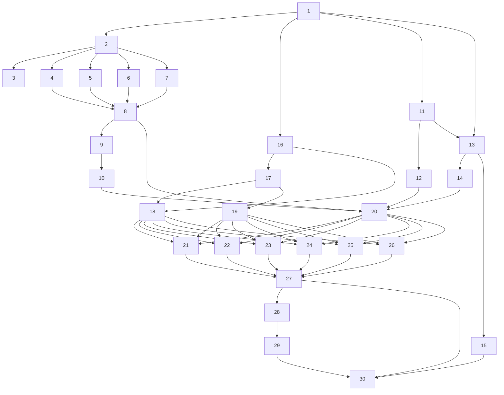

# Implementation Plan: Code Transformation Engine

## Overview

This implementation plan covers the full-stack development of the Code Transformation Engine platform — from infrastructure and backend services through AI agents to the React frontend.

## Priority Classification

| Priority | Scope | Status |
|----------|-------|--------|
| **🔴 P1 — REQUIRED** | Frontend + Backend + Deterministic Engine | Active |
| **🔴 P2 — REQUIRED** | ATX Analysis Agent | Active |
| **🔴 P3 — REQUIRED** | ATX Transform Agent | Active |

Every task in this plan is **REQUIRED**. The roadmap tasks that once sat beside them have been
removed; the scope they carried is recorded where it was withdrawn, not in a separate history.
`requirements.md` marks the requirements that scope left behind `[NO TASK]` or `[PARTIAL]` in place,
and the removal tables in `design.md` carry the *producing task withdrawn* rows naming the components
and endpoints involved.

## Task Dependency Graph

<!-- Every task is a node. Tasks are numbered 1–30 in the order `## Tasks` lists them, so a task's number and its position agree; there is no second ordering signal and no suffixed label. An edge A --> B means A MUST complete before B starts. Execution is sequential — one task at a time, in the order `## Tasks` lists them — and that order is a topological sort of this graph. The graph is not a scheduling instruction; it is the record of **why** the order is what it is, and it is what stops a later tidy reordering the list back into a broken sequence. -->

**Four edges were boundary bugs. Each is stated once, here, so a later tidy cannot merge one away without seeing why:**
- `9 --> 10` — **definer before consumer.** Task 10 calls the agent classes Task 9 defines; run concurrently, Task 10 guessed five method signatures wrong and all four SSE endpoints returned HTTP 200 with a `TypeError` inside the stream swallowed by a broad `except`.
- `11 --> 13` — Task 13's `stdout_filter.py` **copies** the de-noiser group out of `atx-analysis-agent/services/command_service.py`, naming that file by path; Task 11 creates it.
- `28 --> 29` — Task 29 imports the `conftest.py` fixtures Task 28 defines, by name.
- `21 & 22 & 23 & 24 & 25 & 26 --> 27` — **`App.tsx` has one route-table writer.** Task 27 is the only task in the plan that registers routes; registration was once carried by three page tasks at once and the surviving table was whichever finished last.

The order in `## Tasks` is a topological sort of this graph. Where the graph left two tasks unordered relative to each other, the tie was broken to keep related work adjacent — a service's own tasks together, and a backend surface before the frontend that consumes it — and those choices were free: nothing in the graph constrains them and reordering them against each other would not break the build. What the graph **does** constrain MUST be preserved: no task may be moved ahead of one it has an edge from.

Because tasks run one at a time, a consumer's producer has already run and its code is on disk. Build Constraint 85 is the obligation that follows: read the producer's real interface out of the code rather than inferring it. Build Constraint 36 governs the other half — a later task **edits** what an earlier task created and never re-creates it.

## Tasks

- [ ] 1. Bootstrap project from seed files: Copy all files from `seeds/` into their target locations (see `seeds/README.md`). **`seeds/` is the single authority for every file it contains.** `.kiro/steering/dev-env-setup.md` is advisory reference material only — it documents why the pins are what they are, it does not instruct you to author anything. Copy the seeds; never re-derive a seeded file from `dev-env-setup.md` or from memory, and if the two disagree, the seed is correct and the drift is a defect to report. Copy `seeds/atx-analysis-agent/Dockerfile` to `atx-analysis-agent/Dockerfile`. Copy `seeds/atx-transform-agent/Dockerfile` to `atx-transform-agent/Dockerfile`. Copy `seeds/frontend/.dockerignore` to `frontend/.dockerignore` — the frontend Dockerfile does `COPY . .` after `npm ci`, so without it a host `node_modules/` (wrong platform) overlays the one `npm ci` just installed and a stale host `dist/` ships into the build stage. **The seeded ATX Dockerfiles MUST NOT swallow the ATX CLI install** (Build Constraint 22, design doc "Runtime Prerequisite Verification — the ATX CLI"): no `|| true`, no `|| echo …`, no `2>/dev/null`, no `set +e` on the install or the `cp`/`ln` lines. A failed install MUST fail the build. The seeds now carry the verified install layer (install dir resolved via `readlink -e` on the installer's symlink, both `test -x` guards, `atx --version` gate with inline throwaway credentials) — copy it through intact and verify it survived; do not re-derive it. `linux/arm64` is supported, so an install failure is a packaging or dependency fault to fix, never a platform gap to work around: an image with no `atx` binary builds green, fails every analysis at runtime, and reports healthy throughout because the healthcheck only polls the HTTP server. Run `cd backend && uv lock && uv sync && make export`. **`make export` is not optional**: it regenerates `backend/requirements.txt`, which `backend/Dockerfile:5` consumes (`COPY requirements.txt ./` → `pip install -r requirements.txt`). No other task produces it, so without this step the first backend image build — Task 30, the last task in the plan — fails with `COPY failed: file not found`. `dev-env.md:10` forbids hand-editing `requirements.txt`; `make export` is the only sanctioned way to produce it, and it must be re-run whenever `pyproject.toml` changes. **Generate both ATX agent locks here too**: copy `seeds/atx-analysis-agent/pyproject.toml` and `seeds/atx-transform-agent/pyproject.toml` into place, then run `cd atx-analysis-agent && uv lock` and `cd atx-transform-agent && uv lock`. The lock step belongs in Task 1, not in Tasks 11/13, for the same reason `make export` does: both agent Dockerfiles run `uv sync --no-dev --frozen`, and `--frozen` forbids uv from generating a lock at build time, so the lock must exist before any image build and is an environment-bootstrap artifact, not agent implementation. The seeded agent `pyproject.toml` files are also the authoritative dependency lists — Tasks 11 and 13 MUST NOT re-create or overwrite them, only add the remaining scaffold files (`Makefile`, `.python-version`, `.dockerignore`, `config.py`). Run `cd frontend && npm install`. Install Playwright for e2e testing: `cd frontend && npm install -D @playwright/test && npx playwright install chromium`. Create `frontend/playwright.config.ts` (headless chromium, baseURL `http://localhost:3000`, testDir `./e2e`, timeout 30s, 1 retry). Create `frontend/e2e/` directory. Add `"test:e2e": "playwright test"` to frontend package.json scripts. **Scope vitest away from the Playwright suite** in `frontend/vite.config.ts` — either `test.exclude` covering `e2e/**` alongside the defaults (`node_modules/**`, `dist/**`) or `test.include` scoped to `src/**/*.{test,spec}.{ts,tsx}`. Without this, vitest collects every Playwright spec, fails on each (Playwright's test API is unavailable under jsdom), and reports "no tests" — so no frontend unit test actually runs. A vitest run reporting "no tests" is a configuration failure, not a pass. Copy `seeds/data/aws-managed-transformations.json` to `atx-transform-agent/data/aws_managed_transformations.json` — **this location, and only this location.** It is the sole source of the 13 AWS-managed definitions and the only copy any code reads: `atx-transform-agent/main.py:285`, `services/plan_context_defaults.py:29`, `services/transformation_validation.py:75`. Without it `GET /transformations` returns zero AWS-managed entries, the AWS Managed tab renders empty, the transformation-type dropdown carries no AWS definition, and acceptance Tests 6, 14 and 15 cannot run. Do **not** also copy it to `backend/data/aws_managed_transformations.json`: `grep -rn aws_managed_transformations backend/` finds no reader there, and per Build Constraint 65 an unreferenced artifact is a claim the system makes about itself that is not true. **Copy all five prompt templates from `seeds/backend/prompts/` to `backend/prompts/`** — `analysis-summary.md`, `code-analysis-agent.md`, `documentation-generation.md`, `kiro-spec-generation.md`, `quality-evaluation.md`. They are seeded rather than authored because they carry the exact `{{placeholder}}` tokens the enrichment context substitution depends on (`{{file_stats}}`, `{{dependencies}}`, `{{folder_structure}}`, `{{diagrams}}`, `{{source_url}}`): re-deriving them from prose drifts the token set, and a template whose tokens do not match the substitution map renders as a structural no-op that sends zero codebase context to the model while every call still succeeds. `backend/prompts/` is the **single authoritative location** per design doc "Prompt Template Location and Resolution" — a second copy at the repository root MUST NOT exist, so copy to this destination and only this destination. Task 6 verifies and extends these templates; it does not create them. Create minimal `frontend/src/main.tsx`. Verify: `make lint && make test` green in backend (the seeded `Makefile` has `lint`/`format` targets and the seeded `pyproject.toml` carries `ruff` in the dev group — if either is missing you copied a stale seed), `npm run build` green in frontend, and `backend/requirements.txt`, `atx-analysis-agent/uv.lock`, `atx-transform-agent/uv.lock`, `atx-transform-agent/data/aws_managed_transformations.json` (13 entries) and all five templates under `backend/prompts/` all present on disk.
- [ ] 2. Implement backend structural foundation: config.py (Pydantic BaseSettings), state.py (app state singleton), models.py (Pydantic request/response models), routes/ package skeleton (routes/__init__.py, routes/analysis.py, routes/ai_streaming.py, routes/aux.py, routes/security_fix.py — empty routers), utils/zip_safety.py (ZIP bomb detection). Create backend/data/prompt_library.json. **Do NOT create `backend/data/aws_managed_transformations.json`** — the 13 AWS-managed definitions live only at `atx-transform-agent/data/aws_managed_transformations.json` (copied from the seed in Task 1), which is where every reader looks. A backend copy has no reader (`grep -rn aws_managed_transformations backend/` → nothing), so creating one both violates Build Constraint 65 and, previously, clobbered the 13 seeded entries with whatever "create" produced. Implement main.py with CORS, health endpoint, exception handlers (ValueError→400, FileNotFoundError→404, generic→500), register security middleware, auth router, transformation router, route modules. All errors use {"detail": string}.
- [ ] 3. Implement authentication system: middleware/security.py (AuthMiddleware with 3-mode detection disabled/local/cognito, JWT validation RS256+HS256, path classification, AuditLogMiddleware, slowapi 60 req/min) AND middleware/auth_routes.py (POST /api/auth/login, GET /api/auth/config, GET /api/auth/user).
- [ ] 4. Implement backend utilities: utils/guardrails.py (12 regex patterns for injection detection, sensitive data redaction, MAX_PROMPT_LENGTH=100000), utils/storage_manager.py (JSON persistence with 7-day TTL, 50-cap cleanup, path traversal protection), utils/progress_tracker.py (in-memory state: percentage, status, current_step, message), utils/encryption.py (base64 dev mode, Secrets Manager prod). **This task also owns `backend/utils/bedrock.py`, the Bedrock client factory and invocation wrapper** — it was implied by Task 8 and named explicitly by no task, while Build Constraint 80 depends on it existing and Build Constraints 72 and 74 pin its configuration. An unowned module that three constraints reference is the specification-side counterpart of Build Constraint 65: a rebuild either omits it and scatters `boto3.client("bedrock-runtime")` across four callers, or invents a location the constraints' own citations then fail to resolve against. It belongs **here** rather than in Task 8 because it depends on nothing in the analysis pipeline — it is a client factory plus a retry policy — so it runs with the other utilities, ahead of every later consumer and created by none of them. Timeout configuration, retry and failure classification live in this **one** module and every Bedrock caller in the backend uses it: `services/code_parser_service.py` (Task 8), `agents/doc_analysis_agent.py`, `agents/kiro_specs_agent.py`, `agents/llm_judge.py` (Task 9). Per-caller client construction is forbidden — the policy is one decision and four copies of it drift. Configure per Build Constraints 72 and 74 (explicit `botocore.config.Config`: `read_timeout` 300s sized from measured output-token latency, `connect_timeout` 10s, `retries={"max_attempts": 1, ...}` so the SDK's own retries are off beneath the explicit policy, and a **2-attempt** budget with 1s base exponential backoff above it) and classify per cause, so a read timeout, a throttle and a transient 5xx are retried while a denied model, an invalid request, an absent or expired credential and a region/model mismatch fail on the first attempt. Classification MUST distinguish "could not be attempted at all" (no credential, no region, unreachable endpoint) from "was attempted and raised", because that distinction is what Task 8's `skipped`-versus-`failed` enrichment status is derived from (Build Constraint 75) — a consumer MUST NOT re-derive it from raw exception types. Per Build Constraint 80 the retry and its backoff live **inside** the synchronous function callers hand to `run_in_threadpool`; this module MUST NOT expose an async retry loop that awaits a threadpooled call, which would put the backoff sleep back on the event loop for the length of the retry budget.
- [ ] 5. Implement Tree-sitter parser system with typed dataclass output: Define `ParseResult`, `ClassInfo`, `MethodInfo` dataclasses in parsers/base_parser.py. All parsers MUST return `ParseResult` (not raw dicts). BaseParser abstract class with methods: `parse(source_code, filename) → ParseResult`, `extract_classes(tree) → list[ClassInfo]`, `extract_methods(tree) → list[MethodInfo]`, `extract_imports(tree) → list[str]`, `calculate_complexity(tree) → int`. Implement parsers/java_parser.py, parsers/python_parser.py, parsers/csharp_parser.py, parsers/c_parser.py, parsers/javascript_parser.py, parsers/abinitio_parser.py (30+ extensions, regex-based), parsers/parser_manager.py (routes by extension). All use tree-sitter bindings. `extract_imports` MUST return **module specifiers only** — the thing imported, never the whole statement and never an operator: `import * as angular from 'angular';` → `angular`, `import java.util.List;` → `java.util.List`, `import java.util.*;` → `java.util.*`, `from services import handler` → `services`. **Scope boundary — this task creates the parsers listed above and nothing else.** It MUST NOT create `parsers/mermaid_parser.py` or `services/diagram_generator.py`: those are Task 8's, which runs later, and every rule about identifier sanitisation, the reserved-word list, the ~150-edge cap, `DiagramSet` and per-diagram validation now lives in Task 8's body where the files are created. This task's contribution to diagram generation is the `ParseResult` / `ClassInfo` / `MethodInfo` dataclasses themselves — MermaidParser reads them by typed attribute access (`cls.methods`, `cls.parent_classes`, `method.class_name`), so the field names and types defined here are the interface Task 8 consumes and MUST NOT be changed without changing it there.
- [ ] 6. Create the prompt-template infrastructure the enrichment call site consumes: `backend/utils/prompt_paths.py` and `backend/services/prompt_loader.py`, and **verify and extend** the templates Task 1 already copied into `backend/prompts/` from `seeds/backend/prompts/`. **The five templates already exist on disk when this task starts** (`analysis-summary.md`, `code-analysis-agent.md`, `documentation-generation.md`, `kiro-spec-generation.md`, `quality-evaluation.md`) — do not re-create them and do not overwrite them; re-creating a file an earlier task seeded is how all 13 entries of a seeded data file were silently clobbered (Build Constraint 36). Confirm each is present and carries the `{{placeholder}}` tokens the substitution map fills; where a token the loader substitutes is missing from a template, **edit that template in place** to add it. **Governed by: design.md "Prompt Template Location and Resolution", "Agent Prompt Storage", "AI Enrichment Status Semantics" (as the producer of the metadata that section's decision reads); Build Constraints 38, 39.** This task runs before Task 8 so Task 8 can create `code_parser_service.py` with the enrichment call already wired and remain that file's single writer — **this task MUST NOT write `code_parser_service.py` or `routes/analysis.py`**, only the prompt modules and the already-seeded templates. **Prompt template location and resolution** (design doc "Prompt Template Location and Resolution"): templates live at `backend/prompts/` and nowhere else — a second copy at the repository root MUST NOT exist. Resolution lives in `backend/utils/prompt_paths.py` and is **candidate-based**, probing in order `$PROMPTS_DIR` → `<backend package root>/prompts` → `<repo root>/prompts` → `/app/prompts`, returning the first that exists plus the full list of paths tried; de-duplicate preserving order; resolve **per call**, not once at import. NEVER count `.parent` hops (`Path(__file__).parent.parent.parent / "prompts"` is correct locally and resolves to a nonexistent `/prompts` in the container). A missing template MUST log at **WARNING** naming the template and **every** path tried — silent fallback is forbidden. Built-in default prompts MUST carry the same `{{placeholder}}` tokens as the real templates (`{{file_stats}}`, `{{dependencies}}`, `{{folder_structure}}`, `{{diagrams}}`, `{{source_url}}`); defaults without placeholders make substitution a structural no-op and send zero codebase context to the model. Rendering MUST be **total**: every placeholder is either filled or replaced with a neutral marker (`(not provided)`) in a single pass, no raw `{{token}}` ever reaches the model, unfilled placeholders logged at WARNING. The loader returns render metadata alongside the text: source template path (or `None` for a default), `used_fallback`, substituted variables, unresolved variables, paths tried, and total injected `context_chars`. Provide a **single shared** `describe_prompt_degradation(*results)` helper taking varargs so a multi-prompt phase evaluates all prompts together and produces one message naming each problem — this is the **input** to the `completed`/`degraded` decision, which Task 8 makes inside `code_parser_service.py` (`completed` only when `used_fallback == False` **and** `context_chars > 0`); this task provides the metadata and the helper, Task 8 derives and persists the status. `backend/agents/prompt_loader.py` is a separate thin adapter created by Task 9; this task owns only `backend/services/prompt_loader.py`. Verify prompt resolution **inside the running backend container**, not only locally.
- [ ] 7. Create the version-comparison and OSV vulnerability modules the upgrade-recommendation call site consumes: `backend/services/version_analyzer.py` and `backend/services/enhanced_dependency_analyzer.py`. **Governed by: design.md "Upgrade Recommendation Production"; Build Constraints 31, 65, 66, 67.** These modules depend only on `requests` and the OSV API and are created before Task 8 so Task 8 can create `code_parser_service.py` with the OSV/upgrade call already wired and remain that file's single writer — **this task MUST NOT write `code_parser_service.py`**; the wiring into the pipeline is Task 8's, this task owns the two modules' behaviour. **Upgrade recommendation production — design doc "Upgrade Recommendation Production" is the authority.** Each recommendation persists as `{"name", "current_version", "recommended_version", "ecosystem", "reason"}`. The field is **`name`, not `package_name`** (Build Constraint 31); `ecosystem` MUST be present on every record so a row can be attributed to the manifest it came from. **`services/version_analyzer.py` MUST normalise each declared version before any comparison and then compare component-wise.** What a manifest declares is not a version but a constraint expression, a range, a placeholder, or a parser's stand-in for "not stated": npm operators (`^4.18.2`, `~1.2.3`, `>=2.0.0 <3.0.0` → its lower bound), wildcards (`1.x`), `v` prefixes, Maven ranges (`[1.0,2.0)` → its lower bound), pre-release suffixes (`2.0.0-rc1`, `1.5.0.RELEASE`), unresolved property placeholders (`${spring.version}`), and the parsers' `unknown`/empty placeholders. Where **either** side cannot be normalised the answer is **undefined** — never "current" and never "old". Substring and first-integer comparison is not version comparison: `_is_already_latest` took the first integer found anywhere in each string (`re.search(r"(\d+)")`), so `log4j-core@2.14.1` was declared already current against a 2.21 target and the Log4Shell rule **never fired for any 2.x version**; and `_is_very_old`'s `re.match(r"(\d+)\.(\d+)")` cannot match a string beginning with `^` or `~`, so the npm branch of that heuristic was **structurally unreachable**. Both errors come from the same missing normalisation step. **`services/enhanced_dependency_analyzer.py` implements OSV scanning across 8 ecosystems** and is the module Build Constraint 65 requires be wired into the pipeline (the wiring is Task 8's; producing an unreferenced scanner beside a hardcoded table is the defect). Sources are **prioritised** and **at most one row is emitted per dependency**: an OSV advisory with a released fix, then a curated rule, then the pre-1.0 heuristic. Read fixes from `affected[].ranges[].events[].fixed` **filtered to the queried package**, because advisories also list repackaged mirrors and forks whose version numbers are not comparable. An advisory carrying only `last_affected` and no `fixed` event has no released fix and yields **no** recommendation (`angular@1.8.3` is end-of-life with 10 advisories and correctly produces no row). OSV is a network dependency of an otherwise offline pipeline: a network failure degrades to an **empty scan** with the analysis still completing, and the scan is gated behind a setting (`VULN_SCAN_ENABLED`) so an air-gapped deployment can disable it. A recommendation whose current version is undeterminable MUST carry an explicit note saying why (e.g. `not declared (inherited from parent POM or dependency management)`) — never a blank cell (Build Constraint 67).
- [ ] 8. Implement the deterministic analysis pipeline and wire both AI call sites: this task is the **single writer** of `services/code_parser_service.py`. **Governed by: design.md "Mermaid Diagram Generation Contract", "LLM-Integrated Analysis Pipeline", "Phase 2: AI Enrichment Flow", "Incremental Persistence of Enrichment Output", "AI Enrichment Status Semantics", "Prompt Template Location and Resolution" (consumer side), "Upgrade Recommendation Production" (consumer side), "Bedrock Invocation Timeouts Are Sized From Measured Latency" et seq.; Build Constraints 30, 37, 39, 65, 75, 76, 77, 80, 84.** It imports the already-created modules — `services/prompt_loader.py` + `utils/prompt_paths.py` (Task 6), `services/version_analyzer.py` + `services/enhanced_dependency_analyzer.py` (Task 7), `utils/bedrock.py` (Task 4) — and wires the enrichment call and the OSV/upgrade call; it MUST NOT re-create any of those modules. **parsers/mermaid_parser.py and services/diagram_generator.py are created here** — parsers/mermaid_parser.py (class/sequence/integration diagrams from code). MermaidParser consumes `list[ParseResult]` from Task 5 using typed access (`cls.methods`, `cls.parent_classes`, `method.class_name`), never raw dicts. **Identifier sanitisation** (design doc "Mermaid Diagram Generation Contract"): every emitted Mermaid identifier in all three generators (class, sequence, integration) MUST pass through a **single shared sanitiser** — duplicated per-generator sanitisation is a defect. Its output matches `^[A-Za-z_][A-Za-z0-9_]*$` **or** is the empty string meaning "skip this node, emit nothing". Non-`[A-Za-z0-9_]` characters become `_`, runs collapse, leading/trailing `_` stripped; leading digits get a letter prefix; reserved words (`graph`, `subgraph`, `end`, `class`, `classDef`, `style`, `click`, `linkStyle`, `direction`, `default`, `flowchart`, `classDiagram`, `sequenceDiagram`, `participant`, `note`, `state`, compared case-insensitively) are suffixed (`class` → `class_node`) and never emitted bare; wildcard imports resolve through the package path (`java.util.*` → `java_util_all`, never a bare `*`). The human-readable original is preserved as a quoted label (`safeId["original.import.name"]`) escaping `#` → `#35;` then `"` → `#quot;` in that order. Integration diagram caps dependency edges at ~150 (`MAX_INTEGRATION_EDGES`, Build Constraint 84) and emits a truncation note node when the cap is hit. DiagramGenerator returns a `DiagramSet` dataclass with per-diagram try/except fallbacks **and validates each diagram before returning it** — structural checks (non-empty, valid opening directive, a body line beyond the directive, no bare `*`, no reserved bare ids, with quoted/`[...]` label contents excluded from inspection). On failure log WARNING naming the diagram type and reason and return a **syntactically valid placeholder** diagram; broken Mermaid MUST never reach the frontend, and each diagram type validates independently. Also create: services/file_analyzer.py, services/github_handler.py (GitPython clone with PAT+timeout), services/dependency_analyzer.py (import/package extraction — **distinct from Task 7's enhanced_dependency_analyzer.py**), services/diagram_generator.py, services/code_parser_service.py. The pipeline stores `parsed_files` as a `list[ParseResult]` (serialized via dataclasses.asdict()) — consumers must handle this as a list of dicts with guaranteed keys (classes, methods, imports, complexity, language, line_count). Implement routes/analysis.py endpoints: POST /api/analyze/upload (ZIP+BackgroundTask), POST /api/analyze/github, GET /api/analysis/{id}/status|summary|file-stats|folder-structure|dependencies|dependency-graph|upgrade-recommendations|diagrams|mermaid, GET /api/analyses, DELETE /api/analysis/{id}. Implement middleware/transformation_management.py: CRUD /api/transformations/definitions. Document each endpoint's response envelope key in a code comment at the top of routes/analysis.py (e.g., `# Response envelopes: /file-stats → {"file_stats": [...]}, /dependencies → {"dependencies": [...]}`). Implement the AI enrichment phase per design doc "LLM-Integrated Analysis Pipeline": Phase 2 in `_run_pipeline()` calling Task 6's `prompt_loader` (rendered template + metadata) and Task 4's `utils/bedrock.py` (`bedrock_runtime_client()` / `invoke_with_retry` / `classify_bedrock_error`), plus the `GET /api/analysis/{id}/documentation` read endpoint in `routes/analysis.py`. **This task makes no frontend change of any kind.** The analysis-results tabs, including the Documentation tab that reads this endpoint, are Task 22's alone (`AnalysisResultsDisplay.tsx` is exactly one file with exactly one owner, design doc "Frontend Component Ownership and File Paths"). **Endpoint ownership, `GET` versus `POST` on the same path**: `GET /api/analysis/{id}/documentation` (reads stored `ai_documentation` out of the analysis record) lives in `routes/analysis.py` and is **this task's**; `POST /api/analysis/{id}/documentation` (SSE, generates documentation through `DocAnalysisAgent`) lives in `routes/ai_streaming.py` and is **Task 10's**. Same path, different method, different file, different task. **Enrichment status classification is derived here** from Task 6's render metadata and Task 4's failure classification: set `ai_enrichment_status: "completed"` **only when** `used_fallback == False` **and** `context_chars > 0`; otherwise `degraded` with an explanatory `ai_enrichment_error` naming which condition tripped and which paths were tried (use Task 6's `describe_prompt_degradation`). `skipped` when enrichment was **not attempted** (deliberately disabled via `SKIP_AI_ENRICHMENT`, or no Bedrock client could be constructed — the `BedrockUnavailableError`/`unavailable` case), `failed` when it **was** attempted and raised. "The Bedrock call succeeded" is not evidence the model saw the codebase. Regardless of outcome the analysis still completes and all deterministic results persist. **The Bedrock timeout/retry/classification policy itself lives in `utils/bedrock.py` (Task 4); this task consumes it and MUST NOT construct its own `boto3.client("bedrock-runtime")`** — design doc "Bedrock Invocation Timeouts Are Sized From Measured Latency", "The SDK's Own Retries Are Disabled Beneath an Explicit Policy" and "Retryable and Non-Retryable Bedrock Failures" are the authority. What this task owns is how the pipeline **uses** it: `ai_enrichment_error` MUST name the **operator action** per the triage table, not just the symptom — a read timeout, a denied model, an absent credential, a throttle and a wrong region are five different things to do, so one generic "enrichment failed" string is insufficient. `failed` MUST NOT be reported as `skipped`: the handler was `except Exception: result["ai_enrichment_status"] = "skipped"`, which made a real Bedrock timeout indistinguishable from `SKIP_AI_ENRICHMENT=true` (design doc "AI Enrichment Status Semantics" is the authority and the code contradicted it). **Each model result MUST be persisted as it arrives** (design doc "Incremental Persistence of Enrichment Output"): `result["ai_summary"]` was assigned only after **both** calls returned, so a documentation timeout discarded a summary that had already succeeded — call `storage.save` after **each** model result, and the recorded error names **which** stage failed (`analysis-summary` or `documentation-generation`). `GET /api/analysis/{id}/documentation` MUST pass an **absent** `ai_enrichment_status` through as absent and MUST NOT default it to `"skipped"`; an absent value is unknown (Build Constraint 77). Also create `backend/.dockerignore` excluding `.venv/`, `__pycache__/`, `*.pyc`, `.pytest_cache/`, `.ruff_cache/`, `temp/` — it MUST NOT exclude `prompts/`, which is the one thing in `backend/` that must ship in the image. **Wire the upgrade-recommendation call site**: the pipeline calls Task 7's `services/enhanced_dependency_analyzer.py` (OSV scan, gated behind `VULN_SCAN_ENABLED`) and `services/version_analyzer.py` (normalisation) and persists each recommendation as `{"name", "current_version", "recommended_version", "ecosystem", "reason"}` (the field is **`name`, not `package_name`**, Build Constraint 31; `ecosystem` present on every row). The scanner and the normaliser are Task 7's; **this task is only the caller** — an `enhanced_dependency_analyzer` that nothing in the repository references is the Build Constraint 65 defect, and wiring the call here is what fixes it. Verify prompt resolution **inside the running backend container**, not only locally. Verify: `make lint && make test`, `npm run build`.
- [ ] 9. Implement AI agents: agents/doc_analysis_agent.py (Strands, tools: analyze_codebase_context, generate_kiro_spec, validate_analysis_output, reads StorageManager+MCP, SSE), agents/llm_judge.py (Strands, tools: score_dimension, check_json_structure, detect_hallucinations, 5-dimension scoring), agents/kiro_specs_agent.py (Strands, tools: get_analysis_context, generate_component_spec, validate_specs, in-process MCP). Implement mcp/static_analysis_server.py (9 tools: list_analyses, get_file_statistics, get_folder_structure, get_dependencies, get_dependency_graph, get_code_metrics, get_upgrade_recommendations, parse_code, get_analysis_summary).
- [ ] 10. Implement backend streaming & endpoints: routes/ai_streaming.py (POST /api/analysis/{id}/documentation SSE, POST /api/analysis/{id}/judge SSE, POST /api/analysis/{id}/file-analysis SSE, POST /api/analysis/{id}/kiro-cli SSE proxy). Add doc-analysis storage endpoints (GET /api/analysis/{id}/doc-analysis, /runs, /run/{ts}, DELETE, POST kiro-spec/download). **Endpoint ownership — this task owns the `POST` on `/api/analysis/{id}/documentation` and not the `GET`.** The `GET` (which reads stored `ai_documentation` and returns `{documentation: str, ai_enrichment_status: str}`, passing an absent status through as absent per Build Constraint 77) lives in `routes/analysis.py` and belongs to **Task 8**. This body previously restated the `GET` contract as though it were a deliverable here, so two tasks claimed one endpoint and an executor could reasonably have added a second handler for it in `ai_streaming.py` — two routes on one path, with FastAPI resolving to whichever registered first. The two are only distinguishable by method and file: `POST` → SSE generation, `routes/ai_streaming.py`, this task; `GET` → stored read, `routes/analysis.py`, Task 8. Likewise the Summary endpoint (`GET /summary`, which returns the FULL stored analysis object including `ai_summary` and `file_stats`) is Task 8's; it is named here only as the thing the documentation `GET` is *not*. ATX Transform Agent endpoints already in Tasks 13–15. **Ordering**: this task consumes the `DocAnalysisAgent`, `LLMJudge` and `KiroSpecsAgent` classes Task 9 creates — constructor parameters, method names and the shape of what each SSE-yielding method yields. Task 9 and this task once ran concurrently, so this task's executor had to **guess** that API; it guessed a plausible-but-wrong convention (`storage_manager=` as a constructor kwarg, `(analysis_id, data)` positional pairs, `evaluate`, `analyze_file`) that no agent implements, and the result was five signature mismatches leaving all four SSE endpoints returning HTTP **200** with a `TypeError` raised inside the stream and swallowed by a broad `except` — a green status code over a dead stream, invisible to any test asserting the status. Import the agent classes as Task 9 actually defines them; do not infer a signature from this task's endpoint list. This task must also land **strictly before Task 26**, whose `DocumentationViewer` consumes `POST /api/analysis/{id}/documentation`, and strictly before Task 20, whose `services/api.ts` is the client for all four SSE routes.
- [ ] 11. Implement the ATX Analysis Agent core (atx-analysis-agent/): scaffold, streaming, cancel, reconnect and the de-noiser. **Governed by: design.md "ATX Agent Streaming and Reconnect Contract", "Conversation Record Persistence (ATX Analysis Agent)", "Agent Request Body Contracts", "Runtime Prerequisite Verification — the ATX CLI"; Build Constraints 8, 22, 26, 45, 46, 47, 48, 49, 51, 52, 53, 61.** Create scaffold (Makefile, .python-version, .dockerignore, config.py). **`pyproject.toml` is NOT in that list and MUST NOT be created or overwritten here** — Task 1 copies `seeds/atx-analysis-agent/pyproject.toml` into place and generates `uv.lock` from it, and the Dockerfile's `uv sync --no-dev --frozen` requires the lock to match that exact file. The Dockerfile is likewise already copied from seeds/. Implement main.py (FastAPI :8004, ATX CLI command builder maps analysis types to `atx custom def exec -n <AWS-definition> -p <repo> -x -t`), services/repository_service.py, services/command_service.py (subprocess+SSE, in-memory process registry, SIGKILL), services/storage_service.py (per-conversation `metadata.json`, atomic write, scan-based listing, backfill — design doc "Conversation Record Persistence (ATX Analysis Agent)"), services/conversation_id.py (shared identifier validation). **Core endpoints (this task): POST /analyze (SSE), POST /cancel/{id}, GET /conversations, GET /conversations/{conversation_id}/stream (SSE reconnect), GET /analysis-definitions.** The doc/file-serving endpoints (`GET /conversations/{id}/docs`, `/logs`, `GET /browse`, `GET /file`) and their backing modules are **Task 12's**, which runs next and edits this `main.py` to register them; do not create `file_service.py` or `artifact_collection.py` here. The `/analyze` endpoint MUST emit `{"type": "init", "conversation_id": "..."}` as the first SSE event so the frontend can track the session for cancel. **Streaming and reconnect — design doc "ATX Agent Streaming and Reconnect Contract" is the authority; implement against it rather than re-deriving from this summary.** `POST /analyze` starts a **background worker task** and then tails a durable event record; the worker MUST NOT be tied to the HTTP response, so a client disconnect (a page refresh *is* a client disconnect) MUST NOT kill a running analysis — running the analysis inside the SSE generator was the deeper defect (Build Constraint 47). Two concurrent producers — a stdout reader and a conversation-log tailer — feed **one** `asyncio.Queue`; a single consumer drains it and appends each event to `events.jsonl`, and FIFO on that one queue is the ordering guarantee. Detect the ATX conversation log path from stdout (`"Conversation log: <path>"`) and **start tailing it immediately, while the process is still running — do NOT wait for exit** (reading the log after completion was the reported bug: the console showed only spinner noise during the run and the useful agent output arrived in one lump at the end). Keep tailing until the process has exited **and** a further pass yields nothing, so the tail is not truncated by the exit race. Write the log path to `metadata.json` the moment it is parsed, not at the end, so a mid-run reconnect can find it. **Event channels**: `init` first (Build Constraint 26) and persisted as event one; `log` (conversation log — primary console content, live); `output` (de-noised stdout — secondary, retained because real failures and the `Conversation log:` path appear only there); terminal `complete` or `error`. Payload field is **`data`**, plus `replay?` on replayed events. **stdout de-noising — this task owns the de-noiser, and it is a named module with named symbols.** It lives in `atx-analysis-agent/services/command_service.py` as the `strip_ansi` / `visible_text` / `despinner` / `is_noise` / `StdoutFilter` group, beside the subprocess reader that is its only caller in this agent. Task 13 duplicates that group into `atx-transform-agent/services/stdout_filter.py` under Build Constraint 53, and the two copies MUST stay recognisably identical — change one, change both. Behaviour: strip ANSI; honour `\r` overwrites by keeping the last segment written to the line; drop lines whose visible content is only spinner frames (the whole Braille block, U+2800–U+28FF), box-drawing/block/geometric characters, or blank; collapse the CLI's repeated progress-block repaints to one event per state change via a short memory of recently emitted progress lines, with any non-progress line clearing that memory so genuinely repeated content (two identical `ERROR:` lines) is never suppressed. Bordered lines carrying text (`│ Region: us-east-1 │`) are content and are kept. **`GET /conversations/{conversation_id}/stream`**: 404 on unknown id (matching ATX Transform); replay every persisted event first flagged `replay: true`; then live output if still running; then the terminal event. It MUST reconcile a stale `running` status — if `metadata.json` says `running` but no work is tracked for that id the agent restarted and the analysis is dead, so mark it `interrupted` and emit a terminal event rather than tailing forever (Build Constraint 49). Reads MUST NOT consume a partially written trailing record. **Mirror ATX Transform's streaming and reconnect shape** — the two agents MUST NOT diverge in how they stream and reconnect; a second, differently-shaped streaming design is a defect, not a variant. **This task is backend-only and writes nothing under `frontend/`.** The frontend obligations for the ATX Analysis console (`AtxAnalysisPage.tsx`, `AtxDocumentationPanel.tsx` — reconnect-on-mount, `conversation_id` capture for cancel, the four distinct empty states, the anchor-aware markdown shape) are **Task 23's**, which creates both files. What remains this task's is the **agent-side contract those obligations consume**: `init` carries `conversation_id` as the first event so a client has something to cancel with; `GET /conversations/{conversation_id}/stream` 404s on an unknown id, replays flagged events, then goes live, then terminates — so the client can distinguish "attached, nothing yet" from "cannot attach". The GET /conversations endpoint MUST return items with field `conversation_id` (not `id`) matching the frontend interface. Response shape: `{"conversations": [{"conversation_id": str, "status": str, "created_at": str}]}`. **Request model for `POST /analyze` — exact field names** (design doc "Agent Request Body Contracts" is the authority): `repository_url` (**required**), plus optional `branch`, `analysis_type` (default `"code-assessment"`), `conversation_id`, `pat_token`. The required field is `repository_url`, **not** `repo_url` — `repo_url` is ATX Transform's field name and the asymmetry is deliberate (Build Constraint 8). The model MUST set Pydantic `extra="forbid"` so a caller sending a stale or misspelled name gets a 422 naming the offending field instead of having it silently dropped. **Repository preparation — `-p` needs a local path**: `atx custom def exec … -p <project_path>` expects a local project directory, so a remote `https`/`http` `repository_url` MUST be shallow-cloned (`--depth 1`, honouring `branch`) to `<storage_path>/<conversation_id>/repo` and the resulting **local path** passed to `-p`. Inject `pat_token` as basic-auth userinfo for private repos and redact it from any error reaching logs or clients. Local paths are validated (exists, is a directory) and passed through unchanged, no clone. Mirror the existing ATX Transform clone behaviour in `services/repository_service.py` rather than inventing a second approach — the two agents MUST NOT diverge in how they fetch repositories. SSRF posture matches `backend/services/github_handler.py`: `https`/`http` only; private, loopback, and link-local hosts rejected (`10.`, `172.16-31.`, `192.168.`, `169.254.`, `127.`, `0.`, `localhost`, `::1`); URLs with no path rejected; `git@…` SSH URLs rejected explicitly (no keys exist in the container). **Ordering against Build Constraint 26**: URL and contract validation are **synchronous in the handler**, before the stream opens — bad input is an HTTP 400 with no SSE events emitted. The clone happens **inside the stream generator, after `init` is emitted**; a clone failure is an SSE `error` event, not an HTTP status, because the response is already committed as a stream. **Health endpoint**: `/health` is a **liveness** signal only — it reports that the process is serving and MUST NOT be read as evidence that the `atx` binary is present or usable. The binary's presence is guaranteed by the Dockerfile's `atx --version` build gate (Build Constraint 22) and confirmed at acceptance time via `docker compose exec <svc> atx --version`; Build Constraint 45 records why verification sits at those two points rather than in the request path.
- [ ] 12. Implement ATX artifact collection and documentation serving (atx-analysis-agent/): `services/artifact_collection.py`, `services/file_service.py`, and the doc/file-serving routes registered in the `main.py` Task 11 created — **edit that file, do not re-create it**. **Governed by: design.md "ATX Artifact Collection and Documentation Serving" and its subsections ("Where the CLI Actually Writes", "Copy In, Never Serve In Place", "Collection Is Retryable, Not Once-Only", "Serving"), "What Gets Listed, and Why an Empty `docs/` Is Not Payload"; Build Constraints 50, 54, 55, 56, 61.** **Endpoints (this task): `GET /conversations/{conversation_id}/docs`, `GET /conversations/{conversation_id}/logs`, `GET /browse`, `GET /file`.** Task 11 owns `main.py`'s app, the streaming/cancel/conversation routes, `services/command_service.py`, `services/repository_service.py`, `services/storage_service.py` and `services/conversation_id.py`; this task imports the record store and the identifier validator rather than defining a second copy of either. **Where the CLI actually writes, and the base every path is relative to** (design doc "Where the CLI Actually Writes"; Build Constraint 54 is why each candidate is stated with its base rather than as a bare directory name): the documents land in `ATXDocumentation/` **inside the project path passed to `-p`** — the cloned repo at `<storage_path>/<conversation_id>/repo`, *not* the process cwd — mirrored under the CLI's own run directory `~/.aws/atx/custom/<run_id>/`, whose `artifacts/` sibling holds `git_instructions.md`, `validation_summary.md`, `tasks.json` and `worklog.log`. The original implementation looked in `<storage>/<id>/artifacts` and `<storage>/<id>/ATXDocumentation`, the CLI writes to neither, and `docs/` was empty on every run. **The run directory is derived, not parsed**: `Path(metadata["conversation_log"]).parent.parent`, reusing the `Conversation log:` path Task 11's stdout reader already parsed and persisted — a second stdout-parsing mechanism for information already captured MUST NOT be added. **Candidate order**, documentation directories ahead of `artifacts/` so documentation wins a filename collision: `<storage>/ATXDocumentation`, `<repo_path>/ATXDocumentation`, `<run_dir>/ATXDocumentation`, `<storage>/artifacts`, `<run_dir>/artifacts`. The first source to provide a given relative path wins, so the mirrored tree produces no duplicate entries; the two original candidates are **retained** at one `exists()` each because they cover a future CLI that does write relative to cwd. `/app/.aws` is container filesystem rather than a mounted volume, so the run-directory mirror does not survive a rebuild and collection then succeeds via `repo_path` alone — which is why there are multiple candidates rather than whichever one worked during development. **Copy in, never serve in place**: artifacts live outside the storage root, so they are **copied into** the conversation's `docs/` directory rather than served where the CLI left them, and everything the API serves then still resolves under the storage root. Relative structure below each source directory is preserved; document suffixes only (`.md`, `.markdown`, `.txt`, `.json`, `.csv`, `.yaml`, `.yml`, `.html`); symlinks skipped; the per-file cap matches the cap `GET /file` serves, since collecting something the reader would refuse is pointless. **`docs/` is created per destination file, never up front**, and the listing's payload test requires a **file** inside it — an empty `docs/` is deliberately not payload, so an unconditional `mkdir` would give every directory collection was pointed at a payload marker and promote it into `GET /conversations`: `<storage>/repos` is scratch space for cloned projects, not a conversation, and it appeared as a row whose every action was empty or a 404. Both halves have to agree — keeping the unconditional `mkdir` beside the file-based payload test still lists scratch directories. **Collection is retryable, not once-only** (Build Constraint 55): `ensure_artifacts_collected` retries whenever `docs/` is empty and is a no-op once populated, and it runs **on read**, before the `/docs` listing is built. Running it exactly once at worker exit meant an agent restart mid-run lost the documents permanently while the CLI's output was still sitting on disk with nothing left to copy it in; repair-on-read also lets an already-completed conversation be fixed without re-running a 25-minute analysis. It MUST be idempotent — no file copied twice, and the resulting `docs/` tree unchanged across any number of calls. **Serving**: `list_docs` emits **`storage_path`** (`<id>/docs/<rel>`), the value a client passes straight to `GET /file` — the original returned `{name, path, size}`, no content and no path a client could hand to a reader, which is half of why the Documentation tab showed nothing. The `/docs` response is `{"docs": [...], "status": <conversation status>}`, so an empty list can be **explained** rather than guessed at, and it is the input to the four distinct empty states Task 23 renders (Build Constraint 50). `GET /file` keeps its path-traversal protection and 10MB cap unchanged: a `storage_path`-shaped value crafted to climb out of the storage root is rejected, and every listed document's `storage_path` resolves to an existing file under that root. `GET /browse` and `GET /logs` read through the same module and the same posture — no parallel reader with its own security rules. **This task is backend-only and writes nothing under `frontend/`**: rendering the documents as markdown, the prohibition on `JSON.stringify(doc)` in place of content (Build Constraint 56) and the four empty states are Task 23's. Verify: `make lint && make test`.
- [ ] 13. Implement the ATX Transform Agent core (atx-transform-agent/): scaffold, streaming, the duplicated stdout de-noiser and durable record persistence. **Governed by: design.md "ATX Agent Streaming and Reconnect Contract", "Transform Results Surface and Transformation Record Persistence" (record-durability half), "Agent Request Body Contracts"; Build Constraints 8, 22, 33, 45, 47, 48, 49, 51, 52, 53, 61.** Create scaffold (Makefile, .python-version, .dockerignore, config.py). **`pyproject.toml` is NOT in that list and MUST NOT be created or overwritten here** — Task 1 copies `seeds/atx-transform-agent/pyproject.toml` into place and generates `uv.lock` from it, and the Dockerfile's `uv sync --no-dev --frozen` requires the lock to match that exact file. Task 1 already carries the prohibition; the instruction that would have violated it was still in this list. The Dockerfile is likewise already copied from seeds/. Implement main.py (FastAPI :8005), services/docker_service.py (Docker-in-Docker or git clone fallback), services/transform_service.py, services/github_pr_service.py (PR creation with PAT), services/storage_service.py (the record store specified below), services/stdout_filter.py (the de-noiser copy specified below) and services/repo_id.py (shared identifier validation). **`services/plan_context_defaults.py` and `services/transformation_validation.py` are Task 14's; `services/file_comparison.py` and `services/download_service.py` are Task 15's — do not create them here.** **Core endpoints (this task): POST /transform (accepts `configuration` for ATX CLI `-g` flag), GET /transformation-history (execution records), GET /conversations/{repo_id}/stream (SSE replay then live), POST /create-file-pr/{repo_id}, GET /pr-preview/{repo_id}, GET /branches.** `GET /transformations` (the definitions catalog) is registered by Task 14, and `GET /diff/{repo_id}`, `GET /diff-summary/{repo_id}` and `GET /download/{repo_id}` by Task 15; both edit this `main.py` rather than re-creating it. **`POST /create-file-pr/{repo_id}`, `GET /pr-preview/{repo_id}` and `services/github_pr_service.py` are unchanged and stay exactly as specified — they are API-only capabilities with no UI caller.** The results page offers no PR affordance and the frontend carries no client method for either route (Task 24), so the only caller is a direct API client; that is deliberate, is recorded in design doc "Agent Service Interfaces", and these endpoints MUST NOT be removed or gated on the grounds that nothing in the frontend calls them — a published endpoint whose callers are external is a capability, not dead code. The `services/transform_service.py` MUST run ATX CLI via `subprocess.Popen` (streaming) instead of `subprocess.run` (blocking). Write stdout/stderr line-by-line to `{storage_path}/{repo_id}/logs/output.log` with ISO timestamps (`[2026-08-03T11:38:55+00:00] content`). Track running processes in a `running_processes: dict[str, subprocess.Popen]` dict. Add `GET /conversations/{repo_id}/stream` endpoint to `main.py` — replays stored log lines, then tails live (poll 0.5s), then emits a terminal event. **Payloads and termination are governed by design doc "ATX Agent Streaming and Reconnect Contract" → "Payload Discriminator — Platform-Wide" and "Stream Termination"; implement against those rather than re-deriving from this summary.** The parts that were previously left implicit and shipped wrong: (a) **the discriminator is `type` inside the `data:` JSON payload, on every event** — the SSE `event:` name MUST NOT carry it, because the shared `streamSSE` client discards `event:` lines, so a name-only discriminator arrives untyped and every consumer branch keyed on it is silently dead; emit on the default `message` event name. (b) Log lines are `{"type": "output", "data": "[ISO timestamp] content", "replay": true}` — channel **`output`, not `log`** (this is captured CLI stdout; `log` is reserved for the ATX conversation log, which this agent does not produce), field **`data`, not `line`**, and the stored `[ISO timestamp] ` prefix is carried verbatim **inside `data`**. Live payloads **omit the `replay` key entirely** rather than sending `replay: false`, matching the optional union member. (c) Terminal events are `{"type": "complete", "status": <status>}` on success and `{"type": "error", "message": <human-readable reason>}` on failure — the `error` union member **requires** `message`, so a bare `status` does not satisfy it and relabelling alone would not have fixed this. Every stream MUST end on a terminal event; that is what clears the client's in-progress state. (d) **The tail loop keys on the record's persisted status (`while status == "running"`), not on `is_running()` / process liveness.** Between `POST /transform` returning and the ATX CLI launching, the background task is still cloning and nothing is registered in the process map, so a liveness-keyed loop falls straight through and emits a terminal event before any work happens — that is how `{"type": "complete", "status": "running"}` shipped. `running_processes` is for cancel and liveness inspection, not for terminating a stream. (e) Apply the **same stdout de-noiser the analysis agent uses**, at **write time**, so `output.log` holds only de-noised lines and the stream is a faithful tail of it — replay and live identical by construction. **Where the two copies live, stated precisely because the previous wording was wrong**: the analysis agent's copy is the `strip_ansi` / `visible_text` / `despinner` / `is_noise` / `StdoutFilter` group inside `atx-analysis-agent/services/command_service.py` (Task 11 owns it and names it there); this agent's copy is a standalone module, `atx-transform-agent/services/stdout_filter.py`. This task previously read "the same stdout de-noiser the analysis agent uses (`services/stdout_filter.py`)", which named a path **that does not exist in the analysis agent** — a bare `services/…` with no agent prefix resolves against this agent's own tree, so the instruction pointed at the file it was asking you to create and there was nothing to copy from. Because the two agents ship as separate containers with separate dependency closures, a shared import across the package boundary is unavailable and the de-noiser is necessarily **duplicated** under Build Constraint 53: the two copies MUST stay recognisably identical (change one, change both) and **each carries a header comment naming its counterpart by full path** — this module's header names `atx-analysis-agent/services/command_service.py` and the symbol group within it, so a maintainer who finds one copy can find the other without a repo-wide search. The GET /transformation-history endpoint MUST return `{"records": [...]}` format. The frontend will access `response.data.records` — ensure field is named `records` (array of {repo_id, status, created_at, repo_url}). **Request model for `POST /transform` — exact field names** (design doc "Agent Request Body Contracts" is the authority, same table both ATX agents point at): `repo_url` and `transformation_type` (**required**), plus optional `branch`, `configuration`. This agent's field is `repo_url`, **not** `repository_url` — that is ATX Analysis's field name and the asymmetry MUST NOT be unified (Build Constraint 8). The model MUST set Pydantic `extra="forbid"`. **Health endpoint**: `/health` is a **liveness** signal only — it reports that the process is serving and MUST NOT be read as evidence that the `atx` binary is present or usable. The binary's presence is guaranteed by the Dockerfile's `atx --version` build gate (Build Constraint 22) and confirmed at acceptance time via `docker compose exec <svc> atx --version`; Build Constraint 45 records why verification sits at those two points rather than in the request path. **Record persistence**: each transformation record persists to `<storage>/<repo_id>/metadata.json`, one record beside its own trees, deliberately mirroring `atx-analysis-agent`'s per-conversation `metadata.json` plus scan-based listing — the two ATX agents MUST NOT diverge on how durable state works. Records MUST NOT live in a module-level dict or list: `/diff`, `/diff-summary`, `/download`, `/pr-preview` and `/create-file-pr` all gate on the record existing, so a process-local index makes every completed transformation permanently 404 after a restart with all of its trees still on disk. Every write is **atomic** — temp file in the same directory plus `os.replace` — so a reader landing mid-write gets the old record or the new one and never a truncated one. Every read hits the file and there is **no cache**: the stream's tail loop polls the persisted status every 0.5s, so a cache that missed the `running` → `completed` write hangs that stream forever and one that expires early terminates it during the pre-launch clone window. `POST /transform` persists the record **before** responding and returns **503** when the storage directory is not writable — accepting work whose result cannot survive recreates the unreachability defect. `GET /transformation-history` is rebuilt by **scanning** storage, newest first by `created_at`, since filesystem iteration order is not chronological and a `uuid4` prefix does not sort; the response shape is unchanged (Build Constraint 33). A directory with neither readable metadata nor a `repo/` tree is **not listed at all** — every action on such a row 404s, which is worse than no row; a directory that has metadata is always listed, tree or not, because a run that failed before cloning is real history and its recorded status explains the absent tree. Status mutations are read-modify-write against disk, so the background task's `completed` is visible to the next poll, including across a restart. **Backfill is repair-on-read and idempotent** (same precedent as `ensure_artifacts_collected`): a directory holding trees but no `metadata.json` yields a reconstructed record, persisted once, carrying `repo_id` from the directory name, `created_at` from directory mtime flagged `created_at_source: "filesystem"`, accurate `has_transformed_tree`/`has_original`, `status: "unknown"`, `backfilled: true`, and `repo_url`/`branch`/`transformation_type` present and **`null`** — never guessed, because those fields only ever existed in the request body. Present-but-null distinguishes "unknown" from "not applicable", so the PR flow refuses a null `repo_url` with a **400 explaining why** instead of inventing a remote to push a branch to — an API-level behaviour, since no UI path reaches it — while the diff and the download work normally because both derive from the trees. A record left `running` with nothing tracked in this process is reconciled to `interrupted` per Build Constraint 49. `repo_id` validation lives in one shared module (`services/repo_id.py`) used by both the record store and the download service — two regexes for one rule are two chances to diverge (Build Constraint 53). Verify: `make lint && make test`.
- [ ] 14. Implement transformation identifier resolution, catalog flattening and the default `-g` configuration. **Governed by: design.md "Transformation Identifier Resolution and Validation", "Transformation Configuration Defaults (`-g additionalPlanContext`)"; Build Constraints 33, 57, 58, 59, 77.** Create `atx-transform-agent/services/plan_context_defaults.py` and `atx-transform-agent/services/transformation_validation.py`, and register `GET /transformations` in the `main.py` Task 13 created — **edit that file, do not re-create it**, and do not re-create Task 13's `TransformRequest`; the validator below constrains a field Task 13 already declares. The catalog reads `atx-transform-agent/data/aws_managed_transformations.json`, which Task 1 copied into place. **Transformation identifier resolution and validation** is governed by design doc "Transformation Identifier Resolution and Validation"; implement against that section rather than re-deriving from this summary. `GET /transformations` MUST annotate every entry with **`atx_definition_name`**, the resolved CLI identifier: `name` when `type == "custom"`, otherwise `id` falling back to `name`. Resolution belongs here, at the boundary that knows each record's source, so no consumer has to infer which field holds the identifier. **The identifier field differs by source**: AWS-managed records keep it in `id` (`AWS/java-version-upgrade`) with `name` as a display label; custom records keep it in `name`, because their `id` is a local `uuid4` the ATX control plane has never heard of. A blanket `id` would trade the `ValidationException` for "definition not found" on every custom definition, and a `uuid4` satisfies the `resource` pattern, so validity alone cannot distinguish the two shapes — `type` is what does. `atx_definition_name` is **`null`** when no usable identifier exists (e.g. a custom name containing spaces); never substitute a value that would fail later. **Custom definition files hold a JSON array, not a single record** — the backend's definition CRUD writes one `definitions.json` containing a list, so loading MUST flatten one level and MUST skip non-object entries and unreadable/invalid files with a warning rather than failing the listing. `custom.append(json.loads(...))` appended the whole array as one element, so the catalog carried a nested list and the dropdown rendered a blank row; custom transformations were unselectable for that reason alone, independently of the identifier bug. **`TransformRequest.transformation_type` MUST validate against the ATX `resource` pattern in a Pydantic field validator** → **422 naming the rejected value and both accepted forms** (the short definition name — optional `AWS/` prefix, alphanumeric segments joined by single `.`, `_` or `-`, at most 64 characters after the prefix — and the package ARN `arn:aws:transform-custom:<region>:<12-digit-account>:package/<name>`). Use **`fullmatch`, not `match`** — the service's own alternatives are unevenly anchored and Python's `$` matches before a final newline, so `match` admits `"AWS/java-version-upgrade\n"`. This is a value constraint on an already-declared field; it changes no field names (Property 12 is unaffected). **Default `-g` configuration — design doc "Transformation Configuration Defaults (`-g additionalPlanContext`)" is the authority; implement against that section rather than re-deriving from this summary.** The agent MUST supply a default `additionalPlanContext` when a request carries no `configuration`, for definitions known to require one — currently `AWS/java-version-upgrade` → Java 21 and **deliberately nothing else**. The plumbing `TransformRequest.configuration` → background task → `build_atx_command`'s `["-g", configuration]` was already complete and correct; nothing ever supplied a value, so every `java-version-upgrade` run died at CLI startup on `Running this transformation in non-interactive mode requires the --configuration (or -g) input … with the "additionalPlanContext" section populated`. The default belongs **here, in the agent, not in the frontend** — a frontend default leaves every direct `POST /transform` caller broken, including the `curl` invocations in the acceptance-test doc, and makes the CLI's most consequential argument a property of one page rather than of the endpoint. A caller-supplied non-empty `configuration` **always wins**, verbatim, and is never merged with or appended to a default; where neither a caller value nor a registered default exists, **no `-g` is passed** and the CLI's own error is the correct outcome. **Matching is on the resolved definition identifier by exact equality** — never substring or prefix, since `AWS/java-version-upgrade` and a hypothetical `AWS/java-version-upgrade-preview` are different definitions with different correct targets — and the definition name MUST first be resolved out of the package-ARN form `arn:aws:transform-custom:<region>:<12-digit-account>:package/<name>`, because the `transformation_type` validator admits that form. **The default is recorded and visible, never silent**: the persisted record carries the effective `configuration` plus a **`configuration_source`** of `"request"` or `"agent-default"` (and `null` where no `-g` was passed) — a field naming the origin rather than a boolean, so a third origin can be added without changing what the existing values mean, and `"agent-default"` rather than `"definition_default"` because the axis is *who supplied the value*: the value was hardcoded in the agent, so the catalog-declared successor reads `"catalog-default"` and the two stay distinguishable where a per-definition spelling would not have told them apart — and a line stating that a default was applied **and what it was** is written into `output.log` through the **same de-noised write path as every other line** (`StdoutFilter` at write time, same `[ISO timestamp] ` prefix), so it appears in the console the user is already watching and replay matches live by construction. Silently rewriting the argument that decides a transformation's target version is the failure Build Constraint 77 names. `AWS/nodejs-version-upgrade`, `AWS/python-version-upgrade` and the rest deliberately have **no** default and still fail with the CLI's message until a target version is chosen for each: the correct targets are not established here, and a guessed version is a **plausible wrong answer** rather than a missing one — it would run to completion and produce a migration nobody asked for. **This lookup table is a stopgap and MUST be implemented as one, not presented as the design.** The durable fix has two parts: `data/aws_managed_transformations.json` declares which definitions require `additionalPlanContext` — it carries no such field today, which is precisely why **nothing downstream can tell which transformations need it**, and why neither a UI prompt nor a boundary validator was possible — published through `GET /transformations` beside `atx_definition_name` and resolved at the same aggregating boundary; after which the UI requires the value with a prefilled editable input and the request model rejects its absence with a **422 naming the requirement**, in the same fail-fast shape already used for `transformation_type` (Build Constraint 58). Requiring the value is better than defaulting it, because the target version is a user decision. Verify: `make lint && make test`.
- [ ] 15. Implement the transform results surface: the diff payload, the summary fields and the download. **Governed by: design.md "Transform Results Surface and Transformation Record Persistence", "Output Composition — Source Changes Versus Generated Documentation"; Build Constraints 68, 84.** Create `atx-transform-agent/services/file_comparison.py` and `atx-transform-agent/services/download_service.py`, and register `GET /diff/{repo_id}`, `GET /diff-summary/{repo_id}` and `GET /download/{repo_id}` in the `main.py` Task 13 created — **edit that file, do not re-create it**. Both services read the record store and the `services/repo_id.py` validator Task 13 created; neither re-implements either. **The diff payload, the summary fields and the download contract are governed by design doc "Transform Results Surface and Transformation Record Persistence" (record durability is Task 13's half of that section); implement against it rather than re-deriving from this summary.** `GET /diff/{repo_id}` returns `{repo_id, files, truncated, omitted_files}`, where each changed file is `{filename, status, lines, truncated}` and each line is `{type: "added" | "removed" | "unchanged", content, old_line_number, new_line_number}`. Pairing and line numbering come from `difflib.SequenceMatcher` opcodes computed **on the agent side**, which is the only side holding both trees; the frontend renders `lines[]` directly and MUST NOT parse unified-diff text. The payload MUST NOT be keyed on `path` and MUST NOT carry `before`/`after`/`diff` — `EnhancedFileComparison` keys its tab strip on `filename` and its rows on `lines[]`, and its normalisation casts the response and defaults missing fields, so a shape mismatch renders every file as "unknown" with zero rows and reports nothing. `replace` opcodes emit removed-then-added, so a modified file always yields both. Unchanged **files** are excluded (nothing to render, and they are the bulk of any repository); unchanged **lines** are retained, because the renderer collapses runs of them into "show N unchanged lines". Bounds are enforced server-side and reported in the response so the view can state that it is truncated: 2,000 lines per file (that file flagged `truncated: true`), 20,000 lines per response (further files keep their tab with empty `lines[]` and `truncated: true`), 300 changed files (the rest counted in `omitted_files`), 500,000 bytes read per file (content replaced with a size notice). `GET /diff-summary/{repo_id}` MUST emit `changed_files`, `additions` and `deletions` alongside `total_files` and the per-status counts, with `additions`/`deletions` derived from the diff itself and computed **uncapped**, so a truncated view never understates the size of the real change. `total_files` counts every file the comparison walked — it is the size of the repository, not the size of the change — and MUST NOT be presented as "files changed"; that substitution reported 49 for a 5-file change. **Output composition — a transformation produces two distinct kinds of output and the result MUST state each kind's count separately** (design doc "Output Composition — Source Changes Versus Generated Documentation"). Every entry of `GET /diff` carries **`category`**: `"source"` or `"documentation"`. `GET /diff-summary/{repo_id}` gains **`source_files_changed`**, **`documentation_files_changed`** and **`changed_by_category`** (files/additions/deletions per class), and those keys are **always present, including when they are `0`** — a count absent by inference is the defect. Classification, computed where the trees are already walked and applied in this order: any path component equal to `ATXDocumentation` is documentation (matched on **any** component, not just a prefix, because the tree sits under the project path); then any **added** markdown file (`.md`, `.markdown`) anywhere is documentation, because a markdown file the repository did not have was written by the run; then a **modified** markdown file is **source**, because editing a README the repository already had is a change to the repository, not a generated artefact; everything else is source. This is **additive** — `changed_files`, `additions`, `deletions`, `total_files` and the per-status counts keep their existing meanings exactly, so the header reading them is unaffected — and **nothing is filtered**: both classes stay in the payload and stay viewable, since `category` is a label on the output rather than a gate over it and the documents are the point of a documentation-only run. The failure being fixed: a run of `AWS/comprehensive-codebase-analysis` reported 32 changed files that were all generated documents (`original/` 49 files, `repo/` 81, the 49 shared paths byte-identical, all 32 additions `ATXDocumentation/*.md`), the diff was correct, and the view gave the reader no way to distinguish that from "my source changes are missing"; a cross-check run had 5 modified source files with 16 additions and 7 deletions, so the pipeline does surface source edits and the defect was entirely in what the result stated about itself (Build Constraint 68). **`GET /download/{repo_id}`** streams the **whole** transformed tree from `<storage>/<repo_id>/repo` as a zip — the entire tree, not only the changed files, and never `original/`, which is the diff baseline. `.git` is excluded; `.gitignore` is repository content and is kept. `zipfile` writes into an unseekable sink drained after each 64KB read, so nothing larger than one buffer is ever held and the response carries **no `Content-Length`** and arrives chunked — that is the observable proof it streams. Uncompressed size is measured by walking the tree **before** a byte is sent and over-cap is a **413 naming the 500MB limit**, because once headers are sent a limit discovered mid-stream can only be expressed as a broken archive that opens cleanly and is missing files; pull the generator's first chunk eagerly so a missing tree is a 404 and an over-cap tree a 413 rather than an exception behind an already-sent 200. Path safety: `repo_id` is validated before any filesystem access, the resolved tree is asserted to sit under the storage root, every archive member resolves inside the repo root, and symlinks or `..` segments escaping that root are refused rather than followed. The download is offered even when the diff has nothing to show, and it is what justifies capping the diff at all. Verify: `make lint && make test`.
- [ ] 16. Implement frontend structural foundation: src/main.tsx (StrictMode + App render), src/vite-env.d.ts, tsconfig.node.json, src/test/setup.ts (vitest jsdom cleanup), src/types/appState.ts, src/services/logStore.ts. Implement App.tsx placeholder: ThemeProvider with AWS palette, empty Router. Verify `npm run build` passes.
- [ ] 17. Implement TypeScript type definitions: types/index.ts (AnalysisRequest, AnalysisResponse, ProgressStatus, FileInfo, Dependency, PromptTemplate), types/designDoc.ts (DesignJob, Stage), types/antToMaven.ts. The `ai_enrichment_status` union in types/index.ts MUST be `'completed' | 'degraded' | 'failed' | 'skipped'` — `degraded` is required so consumers can distinguish contextless AI output from a genuine success.
- [ ] 18. Implement frontend shell: App.tsx with full AWS theme (palette #232F3E/#FF9900/#F8F9FA, typography, shape borderRadius:8, component overrides for MuiButton/MuiCard/MuiChip/MuiDrawer), app-level state (selectedNavItem, currentAnalysisId, analysisResults, selectedFile, isLoading, analysisCount), callbacks (handleAnalysisStart/Complete/Select, handleFileSelect, handleNavItemSelect). AuthContext.tsx (provider with loading/authenticated state), authService.ts (mode detection, SSRF guard), LoginPage.tsx (3-mode), CallbackPage.tsx (Cognito hash extraction). **App.tsx layout structure**: The App component MUST wrap all non-auth routes in a flex layout with the Navigation sidebar: `<Box sx={{ display: 'flex' }}><Navigation /><Box component="main" sx={{ flexGrow: 1 }}>...routes...</Box></Box>`. Auth routes (/login, /callback) render without Navigation. **This task also creates `frontend/src/components/Navigation.tsx`**, moved here from Task 20: this body mandates rendering `<Navigation />` inside its flex layout while Task 20 created the file later, so an executor had to either import a module that did not exist or invent a placeholder that Task 20 would then have had to notice and replace — the exact failure `.kiro/steering/task-execution.md` forbids ("never build a placeholder expecting a later task to replace it"). `Navigation.tsx` is shell furniture: it is part of the layout, it is rendered by nothing but this file, and it reads only app-level state this task already owns. Carry across everything Task 20 previously said about it, unchanged: **280px Drawer, MUI icons, collapsible sections, `analysisCount` badge, user info, logout — and it MUST use `useNavigate` to route on click, not merely update state** (Build Constraint 14; updating state without changing the URL leaves the address bar stale, breaks the back button, and makes a deep link unreachable). Its **nav item list and the routes those items navigate to are Task 27's**, not this task's — create the component with its three sections and its chrome; Task 27 wires each item to the route table it registers at the same time, so the two halves of Build Constraint 60 (every registered route has an inbound navigation path) are decided by one task rather than negotiated across two.
- [ ] 19. Implement visualization components — all five created at `frontend/src/components/`: FileStatsChart.tsx (Recharts PieChart+BarChart, AWS palette), FolderTree.tsx (@mui/x-tree-view, file-type icons, onFileSelect, filter), DependencyGraph.tsx (D3.js force-directed SVG, ecosystem colors, zoom/pan, click→onNodeClick), DependencyViewer.tsx (table with vulnerability Chips, sort/filter, expandable details), DiagramViewer.tsx (mermaid dynamic import, type toggle, copy-to-clipboard, fullscreen). This task creates component files only — it MUST NOT edit `AnalysisResultsDisplay.tsx` or any page component; Tasks 21 and 22 import these components once they exist. **DiagramViewer render contract** (design doc "DiagramViewer Render Contract"): the rendered SVG and the diagram type it belongs to MUST be stored as a **single state unit** (e.g. `{ type, svg }`), never as two independent pieces of state; that unit MUST be cleared (`{ type: '', svg: '' }`) at the start of every render **before** the async `import('mermaid')` / `mermaid.render` work begins, so stale markup is never presented as the current type; an in-flight render MUST be cancellable and a settled result for a superseded type discarded. The render container MUST expose `data-testid="diagram-render-area"`, `data-diagram-type` (type currently selected in the toggle), and `data-rendered-type` (type whose SVG has settled into the DOM, empty while rendering). Mermaid parse failures render an inline error for the failing type and leave the remaining types selectable.
- [ ] 20. Implement frontend services & shell components: services/api.ts (~60 methods, 4 axios instances with JWT interceptors + 401 handling, all REST + SSE streaming methods with AbortController + TextDecoder buffer-split pattern — all list methods must unwrap backend response envelopes (e.g., response.data.analyses ?? [], response.data.definitions ?? []), request bodies must use exact field names from backend Pydantic models in models.py)). **`Navigation.tsx` is NOT this task's** — it moved to Task 18, which mandates rendering `<Navigation />` inside its flex layout and so cannot wait for the file to appear. Do not create it here. Shared components: ErrorBoundary.tsx, LoadingOverlay.tsx, FileUpload.tsx, GitHubInput.tsx, AgentLogViewer.tsx, AiLogDrawer.tsx (Drawer right 400px, SSE events, auto-scroll). **This task also creates the shared markdown link-resolution module — `frontend/src/utils/markdownLinks.ts` and `frontend/src/utils/markdownComponents.tsx` — because it has three consumers and all three run after it.** `AnalysisResultsDisplay` (Task 22), `AtxDocumentationPanel` (Task 23) and `DocumentationViewer` (Task 26) all import it; specifying it inside any one of them would make one consumer its producer, and specifying it inside the analysis-results task (where it previously lived) is exactly why Task 26 carried no instruction to use it and why **three divergent copies with three different slug rules** existed — the failure Build Constraint 71 exists to prevent. It belongs here, ahead of all three, so every consumer is an importer rather than a potential re-implementer.

  **Markdown link resolution — design doc "Generated Markdown Link Resolution" is the authority; implement against it rather than re-deriving from this summary.** Exactly **one** such module exists and every markdown surface imports it; the surfaces share the whole contract while differing on exactly one axis — whether a relative link has a collection to resolve against — which is an option, not a second implementation. The module classifies every link into exactly one of four outcomes: external (`http`/`https`/`mailto`/`tel` → `target="_blank" rel="noopener noreferrer"`), same-document (`#fragment` → `preventDefault()` + scroll), cross-document (resolves to a document present in the supplied collection → select it, then scroll to any `#fragment` **after** the new markup has committed, since the heading does not exist in the tick the link is clicked), or **unresolvable** (anything else, including unrecognised schemes) → a non-navigating element whose accessible text **names the target**. A dead tab and a click that silently does nothing both misrepresent the state (Build Constraint 70). Relative paths resolve against **the open document's own directory**, not the collection root, with `./` and `../` normalised and any path climbing above the root refused rather than clamped. Tolerances: percent-encoding, a missing `.md`, directory-style `index.md`/`README.md`, and case — but **exact matches are tried across all candidate forms before any case-insensitive match**, and an ambiguous case-insensitive match is unresolvable rather than guessed. **Heading ids follow GitHub's slug rule**, because generated tables of contents assume it: punctuation is deleted and each remaining space maps to one hyphen, so `Installation & Setup` is `installation--setup` with **two** hyphens — a rule collapsing punctuation runs to a single hyphen yields `installation-setup` and every such ToC entry silently leads nowhere. Ids derive from the heading's **flattened text**, not `String(children)`, which yields `[object Object]` for a heading containing a code span or a bold run; and heading scanning for anchor validation **skips fenced code blocks**, or the many `# Install dependencies` shell comments in generated docs would be advertised as anchors. A surface that renders a single document supplies **no collection**, so cross-document resolution is unavailable there and relative links render as unresolvable, never as external anchors.
- [ ] 21. Implement core analysis UI: Dashboard.tsx (quick action cards: New Analysis, View Results, ATX Analysis, ATX Transform; RecentAnalysisTable, stats), BedrockAnalysisPage.tsx (GitHub+ZIP tabs, react-dropzone, analysis initiation with ProgressTracker inline), ProgressTracker.tsx (polls status/2s, MUI Stepper 5 steps, LinearProgress, onComplete/onFailed callbacks), and RecentAnalysisTable.tsx at `frontend/src/components/RecentAnalysisTable.tsx` (the recent-analysis table `Dashboard` renders; its rows navigate to `/results/{id}`, which is one of the two in-page paths Task 27 verifies for that route under Build Constraint 60). **The analysis results page `AnalysisResultsDisplay.tsx` and its eight tabs are Task 22's — do not create that file here.** Route registration for `/` and `/analysis` is Task 27's. Verify: `npm run lint && npm run test`.
- [ ] 22. Implement the analysis results page at exactly `frontend/src/pages/AnalysisResultsDisplay.tsx` — **exactly one file with this name may exist in the repository**. **Governed by: design.md "Frontend Component Ownership and File Paths", "AI Enrichment Status Semantics" → Consumer requirements, "Generated Markdown Link Resolution", "DiagramViewer Render Contract" (consumer side); Build Constraints 16, 31, 32, 34, 40, 50, 67, 71, 77.** The backend shapes it reads are Task 8's and MUST be read from that code rather than inferred from this body (Build Constraint 85). The results page **composes the visualization components Task 19 already created from the start**: there is no placeholder phase and no tab may render placeholder text at any point. It reads the analysis id from the route via `useParams()` (route `/results/:id`) — not props, not global state — and imports every visualization as `../components/<Name>` (`../components/DependencyGraph`, `../components/DiagramViewer`, `../components/FileStatsChart`, `../components/FolderTree`, `../components/DependencyViewer`) — **never `./<Name>`**, which from `pages/` resolves to a nonexistent module or a duplicate copy routing does not use. Use aliased imports where the type and component names collide (`import type { DependencyGraph as DependencyGraphData } from '../types'; import { DependencyGraph as DependencyGraphViz } from '../components/DependencyGraph';`). 8-tab interface lazy-loading each endpoint; each tab component must include a defensive type guard (e.g. `if (!Array.isArray(data)) return <fallback/>`) to gracefully handle unexpected data shapes. Per-tab requirements: **Dep Graph** renders `DependencyGraph`, normalising relationships with `data.edges ?? data.links ?? []` (the backend serves them under `links`) and reporting the **normalised** count in the summary line above the graph — reading `edges` alone yields a truthful-looking "0 edges" against a populated graph; container height 500px. **Diagrams** renders `DiagramViewer`, transforming the backend shape `{key: {mermaid_code: "..."}}` → `Record<string, string>` at the boundary (take `value.mermaid_code` for object values, tolerate plain strings), preserving keys as toggle labels. **Files** renders `FileStatsChart` above the extension table. **Folders** renders `FolderTree`. **Dependencies** renders `DependencyViewer`. **Summary** renders `ai_summary` as markdown (ReactMarkdown) above a stats grid (Total Files, Total Lines, Languages, Dependencies) — not a raw key-value table. It MUST surface an outcome for **every** non-`completed` `ai_enrichment_status` (design doc "AI Enrichment Status Semantics" → Consumer requirements is the authority): `failed` as an error carrying the recorded `ai_enrichment_error`, `skipped` as informational, `degraded` as a warning, and a status the component does **not recognise** as a warning naming the value — never a fallthrough to the clean success path, which reports a state the system never claimed. Both failure states MUST state that the deterministic code-analysis results are complete and unaffected. Silently falling back to the stats grid is what made five consecutive Bedrock timeouts read as "the AI step didn't run". **Upgrades** renders columns Package, **Ecosystem** (Chip), Current Version, Recommended Version, Reason. Package reads **`name`** — **not** `package_name`, which the backend has never produced and which rendered `undefined` into an empty Package cell on every row (Build Constraint 31 records the mapping); Ecosystem reads `ecosystem`, produced all along and missing from the TS interface, so no row could be attributed to a manifest. A record whose current version is undeterminable renders its explanatory note, **never a blank cell** — a blank meaning "unknown" is indistinguishable from a rendering fault (Build Constraint 67). An empty array renders "No upgrades recommended" and a failed request renders a load failure naming it; the two strings MUST differ, because absence and failure are different facts (Build Constraint 50). **Documentation** (Tab 7) calls `GET /api/analysis/{id}/documentation` and renders `data.documentation` via ReactMarkdown with status-aware handling: `degraded` → render beneath a warning Alert stating the documentation was generated without the analysis context and does not describe the analysed codebase; `failed` → an error Alert carrying `ai_enrichment_error` plus the note that the deterministic results are unaffected, and it MUST NOT fall through to "No AI documentation available yet", because an attempted call that errored is a different fact from an analysis with no documentation and that fallthrough is what let a Bedrock read timeout read as an ordinary empty state; `skipped` → Alert naming Bedrock unavailability; a present but **unrecognised** status → a warning Alert naming the value, never the success path; absent status and no data → "No AI documentation available yet". **Markdown rendering goes through the shared link-resolution module `../utils/markdownComponents`, which Task 20 already created** — import it; do **not** re-implement it, do not hand-roll a local `a` or `h1`–`h6` handler, and do not copy it. That module carries the full contract (the four link outcomes, directory-relative resolution, the match-precedence tolerances, and GitHub's slug rule with `Installation & Setup` → `installation--setup`) and design doc "Generated Markdown Link Resolution" is its authority. Exactly one such module exists repo-wide: **three** divergent copies with **three different slug rules** previously existed, and Build Constraint 71 is why there is now one. This tab renders a single document and supplies **no collection**, so cross-document resolution is unavailable here and relative links render as unresolvable, never as external anchors. Route registration for `/results/:id` is Task 27's. Verify: `npm run lint && npm run test`.
- [ ] 23. Implement the ATX consoles with SSE streaming: AtxAnalysisPage.tsx (conversation list, new analysis form (repo URL input only — NO analysis type dropdown, hardcoded to 'code-assessment'), SSE terminal-style Box, cancel, docs tab), AtxJavaTransformPage.tsx (repo+branch input + dynamic transformation type selector (loads all 13 AWS managed transforms + custom transforms from `GET /atx-transform/transformations`), start, history with SSE streaming console mirroring AtxAnalysisPage architecture — targets ATX Transform Agent port 8005, conversation list from Transform Agent, stream reconnection on conversation click), and AtxDocumentationPanel.tsx (the ATX Documentation tab's side-list-beside-content panel, consumed by `AtxAnalysisPage`). **Governed by: design.md "ATX Agent Streaming and Reconnect Contract" (client half), "ATX Artifact Collection and Documentation Serving" → "Rendering", "Transformation Identifier Resolution and Validation" (consumer side), "Generated Markdown Link Resolution"; Build Constraints 32, 50, 56, 57, 60, 71.** The agent-side contracts this page consumes are Tasks 11, 12 and 14's and MUST be read from their code rather than inferred from this body (Build Constraint 85). **Frontend obligations for the ATX Analysis console, moved here from the ATX Analysis Agent task.** Task 11 is the backend agent and specified these against files it does not create; they are this task's because this task creates both files. `AtxAnalysisPage.tsx` captures `conversation_id` from the `init` SSE event and uses it for `POST /cancel/{id}`. **Reconnect on mount**: `AtxAnalysisPage` attaches to `GET /conversations/{conversation_id}/stream` on mount — restoring the remembered conversation, falling back to a running one — so a page refresh restores the console instead of an empty state; attaching also works for finished conversations (replay only); Cancel stays available on a reconnected running conversation; and a stream that cannot attach (404, network, agent down) MUST surface an **explicit error**, because an indefinite `Waiting for events...` placeholder is the defect being fixed and MUST NOT be the failure mode (Build Constraint 50). **The Documentation tab** (`AtxDocumentationPanel`) renders markdown via `ReactMarkdown` + `remarkGfm` through the shared `../utils/markdownComponents` module Task 20 already created — the same anchor-aware component shape as the analysis-results Documentation tab, imported rather than re-implemented (Build Constraint 71). Document metadata MUST NOT be rendered in place of content — no `JSON.stringify(doc)` fallback, which looks like output and so goes unreported (Build Constraint 56). It reads each document through `GET /file` using the `storage_path` the agent's `list_docs` supplies, never through a parallel reader with its own security posture. **Four distinct empty states**, keyed off the `status` the agent returns alongside the list: still running / completed with no documentation / ended as `<status>` before producing documentation / could not load the list. One catch-all covering both absence and failure is the ambiguous-empty-state failure mode Build Constraint 50 forbids; an empty document set is reported as empty **by name**, not as a missing one. **Critical**: All page components MUST render their form UI (inputs + buttons) unconditionally on mount — do NOT gate form rendering on API success. Load conversations/history in a `useEffect` hook (not useState). If the API call fails or returns unexpected shapes, render the form with an empty list — never crash or render empty. Apply defensive normalization to API responses (e.g., `Array.isArray(data) ? data : data?.records ?? []`). **The transformation-type dropdown displays the label and submits the identifier** (design doc "Transformation Identifier Resolution and Validation"): each option MUST render `t.name` (`Java Version Upgrade`) as its text and carry the **resolved identifier** `atx_definition_name` as its value, falling back to `id` **for AWS-managed records only** — a `type == "custom"` record's `id` is a `uuid4` the CLI does not know, so a missing `atx_definition_name` there yields `null`. An entry with no resolved identifier renders **disabled** rather than submitting something that cannot work. Binding the dropdown to the display label is what produced the AWS `ValidationException` on `resource` and failed every transformation. **The frontend does NOT supply a default `-g` configuration — the agent does** (design doc "Transformation Configuration Defaults (`-g additionalPlanContext`)", Task 14). The page MAY send `configuration`, and a caller-supplied value always wins, but a definition's executability MUST NOT depend on this page filling the field in: a frontend default leaves every direct `POST /transform` caller broken. An earlier design bullet placed that obligation here, no code ever implemented it, and every `AWS/java-version-upgrade` run died at CLI startup — the placement was wrong, not merely unimplemented. **The transformation history sidebar on `AtxJavaTransformPage` MUST navigate a `completed` record's row to `/transform-results/{repo_id}`**, keeping the console replay available as an explicit secondary action, since the console is where a failure's reason lives even when the run reports success; a row in any other status replays the console instead, because there is no diff to render and the results page would substitute an empty view for the output that run does have. **Every registered route MUST have at least one inbound navigation path from the running UI** (Build Constraint 60): `/transform-results/:id` was routed with nothing repo-wide navigating to it, which raises no error and renders correctly for anyone who types the URL, so the results surface of a finished transformation shipped as dead code. Route registration for `/atx-analysis` and `/atx-transform` is Task 27's, which also owns the inbound-navigation half of Build Constraint 60; what stays this task's is the in-page navigation that satisfies it for `/transform-results/:id` — the history-sidebar obligation above. Verify: `npm run lint && npm run test`.
- [ ] 24. Implement the transform results surface: AtxTransformPage.tsx (diff view, EnhancedFileComparison side-by-side, whole-tree download as the page's only action — **no PR button, dialog or preview**), EnhancedFileComparison.tsx (line numbers, green/red highlights, file navigation, collapse unchanged, long lines wrapped). **Governed by: design.md "Transform Results Surface and Transformation Record Persistence", "Output Composition — Source Changes Versus Generated Documentation", "File Navigation for a Changed-File Collection", "Diff Row Rendering — Long Lines Wrap"; Build Constraints 32, 65, 68, 69.** It reads the payloads Task 15 serves; the response shapes below are that task's and MUST be read from its code, not inferred from this list (Build Constraint 85). `AtxTransformPage` consumes the payloads defined in design doc "Transform Results Surface and Transformation Record Persistence" — it keys file tabs on `filename` and rows on `lines[]`, states when a file or the response was truncated, reads `changed_files`, `additions` and `deletions` from `GET /diff-summary/{repo_id}` and MUST NOT present `total_files` as files changed, and offers `GET /download/{repo_id}` as the lossless full-tree artefact beside the capped diff view. **`GET /download/{repo_id}` is the page's only action.** The page MUST NOT offer a PR affordance — no "Create PR" button, no PR dialog, no PR preview — so the download is the sole route from a finished transformation to its transformed code, and that is what the diff's caps rest on. PR creation stays an **agent capability** callable directly against `POST /create-file-pr/{repo_id}` and `GET /pr-preview/{repo_id}` (design doc "Agent Service Interfaces" records both as API-only with no UI caller); those endpoints are NOT removed from the agent. Correspondingly the frontend MUST NOT carry `services/api.ts` client methods for them: a client method nothing calls is code produced but never called, which is Build Constraint 65's defect, and it would also read as a half-removed feature to the next reader. **`AtxTransformPage` MUST state both output counts, always** (design doc "Output Composition — Source Changes Versus Generated Documentation"): it reads `source_files_changed` and `documentation_files_changed` from `GET /diff-summary/{repo_id}` and renders both unconditionally, including zeros, so a source-only run reports `0 documentation files` and a documentation-only run reports `0 source files` and neither number is ever absent by inference. When source is zero and documentation is not, the page states plainly that the run generated documentation and made no source changes — that sentence is the fix, because a run reporting "32 files changed" that were all `ATXDocumentation/*.md` was indistinguishable from a run whose source changes had gone missing (Build Constraint 68). Both classes remain viewable; nothing is filtered out of the view on account of its category. **`EnhancedFileComparison` navigates files with a vertical listbox, not a horizontal tab strip** (design doc "File Navigation for a Changed-File Collection"). A `<Tabs>` strip works for the three-or-four-file case it was built against; a real run produces dozens, so it scrolled sideways and truncated the filenames — the only thing distinguishing one entry from another (Build Constraint 69). The list sits on the right with the diff on the left, matching `AtxDocumentationPanel`'s existing side-list-beside-content shape rather than inventing a second answer to a problem this codebase has already solved; entries are grouped by `category` with a per-group count; each label is the **full relative path**, not a basename, because that is what distinguishes `src/main/App.java` from `src/test/App.java`; each entry shows its `status` and whether that file was truncated; the container carries `role="listbox"` with `role="option"` and `aria-selected` on entries, a **roving tabindex** so exactly one entry is focusable at a time, and Up/Down/Home/End moving the selection; below the `md` breakpoint the layout stacks the list above the content. **`EnhancedFileComparison` MUST wrap long diff lines** (design doc "Diff Row Rendering — Long Lines Wrap"). The renderer used `whiteSpace: 'pre'` with `overflow: hidden` and `textOverflow: 'ellipsis'`, so everything past the pane width was **unreachable** — not scrollable, not selectable, not copyable — which is a silent loss of the one thing the view exists to show, the same family as Build Constraint 67 where an unreadable value must state why rather than present a plausible-looking partial. A line longer than the pane wraps to the pane; clipping with an ellipsis is forbidden and horizontal scrolling of the diff pane is not the substitute. **Leading whitespace is preserved** — indentation is meaningful in code, so the whitespace mode keeps runs of spaces and tabs while still permitting breaks, and wrapping MUST NOT normalise them. **A single unbroken token longer than the pane still wraps**: minified sources, base64 blobs, data URIs and long URLs offer no break opportunity, so breaking only at spaces leaves exactly the cases this fixes still clipped. Line numbers align to the **first** visual line of a wrapped row (not centred across it, not repeated per visual line) and the per-type added/removed/unchanged background covers the row's **full wrapped height**, so a wrapped row still reads as one row — the gutters and backgrounds were sized against an assumption that every row is exactly one line tall, wrapping invalidates it, and getting these two wrong is what makes a correct wrap look broken. Fixed per-row heights MUST NOT be reintroduced to restore the old appearance. Route registration for `/transform-results/:id` is Task 27's; Task 23 owns the in-page navigation that reaches it. Verify: `npm run lint && npm run test`.
- [ ] 25. Implement TransformationManagement.tsx (Custom+AWS Managed tabs, CRUD cards, publish). **Governed by: design.md "Transformation Catalog Sources of Truth"; Build Constraints 32, 57, 63, 64.** **`TransformationManagement` sources each tab from what is authoritative for it** (design doc "Transformation Catalog Sources of Truth"). The **Custom** tab keeps the backend CRUD collection it creates, edits and deletes (`GET/POST/PUT/DELETE /api/transformations/definitions`); the **AWS Managed** tab reads the transform agent's catalog (`GET /atx-transform/transformations`) and presents its AWS-managed entries. The page previously loaded the CRUD collection and partitioned it with `type === 'aws-managed'`; no AWS-managed record is ever written to that collection — the 13 AWS-managed definitions live only in the agent's `data/aws_managed_transformations.json` — so the filter was correct, the source was wrong, and the partition was **empty by construction** with nothing raising an error (Build Constraint 63). Custom entries present in the agent catalog are the same records the Custom tab already owns and MUST NOT be duplicated into the AWS Managed tab. AWS-managed cards are **read-only** and surface `source → target` plus the resolved `atx_definition_name`; an entry with no resolved identifier is marked **not executable**, the same posture as the unselectable dropdown option and for the same reason. **The two loads are independent**: each source is fetched, guarded and reported on its own, so a failure on one leaves the other's list intact, and each tab's empty state names whether it is absence ("no definitions") or failure ("could not be loaded", naming the source). A single shared `try`/`catch` set both lists to `[]`, making an unreachable agent indistinguishable from "none available" (Build Constraint 64). Route registration for `/transformations` is Task 27's. Verify: `npm run lint && npm run test`.
- [ ] 26. Implement AI documentation pages: DocumentationViewer.tsx (3-tab: Generated/Kiro Spec/History, SSE markdown streaming, agent thinking collapsible, regenerate-with-feedback dialog, download), LlmJudgePanel.tsx (5 score cards circular progress 0-10, overall score, feedback text, regenerate button, evaluation history), PreviousAnalysesPage.tsx (table with View/Delete, sort, auto-refresh). **`DocumentationViewer` renders its markdown through the shared `../utils/markdownComponents` module Task 20 already created — import it, do not hand-roll a local `a` handler.** This task previously said "SSE markdown streaming" and nothing more, giving an implementer no reason to reach for the shared module, and `DocumentationViewer` was historically the **third** of the three divergent copies with three different slug rules that Build Constraint 71 exists to prevent; the module's contract lives in Task 20 and in design doc "Generated Markdown Link Resolution". Route registration for `/previous` is **Task 27's**. It consumes `POST /api/analysis/{id}/documentation` and `POST /api/analysis/{id}/judge`, both created by Task 10, which runs earlier.
- [ ] 27. Register every application route and wire the navigation to it. **This task is the sole owner of route registration and of the nav item list**, and the only task in the plan that writes `frontend/src/App.tsx` after Task 18's shell. It exists because the page tasks that precede it each previously carried a "**Wire into App.tsx routes**" instruction: three tasks rewriting one file's route table, and when they ran concurrently the surviving table was whichever finished last while the other two tasks' routes were silently lost. Sequential execution removes the lost-write, but not the duplication — three tasks each holding a partial route table still produces three partial answers to one question. Route registration is therefore one task's, and it runs after every page it registers exists.

  **Two files, two narrow edits.** In `App.tsx`, replace Task 16's placeholder routes with the real components, inside the flex layout Task 18 built — do not restructure that layout, do not touch the theme, the `AuthContext` wiring, or the app-level state and callbacks; those are Task 18's and this task only fills the route table in the `<Box component="main">` slot. In `Navigation.tsx`, populate the nav item list Task 18 left as chrome, so each item calls `navigate(route)` for a route registered here (Build Constraint 14 — `useNavigate`, never state-only).

  **The route list this task owns.** Auth routes render **outside** the flex layout, with no `<Navigation />` (Build Constraint 11):

  | Route | Component | In sidebar? |
  |---|---|---|
  | `/login` | `LoginPage` (Task 18) | no — auth route, renders without Navigation |
  | `/callback` | `CallbackPage` (Task 18) | no — auth route, renders without Navigation |
  | `/` | `Dashboard` (Task 21) | yes — "Dashboard" |
  | `/analysis` | `BedrockAnalysisPage` (Task 21) | yes — "Code Analyse" |
  | `/results/:id` | `AnalysisResultsDisplay` (Task 22) | **no** — needs a selected analysis id (Build Constraint 13) |
  | `/previous` | `PreviousAnalysesPage` (Task 26) | yes — "Previous Analyses" |
  | `/atx-analysis` | `AtxAnalysisPage` (Task 23) | yes — "ATX Analyse" |
  | `/atx-transform` | `AtxJavaTransformPage` (Task 23) | yes — "ATX Transform" |
  | `/transform-results/:id` | `AtxTransformPage` (Task 24) | **no** — needs a selected `repo_id` (Build Constraint 13) |
  | `/transformations` | `TransformationManagement` (Task 25) | yes — "Transforms" |

  **The table above is the whole route list.** Register nothing beyond it and add no nav item beyond it — **a nav item pointing at an unregistered route is the mirror image of the defect below**, and Build Constraint 12 forbids leaving `PlaceholderPage` references behind for components that do exist.

  **Build Constraint 60 — every registered route MUST have at least one inbound navigation path from the running UI, and this task is where that is decided** because it is the one task holding both halves. A route with no inbound path raises no error and renders correctly for anyone who types the URL, so the symptom is a feature that exists, passes its own tests, and no user can reach: `/transform-results/:id` was registered with nothing repo-wide navigating to it, leaving the results surface of a finished transformation — the point of the whole run — dead. The two sidebar-excluded routes are reached from **in-page** navigation, which this task MUST verify exists rather than assume: `/results/:id` from `Dashboard`'s `RecentAnalysisTable` and from `PreviousAnalysesPage`'s View action; `/transform-results/:id` from `AtxJavaTransformPage`'s transformation-history sidebar on a `completed` record (Task 23 owns that call site). Verification is by following each path in the running UI, not by reading the code.

  **Build Constraint 62 — check every new route against `frontend/nginx.conf`'s proxy location table before adding it.** Every proxy prefix is a path the SPA can no longer own, and the proxy answers first: `/atx-transform` is **both** the React route above and the transform agent's proxy prefix, recorded in design doc "Known Defect — `/atx-transform` Is Both an SPA Route and a Proxy Prefix" as **unresolved**. Reproduce the collision as specified rather than papering over it with an exact-match `location = /atx-transform`, which the design doc names as a non-fix; if it is ever resolved, one of the two paths moves and every consumer of the moved path moves with it.

  Verify: `npm run lint && npm run test` green, and every route in the table above reachable by clicking through the running UI.
- [ ] 28. Create documentation: README.md (prerequisites, quick start, architecture overview, stopping). Create backend/tests/conftest.py (shared fixtures: test_client, mock_storage, mock_bedrock, sample ZIP). Document service contracts in backend/contracts.md (response envelope, error format, SSE schema, health schema, analysis_id format). **This task is the sole owner of `backend/tests/conftest.py`** — Task 29 imports its fixtures by name and MUST NOT create, replace or extend it. Define every fixture that task names here, because a test module that finds a fixture missing will define a local one and the shared fixture then has two divergent definitions.
- [ ] 29. Implement integration tests: test_api_core.py (~8 tests: health, CORS, auth config, analyses list, 404, prompt-library, storage stats), test_analysis_pipeline.py (~7 tests: upload→id, status, file-stats, dependencies, delete→404), test_specialist_agents.py (~4 tests: GET /health for ATX analysis+transform agents). Import the `test_client`, `mock_storage`, `mock_bedrock` and sample-ZIP fixtures from the `conftest.py` Task 28 created; do not define local copies of them.
- [ ] 30. Start all services via Docker Compose (`docker compose up -d --build`) and wait for all four health checks to pass. Load the `#acceptance-tests` steering doc — it is the single authority on acceptance-test coverage and this task implements it without restating it. Implement Playwright specs that **strictly** satisfy its Acceptance Coverage Contract: every Assertion Rule is binding, and every mandatory numbered Test is covered in full, with the exact selectors, counts, status codes, and field names it specifies. No subsetting, no paraphrasing, no weakening an assertion to reach green; a route with no spec is a failed run. Run the suite, fix every defect in the product code until it is green, then print access endpoints.

## Build Constraints

Rules that apply to ALL code changes. Violations cause build failures, runtime bugs, or test gaps.

### TypeScript / Frontend

1. **Strict mode enforced**: `noUnusedLocals`, `noUnusedParameters` enabled. Do NOT import `React` (not needed with `jsx: react-jsx`).
2. **MUI theme**: Full palette (primary #232F3E, secondary #FF9900), typography h1-h6+button, shape.borderRadius:8, component overrides for MuiButton/MuiCard/MuiChip/MuiDrawer.
3. **Icon imports**: Only import icons actually used — unused icon imports fail the build.
4. **Frontend env vars**: Use `import.meta.env.VITE_*`, default to empty string.
5. **SSE streaming pattern**: Return AbortController, read auth_token from localStorage, buffer-split-on-newline, parse JSON per line.
6. **Markdown anchor links in SPA**: ReactMarkdown with ToC links MUST use custom heading components with slugified `id` attributes. Without this, React Router intercepts `#` links → 404.

### API Contract

7. **Response envelope unwrapping**: Backend returns wrapped responses (e.g., `{"file_stats": [...]}`). Frontend `api.ts` MUST unwrap to inner data. Known keys: `/analyses`→`.analyses`, `/file-stats`→`.file_stats`, `/folder-structure`→`.folder_structure`, `/dependencies`→`.dependencies`, `/dependency-graph`→`.dependency_graph`, `/upgrade-recommendations`→`.upgrade_recommendations`, `/diagrams`→`.diagrams`, `/transformations/definitions`→`.definitions`.
8. **Request body field names — design.md "Agent Request Body Contracts" is the single authority**: Every POST endpoint the frontend calls has its field names listed in that table. Callers, agent request models, and acceptance tests are all written against it; when they disagree, the table wins and the disagreeing side is the defect. This constraint previously read as a sentence naming two field names, which meant there was nowhere to *check* a name — an agent model declared `repo_url` while the design, this constraint, and the acceptance-test curl commands all said `repository_url`, and the mismatch shipped as a 422 on the ATX Code Analysis page. Essentials:
   - `POST /atx/analyze` (ATX Analysis) takes **`repository_url`**; `POST /atx-transform/transform` (ATX Transform) takes **`repo_url`**. The asymmetry is deliberate and **MUST NOT be unified** — renaming either side without simultaneously updating every caller silently breaks whichever caller was missed.
   - The backend GitHub endpoint (`POST /api/analyze/github`) takes **`repo_url`**, matching `backend/models.py::GithubAnalysisRequest`. It is **not** `url`.
   - A 422 means the caller and the request model disagree about a field name. Read the table before changing either.
   - Agent request models set Pydantic **`extra="forbid"`**, so a stale or misspelled name surfaces as a validation error naming that field rather than being silently discarded. Silent discard is how a required field ends up missing with the only signal being an error about the *required* name and no hint what was actually sent.
9. **Empty body for optional models**: Send `{}` even when all fields have defaults. FastAPI requires parseable JSON.
10. **List endpoint field alignment**: Backend list endpoints MUST return ALL fields the frontend TypeScript interface expects.

### App Layout & Routing

11. **Navigation sidebar always visible**: App.tsx MUST render Navigation in `display: 'flex'` layout. Visible on EVERY page except `/login` and `/callback`.
12. **App.tsx routing completeness**: Must render a page for EVERY nav item. Never leave PlaceholderPage references after components are implemented.
13. **Context-dependent routes excluded from nav**: Pages requiring a selected resource (e.g., Results needs analysisId) do NOT appear in sidebar.
14. **Navigation must use `useNavigate`**: Clicking nav items MUST call `navigate(route)` to change the URL, not just update state.

### Component Integration

15. **No placeholder text in rendered UI**: When a component is built, it MUST be imported and rendered in its consumer. "Under construction" in a rendered page is always a bug.
16. **Backend data format → Frontend rendering**: Handle BOTH possible formats the backend may return. Add defensive type guards rather than showing "No data."
34. **Component file names are unique repo-wide**: Before creating a component file, search for the name. If it exists, **edit it** — never create a second file with the same basename in a different directory. Pages live in `frontend/src/pages/`, reusable components in `frontend/src/components/`.
35. **Bad import path in a task = spec defect**: A task instruction whose import path implies a different directory than design.md specifies is a spec defect. Follow design.md and flag the task; do NOT create a file to satisfy the bad path.

### Task Sequencing

36. **A later task edits a file an earlier task created, and never re-creates it**: where a task's instruction is "create X" and X already exists on disk from an earlier task, that instruction is a **spec defect to report**, not licence to overwrite. Open the file and edit it. Re-creation destroys content the plan depends on and leaves no diagnostic: the backend-foundation task "created" `backend/data/aws_managed_transformations.json` that the bootstrap task had already seeded, clobbering all 13 AWS-managed definitions — and that happens in **any** execution order, which is why this rule is not about scheduling. Never build a placeholder expecting a later task to notice and replace it; the placeholder can end up being the shipped version. The `App.tsx` route table is the parallel form of the same failure: the page tasks each carried a "wire into App.tsx routes" instruction and, run concurrently, the surviving table was whichever finished last. That one is now prevented by **ordering** — one task, Task 27, registers routes, after every page it registers exists — rather than by this rule; what this rule still catches is the re-creation, which ordering alone does not.

### Diagram Generation

37. **Mermaid output is sanitised and validated**: All Mermaid identifiers pass through the shared sanitiser. Diagrams are structurally validated before leaving the backend. Invalid output is replaced with a valid placeholder, never emitted broken.

### Docker & Infrastructure

17. **Docker COPY**: No shell redirects. Create `.gitkeep` for optional dirs.
18. **Dockerfile --platform**: `linux/arm64` only in production Dockerfiles.
19. **Frontend lock file**: `package-lock.json` must exist before Docker build.
20. **docker-compose.yml**: No `version:` key. Ports bound to `127.0.0.1`. AWS_SESSION_TOKEN in all services.
21. **Nginx proxy_pass**: Use `proxy_pass $var;` without trailing path. Use `rewrite ^/prefix/(.*) /$1 break;` for prefix stripping.
22. **ATX CLI installation**: ATX agent Dockerfiles are seeded at `seeds/atx-analysis-agent/Dockerfile` and `seeds/atx-transform-agent/Dockerfile`; Task 1 copies them into place, and their install layer is the source of truth. They install Node.js 22+ and the ATX CLI via `curl -fsSL https://transform-cli.awsstatic.com/install.sh | bash`. **Resolve the install directory through the installer's own symlink — never hardcode a path**: `readlink -e` on `$HOME/.local/bin/atx`, then `dirname`, then copy that ENTIRE directory to `/opt/atx/` and symlink `/usr/local/bin/atx` at the copied binary (the binary cannot run without its sibling chunk files, plugins and `lambda-*` dirs). Use `readlink -e`, not `-f` — `-f` canonicalises non-existent paths and exits 0, so a missing symlink yields a plausible path and the `&&` chain continues. `test -x` guards on both the resolved source and the copied destination, so an empty `/opt/atx` cannot pass. Required in the image: Node.js 22+, `git`, `unzip`, `ca-certificates`, `curl` — `unzip` is a hard dependency of the install script (it extracts `atx.zip`); `xz-utils` alone is insufficient. **The install MUST NOT be swallowed — the build MUST fail if ATX CLI installation fails.** This was already stated and was still violated, so the specific evasions are named: no `|| true`, no `|| echo …` (e.g. `|| echo "ATX CLI not available for this platform"`), no `2>/dev/null`, no `set +e`, on the install line or the `cp`/`ln` lines. Each turns a failed install into a green build with no `atx` binary — every analysis then fails at runtime while the container reports healthy, because the healthcheck only proves Uvicorn accepted a connection. **`atx --version` stays as the build-time gate and MUST NOT be dropped when it fails.** It requires loadable AWS credentials: the CLI refuses to start any subcommand without a resolvable provider (it does not validate them for `--version`), so a bare `&& atx --version` can never pass in a credential-free build. Supply literal placeholder values inline on that single `RUN` layer — not as `ENV` — so nothing persists into the image; they are placeholders, not secrets. `linux/arm64` **is** supported: the installer resolves `linux-arm64`, verifies its checksum and completes. A failure here is a packaging or dependency fault, never a platform gap — do not "fix" it by softening the install, which is the exact wrong turn that produced this bug. See Build Constraint 45 and design doc "Runtime Prerequisite Verification — the ATX CLI" for the full rationale and the canonical `RUN` block. **The no-swallowing rule binds every command whose failure is meant to stop the build, including this constraint's own enforcement machinery.** All four agent hooks under `.kiro/hooks/` were themselves ending in `|| true` or `2>/dev/null` — a lint hook that cannot fail and a test hook that cannot fail report green over exactly the violations they exist to catch, and a check that cannot fail is worse than an absent one because its passing closes the question (Build Constraint 78, same shape one layer up). Each hook MUST exit non-zero when the command it runs fails, MUST run every tree it claims to cover rather than short-circuiting on the first, and MUST NOT redirect the diagnostic that names the failure.

### Python / Backend

23. **Python tooling**: NEVER call `ruff`, `pytest`, or `python` directly. Always use `make lint`, `make test`, `make run` (which use `uv run` internally).
24. **Python deps**: boto3>=1.35.74 for langchain-aws==0.2.10 compatibility.
25. **FastAPI union return types**: When endpoint may return StreamingResponse or JSONResponse, add `response_model=None`.
26. **ATX SSE init event**: All ATX agent SSE endpoints MUST emit `{"type": "init", "conversation_id": "..."}` as first event.
80. **Blocking work is moved off the event loop, and the offload wraps the retry**: uvicorn serves every request on one event loop, so work left on it freezes the **whole process**, not the request that started it — `/health` timed out at 30s for the duration of a 5m36s analysis and answered in 2.4–12.5ms once the offload was in place, which is a service that looks alive to nothing and reports healthy to nobody. Every step of the analysis pipeline blocks and none of it awaits: the GitPython clone, the Tree-sitter parse walk, the storage reads and writes, and the Bedrock calls. Two mechanisms, chosen by what the function is allowed to be:
   - **Background pipeline entry points are plain `def`, never `async def`.** `BackgroundTasks` threadpools a synchronous callable and awaits a coroutine **on the loop**, so the declaration keyword is the whole decision. `_run_github_analysis` (`backend/routes/analysis.py`) and `CodeParserService.analyze_zip` / `analyze_directory` are the entry points; re-declaring any of them `async def` silently returns the entire pipeline to the loop with no error and no diagnostic, only a POST response that never flushes and every other request queued behind it. Pin this directly — `inspect.iscoroutinefunction` on each entry point is a cheap assertion that names the exact regression.
   - **An async generator cannot become a `def`**, so the four SSE generators — `_documentation_stream`, `_judge_stream`, `_file_analysis_stream`, `_kiro_cli_stream` in `backend/routes/ai_streaming.py` — keep their blocking steps off the loop **explicitly**, via `starlette.concurrency.run_in_threadpool`, including the analysis-JSON reads (`_load_off_loop`) and the result writes, not only the model calls. Six synchronous scoring calls between yields freeze the loop just as thoroughly as one clone.

   **The load-bearing subtlety, and the reason this is a constraint rather than "call `run_in_threadpool`": threadpool the synchronous method that *contains* the retry wrapper — never a retry loop that awaits a threadpooled call.** `await run_in_threadpool(self._invoke_model, prompt)` where `_invoke_model` retries and backs off internally is correct; `for attempt in …: await run_in_threadpool(client.invoke_model, …); time.sleep(backoff)` is the inversion, and it puts the backoff sleep straight back on the loop — reintroducing exactly the freeze the offload existed to remove, and now for the length of the retry budget rather than one call. With Bedrock's 2 attempts against a 300s read timeout (Build Constraints 72, 74) that is minutes of frozen process per failing enrichment. The rule is stated in three code comments (`agents/llm_judge.py`, `agents/kiro_specs_agent.py`, `agents/doc_analysis_agent.py`) and is what the nesting-order test in `backend/tests/test_event_loop_responsiveness.py` pins.
   **This needs its own check, because the acceptance suite cannot see it.** Test 12 scenario 3 asserts *browser* responsiveness — navigation clicks still work, no "page unresponsive" warning — and a browser stays responsive whether or not the backend loop is blocked, so that scenario passes over the defect. The check that detects it is server-side and has two halves: a second request served **concurrently** with the blocking step (so the loop demonstrably regained control), and an assertion that the blocking step ran on a thread other than the loop's. Either half alone is satisfiable by the broken code.

### Testing & Progress

27. **E2e test assertion depth**: Tests MUST verify PRESENCE of expected DOM elements. Tests that only check absence-of-errors are insufficient.
28. **No PROGRESS.md**: Do NOT create or update PROGRESS.md. Task progress is tracked by the spec system (checkbox state in tasks.md).
40. **Every variant of a selector is tested**: When a component exposes a variant/type selector (toggle group, tabs, dropdown), tests MUST exercise **every** option, not just the default. Asserting only on the initially-selected variant is why a broken Integration diagram shipped while Class and Sequence rendered.
41. **Async renders publish a settled-state marker**: Components with asynchronous rendering MUST expose a settled-state marker so tests can wait for the correct render. Tests MUST NOT assert immediately after triggering an async render — stale DOM from the previous state can satisfy the assertion.
42. **Enrichment and diagram checks run against a fresh analysis**: AI output and diagrams are stored at analysis time. Any test or manual check of enrichment or diagram content MUST run against a **freshly created analysis**; re-opening a stored analysis proves nothing about a generation fix.
43. **Field-name contract tests are two-directional**: Every POST endpoint the frontend calls MUST have a contract test asserting **both** directions — the documented body (per design.md "Agent Request Body Contracts") returns **not-422**, and a body using a sibling endpoint's field name returns **422**. The negative direction is what actually pins the contract; with only the positive assertion, a rename passes silently. Applies to the backend analyze endpoints and to **every** agent endpoint — `POST /atx/analyze` had no test at all, which is why a `repo_url`/`repository_url` mismatch reached production.
44. **A contract test MUST be verified to fail against the pre-fix code**: Write the test, run it against the defect, watch it fail, then fix. A test written after the fix and never run against the broken code proves nothing about whether it can detect the defect it was written for.
82. **Every correctness Property has a named test mechanism, and the dependency that mechanism needs is declared**: a property stated in *For any* form with no framework behind it produces no test — the executor reads an invariant, has nowhere to put it, and writes an example test or nothing at all, and in both cases the property is reported as covered by the section it sits in. The mechanism is therefore **part of the specification, not an implementation choice**: design.md "Property-Based Testing" carries the assignment for Properties 1–52, exhaustive by number across Hypothesis (backend and both agents), fast-check under vitest (frontend), and static check (Properties 3 and 5, which have no input space). A property whose number does not appear in that table is a spec defect, and a mechanism table that names a framework for some properties and leaves the rest quantified-but-unassigned is the same defect wearing a table — that is how 39 properties sat mechanismless while six had Hypothesis.
   **The dependency consequence is currently unsatisfied and MUST be resolved by the build, not assumed.** `hypothesis` is declared in `backend/pyproject.toml` only; neither ATX agent's dev group carries it, and `frontend/package.json` carries no property-testing library at all — no `fast-check`, no substitute. Discharging the table requires `hypothesis` in each agent's dev group (`pyproject.toml` → `make lock` → `make export`) and `fast-check` in the frontend's `devDependencies` (`npm install -D`). A build that treats the table as satisfiable against the current dependency sets writes example tests and reports properties discharged.
   **The traceability comment is the only link from a test back to the property it discharges**: `# Feature: code-insights-platform, Property N: <title>` (`//` in TypeScript), on the test that implements it. Zero tests on disk carry it today and only three backend files import Hypothesis at all, so nothing currently connects a passing suite to a discharged property in either direction — an untagged property test is not traceable and does not count, and a property with no tagged test is open regardless of how many tests exercise nearby code.

### Cross-Boundary Contracts

29. **Repo-root files in Docker**: Use docker-compose bind mounts for files outside build context. Code MUST use fallback chain: container path → local path → embedded defaults.
30. **Data shape documentation**: `parsed_files` = `list[dict]`, `dependency_graph` = `{nodes: [...], links: [...]}`. Reader transforms at boundary if shapes differ.
31. **Backend→Frontend field mapping**: When backend JSON uses different field names than frontend TypeScript, include explicit mapping layer. Known: `links`→`edges` on `dependency_graph`, and on `upgrade_recommendations` the package field is **`name`**, never `package_name` — the interface declared `package_name`, the renderer read it, and it was `undefined` on every record, so the Package column rendered blank while every other cell rendered fine. Which side moves is decided by what is already on disk: stored analyses carry `name`, so the **frontend** moves; renaming the backend field would blank that cell for every existing record and trade a live defect for a historical one. A field the backend produces and the interface omits entirely — `ecosystem` on the same records — is the same defect with no visible cell at all. **A mapping listed here that does not correspond to a real disagreement is more dangerous than a missing one**, because a rebuild implements it: this list previously carried `node.name`→`GraphNode.label`, and `_build_dependency_graph` emits `label` directly on every node (`backend/services/code_parser_service.py`), so a build honouring that entry would read an absent `name` and blank the label of every node in the graph. It is removed for that reason and MUST NOT be re-derived. Before adding an entry, read both sides: the mapping layer exists to reconcile a disagreement that is on disk, not to assert one.
32. **Frontend page mount resilience**: Every page component MUST render its primary UI (forms, buttons, headings) unconditionally — before and regardless of API call results. Use `useEffect` for data loading on mount (never `useState` callbacks). If an API call fails or returns an unexpected shape, show the form with an empty data state, not an empty page. Apply defensive array normalization: `Array.isArray(data) ? data : data?.key ?? []`.
33. **ATX agent response shape contracts**: ATX Analysis Agent `GET /conversations` MUST return `{"conversations": [{conversation_id, status, created_at}]}`. ATX Transform Agent `GET /transformation-history` MUST return `{"records": [{repo_id, status, created_at, repo_url}]}`. ATX Transform Agent `GET /transformations` MUST return `{"definitions": [...]}`, each entry annotated with `atx_definition_name` per Build Constraint 57 — this is the agent's own catalog on port 8005 and its envelope key was pinned by **nothing** until now. It is **not** covered by Build Constraint 7: that list is scoped to backend routes `api.ts` unwraps, and its `.definitions` entry belongs to the backend CRUD route `/api/transformations/definitions`, a different endpoint on a different service. `acceptance-tests.md` cited Build Constraint 33 for this key while 33 did not carry it, and an incorrect citation makes an unpinned key look covered — which is how the gap survived four audits; that file now states the shape inline, and this row is what makes it binding. Frontend pages consuming these MUST unwrap the envelope key and apply `Array.isArray()` guards. Field names in response items MUST match the frontend TypeScript interface exactly (e.g., `conversation_id` not `id`).
38. **Dual-layout paths are candidate-based and container-verified**: Any path that must resolve both locally and in-container MUST be candidate-based with an env override, never `.parent` hop counting, and MUST be verified **inside the running container** — not only against a local or simulated layout.
39. **`completed` is a claim about model input**: AI enrichment MUST NOT report `completed` unless the prompt came from a real template (or a placeholder-bearing default) **and** non-empty context was substituted. "The API call succeeded" is not evidence the model saw the codebase.
45. **External binaries are verified at build time and at acceptance, not per request**: Where a service's function is invoking an external binary, that binary's presence and executability are established by the **image build** — the `atx --version` gate in the Dockerfile (Build Constraint 22) — and confirmed at **acceptance time** — `docker compose exec <svc> atx --version` (steering doc Rule 14). Both checks stay exactly as written; they are the two points the platform actually relies on, and they are what caught an image shipping with no `atx` binary. What is given up is the per-request probe: **`/health` on the ATX agents is a liveness signal only.** It reports that the process is serving and MUST NOT be read as evidence of capability — no consumer, orchestrator, retry policy or UI state may be written against a guarantee `/health` does not provide. The observation behind the original rule stands and is why the defect was invisible: process liveness and service capability are different claims, only the second is useful to a caller, and a healthcheck proving only "the web server accepted a connection" let a container with no `atx` binary report healthy through every failing analysis. A runtime readiness probe verifying the binary remains the stronger design; its absence here is a **deliberate, recorded omission** aligning this constraint with shipped code, not an oversight, and MUST NOT be re-derived as a defect.
46. **A task specifying an HTTP endpoint MUST state its request field names**: Leaving them implicit invites the implementation to invent them, and the invented names will differ from the frontend's. Name the required and optional fields inline and point at design.md "Agent Request Body Contracts" as the authority. The ATX Analysis Agent task omitted them and the agent invented `repo_url` against a frontend sending `repository_url`.
47. **Streaming work outlives the request**: Where a long-running job streams its output over SSE, the job MUST run as a background task and the response MUST tail a durable record of that job's events. The work MUST NOT live inside the response generator — a client disconnect would kill it, and **a page refresh is a client disconnect**. ATX Analysis ran the analysis inside its SSE generator, so refreshing the page silently killed a running analysis.
48. **One durable record, one read path**: Live and replayed views of a stream MUST read the same persisted event record, so the two agree *by construction* instead of by keeping two code paths in sync. Reads MUST NOT consume a partially written trailing record — the read offset always lands on a record boundary, so a subsequent read of the completed record yields that event exactly once.
49. **In-memory process registries need reconciliation**: A persisted `running` status with no tracked process means the service restarted and the work is dead. Readers MUST detect this, mark the record terminal (`interrupted`), and emit a terminal event. Tailing forever produces the same symptom as having no stream at all — an empty console that never resolves.
50. **An indefinite empty state is never an acceptable failure mode**: When a stream cannot attach (404, network failure, agent down), say so explicitly. A placeholder that waits forever is indistinguishable from a hang, and that is exactly the bug the user reported — `Waiting for events...` with no path to any other state.
51. **The SSE discriminator lives in the payload, never the `event:` name**: Every SSE payload across the platform carries `type` in its `data:` JSON, matching an `SSEEvent` union member. Producers emit on the default `message` event name; consumers never read the `event:` name. The shared client parses `data:` only, so a name-only discriminator arrives untyped and every consumer branch keyed on it is silently dead — with an `as SSEEvent` cast asserting a shape nobody produced. Same class as the `repo_url`/`repository_url` 422.
52. **A stream terminates on job status, not subprocess liveness**: "Is a subprocess executing right now" and "has this job finished" are different questions, and only the second may terminate a stream. Key the tail loop on the persisted record status. A terminal event whose own payload still says `running` is by definition a defect.
53. **Deliberately duplicated code must stay recognisably identical**: Where a service boundary forbids sharing (separate containers, separate dependency closures), a duplicated module carries a header comment naming its counterpart and stating change one/change both. Silent divergence between the copies is the same class of defect as two differently-shaped designs for one contract.
54. **A task naming a filesystem location MUST state how that location is determined**: Naming a directory without saying what it is relative to invites the implementation to pick a plausible base and be wrong silently. The ATX Analysis Agent task named `artifacts/` and `ATXDocumentation/` with no base; the implementation resolved them against the conversation storage dir while the CLI wrote them into the project path it was handed, so collection silently found nothing on every run. Where a third-party tool chooses the location, verify it against a real run rather than inferring it from the working directory.
55. **A one-shot side effect at the end of a long job must be idempotent and re-runnable**: Anything that happens only once, only at completion, is lost to any restart — and the inputs usually still exist on disk, so the loss is silent and repairable but never repaired. Make it safe to re-run and trigger it on read.
56. **Never render metadata in place of content**: A view whose job is to show a document must show the document or say why it cannot. Falling back to dumping the record's own metadata produces something that *looks* like output, so the failure goes unreported — worse than an explicit empty state.
57. **A display label and a machine identifier are different fields**: Any selector MUST submit the identifier and display the label. Where a catalog aggregates multiple sources, which field holds the identifier can differ per source, so resolve it once at the aggregating boundary and publish the resolved value rather than re-deriving it in each consumer. An entry with no usable identifier is rendered unselectable, never submitted with a substitute. The transformation dropdown submitted `Java Version Upgrade` and every transformation failed AWS `resource` validation.
58. **Validate externally-constrained values at the boundary, not after the round trip**: Where a downstream service enforces a pattern on a value we pass through, validate it in the request model so a bad value is an immediate 422 naming it. Otherwise the caller gets a success response and the real failure surfaces later as an opaque third-party error in a log tail, with no signal at the call site.
59. **A catalog aggregating files MUST normalise shape**: One file may hold a single record or a list of records; appending parsed file contents directly assumes one record per file and silently admits a nested list into the collection, which then breaks every consumer that iterates it. Flatten, skip non-conforming entries with a warning, and never let an unreadable file fail the whole listing.
60. **A registered route with no inbound link is dead code**: Reachability is part of shipping a page — every route MUST have at least one navigation path from the running UI, and that path is verified rather than assumed. A dead route raises no error and renders correctly for anyone who types the URL, so the symptom is a feature that exists, passes its own tests, and no user can ever arrive at. `/transform-results/:id` was registered while nothing repo-wide navigated there, leaving a finished transformation's results surface — the point of the whole run — unreachable. Same failure mode as Build Constraint 15 one level up: not a placeholder inside a rendered view, but a whole view no user path reaches.
61. **Durable per-unit state lives beside the data it describes and the listing is rebuilt by scanning**: A process registry of units of work is lost to every restart while each unit's own data stays on disk, so the symptom is a history list that survives the restart with every action on its entries returning 404 against data sitting right there — the transform agent held its records in a module-level variable, and afterwards `/diff`, `/diff-summary`, `/download`, `/pr-preview` and `/create-file-pr` all 404'd for every completed run. One record file per unit, beside that unit's data; writes are atomic (temp file + `os.replace`) so a concurrent reader sees the old record or the new one, never a partial one; a poll-driven reader is **not** cached, because a stale entry either hangs the poller on a missed terminal transition or terminates it early before the record exists; and a unit missing its payload directory is not listed at all, since every action on that row would 404.
62. **An SPA route and a reverse-proxy prefix MUST NOT share a path**: Every proxy prefix is a path the SPA can no longer own, so any new route is checked against the proxy location table before it is added. Otherwise the proxy answers first and the user gets the agent's `{"detail":"Not Found"}` where the application should be. `/atx-transform` is both the React route for `AtxJavaTransformPage` and the transform agent's proxy prefix; design doc "Known Defect — `/atx-transform` Is Both an SPA Route and a Proxy Prefix" records this collision as **unresolved**. One of the two paths has to move, and every consumer of the moved path moves with it.
63. **A read-only catalog and a mutable collection are different sources of truth**: A view reads the source that **owns** the records it displays. Partitioning one collection to obtain records only another source ever holds is empty by construction and silent — the predicate is correct, the collection simply never contains what it selects, so nothing throws and nothing logs. Transformation Management's AWS Managed tab filtered the backend's custom-definition CRUD collection with `type === 'aws-managed'`, and the 13 AWS-managed definitions exist only in the transform agent's catalog; the tab was empty for every user. Where a catalog is read-only, say so in the view: its cards offer no mutation.
64. **Independent data sources load independently**: One shared `try`/`catch` around several loads collapses them into a single empty state and destroys the distinction between failure and absence. Fetch, guard and report each source on its own, so a failure on one leaves the others populated, and let each empty state name which it is — "none available" or "could not be loaded", identifying the source. Transformation Management wrapped both of its loads in one handler that set both lists to `[]`, so an unreachable transform agent looked exactly like a catalog with no entries. Same failure mode as Build Constraint 50, arriving through a different door.
65. **Code that is produced but never called is not implemented**: Wiring a component into its pipeline is part of building it, and an unreferenced module is not a spare part — it is a claim the system makes about itself that is not true. `EnhancedDependencyAnalyzer` implements OSV vulnerability scanning across 8 ecosystems and **nothing in the repository referenced it**, so the scan never ran and the Upgrades tab's only input was a hardcoded five-entry table. An unwired analyzer sitting beside a hardcoded stand-in for its output is the design defect, not an unused utility. Before marking a component done, find its call site.
   **The general rule, stated so the next module does not need its own clause: a module MUST be reachable from a request path, a background task or a startup hook, and "imported by nothing outside its own tests" is a build failure, not a tidiness observation.** A test-only importer is the trap — coverage exists, the tests pass, and the module has never run in the product. Three more modules are in exactly this state and each falsifies something the spec asserts:
   - `backend/utils/guardrails.py` — input validation, injection detection and redaction, imported only by `backend/tests/test_utils.py`. **Property 7 asserts redaction that never runs**, so every analysis is stored exactly as the parsers produced it. MUST be wired into the storage write path and the model-response path the property names.
   - `backend/utils/zip_safety.py` — zip-slip and zip-bomb defences, imported by **nothing at all**, while `services/code_parser_service.py` calls `ZipFile.extractall` directly, so **the 2GB uncompressed cap never applies to any upload**. MUST be the only route by which an uploaded archive is extracted.
   - `backend/utils/encryption.py` — token encryption, imported only by `backend/tests/test_utils.py`. It is also the single reader of `AGENTCORE_MODE`, so an unwired copy leaves that flag switching nothing anywhere and makes the PAT-handling behaviour the spec describes untrue in both of its modes.

   A module in this state is not evidence of over-building; it is a claim the system makes about itself that is false, and the more carefully the module is written the more convincing the false claim is.
66. **Comparing externally-declared versions requires normalising the declared form first, then comparing component-wise**: What a manifest declares is not a version — it is a constraint expression (`^4.18.2`, `~1.2.3`, `>=2.0.0 <3.0.0`), a wildcard (`1.x`), a `v` prefix, a range (`[1.0,2.0)`), a pre-release suffix, an unresolved placeholder (`${spring.version}`), or a parser's stand-in for "not stated". Substring matching and first-integer extraction are not version comparison: `_is_already_latest` compared the first integer found anywhere in each string, declaring `log4j-core@2.14.1` already current against a 2.21 target, so the Log4Shell rule never fired for **any** 2.x version; and `_is_very_old`'s `re.match(r"(\d+)\.(\d+)")` cannot match a leading `^` or `~`, making its npm branch structurally unreachable rather than merely inaccurate. Where either side cannot be normalised the result is **undefined** — never "current", never "old". A wrong verdict is worse than no verdict, because it suppresses the recommendation silently.
67. **A value the system cannot determine is labelled with why, never rendered blank**: A blank cell meaning "unknown" is indistinguishable from a rendering fault, so neither state gets reported. An undeterminable current version carries its reason (`not declared (inherited from parent POM or dependency management)`); the Upgrades tab's genuinely broken Package column looked identical to the blank it would have shown for a legitimately unknown value, which is part of why it survived unreported.
68. **A result composed of distinct kinds of output states each kind's count separately, including zeros**: Otherwise a complete result of one kind reads as a missing result of another and the reader cannot tell a correct run from a broken one. A transformation run reported 32 changed files that were all generated documents — `original/` 49 files, `repo/` 81, the 49 shared paths byte-identical, every addition an `ATXDocumentation/*.md` — the diff was correct, and there was no way to distinguish it from "my source changes are missing". Classify additively, keep every existing field's meaning, filter nothing out of the payload, and state both counts unconditionally so a zero is asserted rather than inferred.
69. **Navigation over a collection whose size is not known in advance is a list, not a horizontal tab strip**: A strip sized for the three-or-four-item case scrolls sideways and truncates its labels once real data arrives, discarding the only thing that distinguishes entries. `EnhancedFileComparison` used MUI `<Tabs>` for changed files; a real run produces dozens and the filenames — the entire distinguishing content — were cut off. Use a vertical list with full labels, group and count where the entries have classes, and give it list semantics and keyboard navigation. Where the codebase already solves this shape once, match it rather than inventing a second answer.
70. **Internal links in generated content are resolved against what the application actually holds**: Resolve relative to the **containing document**, not the collection root, and render a link navigable only when its destination is known to exist; anything else is reported unfollowable rather than opened as a URL nothing serves. The markdown handler intercepted only `href` values starting with `#` and sent everything else to `target="_blank"`, so every link in the ATX CLI's 32-document tree — whose `README.md` indexes its siblings by relative path — opened a new tab the SPA cannot serve, while the documents were loaded and addressable all along. Absorb near-misses (percent-encoding, missing extension, directory index, case) but try exact matches across all candidate forms first and treat an ambiguous match as unresolvable rather than guessing. A dead tab and a click that silently does nothing both misrepresent the state.
71. **Where generated content assumes an external convention, match that convention exactly, in one place**: An approximation of a convention fails silently on the cases where it differs. Heading slugs assume **GitHub's** rule because that is what the models writing the tables of contents were trained on: GitHub deletes punctuation and then maps each remaining space to a hyphen, so `Installation & Setup` is `installation--setup` with **two** hyphens, and a rule collapsing punctuation runs to one hyphen yields `installation-setup` — every such entry leading nowhere. Derive ids from the heading's **flattened text**, not `String(children)`, which yields `[object Object]` for a heading containing a code span or bold run, and skip fenced code blocks when scanning headings, or generated `# Install dependencies` shell comments get advertised as anchors. The rule lives in exactly one module: three copies of the markdown components existed here and had drifted to three different slug rules. Copies that share a contract and differ on one axis need an option, not a second implementation (compare Build Constraint 53, which governs the case where a boundary genuinely forbids sharing).
72. **An SDK default timeout is not a budget for a long-running call**: where a call's duration is a function of how much work it is asked to produce, its timeout is **measured and set explicitly**, never inherited. SDK defaults are tuned for small request/response calls and carry no knowledge of what you are asking for. The bedrock-runtime client was built with no `botocore.config.Config`, inheriting botocore's 60s `read_timeout`; `documentation-generation` takes **75.1s** for 4,034 output tokens while `analysis-summary` takes **14.7s** for 654, so the larger call could never complete and AI enrichment failed on five consecutive analyses. It looked intermittent because it was a **threshold that was crossed** — earlier runs produced 12–14k characters and fit, later ones needed 16k and did not, with nothing in the code or config changing between them. Size the budget from the observed latency of the **largest** expected output, with headroom; here latency scales with output tokens, not prompt size (the failing prompt was 23% larger, its output 6× larger).
73. **A documented policy that is not implemented is worse than an absent one, because it is relied on**: design.md specified an explicit exponential-backoff retry policy for Bedrock calls, with an attempt count and a base delay; no `botocore.config.Config` existed anywhere in the backend and the call was a single unguarded `invoke_model`, so the behaviour that actually ran was an SDK default nobody had chosen. An absent policy invites the question "what happens on failure?"; a documented one closes it, and everything downstream is then written as though it holds. Same family as Build Constraint 65 — code produced but never called — both being a claim the system makes about itself that is not true. Before relying on a policy stated in a design document, find where it is configured.
74. **A retry is spent only where a retry can change the outcome, and nested retry layers compound**: a retry cannot rescue a call whose per-attempt timeout is shorter than the work requires — every attempt fails identically — and backing off on a cause that will never clear only delays an honest error. Classify: a timeout, a throttle and a transient service error are retryable; a denied model, an invalid request, an expired credential and a region/model mismatch fail on the **first** attempt, and an unrecognised error is treated as non-retryable rather than assumed transient. Where an explicit policy sits above an SDK, the SDK's own retries MUST be disabled, or the two multiply into a long silent stall: botocore's defaults re-ran the same under-timed 75s request five times and enrichment burned **5.5 minutes** producing five identical timeouts before reporting anything. The retries changed nothing except how long the user waited to hear about it. **A retry budget and a per-attempt timeout are chosen together, because the product of the two is the worst-case time before the caller learns anything** — picking either in isolation is how a policy meant to add resilience becomes a long silent stall, and where the per-attempt timeout is large the attempt count MUST be small. Bedrock's budget is **2 attempts against a 300s `read_timeout`** — 2 × 300s plus one 1s backoff ≈ **10 minutes** — traded down from 5, which bounded the same call at ≈25 minutes; an analysis unresponsive that long presents as alive when it is not, which is one bad failure mode swapped for another. A timeout that has already consumed its full budget is unlikely to clear on an immediate retry, so the extra attempts extended the silence without changing the outcome; the one retry is kept because a throttle or a transient 5xx does clear. At two attempts exponential backoff degenerates to a single delay — expected, not a defect, and no claim is made that multi-step growth is doing work on this path.
75. **A recorded failure names the operator action, not just the symptom — and two outcomes demanding different responses MUST NOT share a status value**: a read timeout, a denied model, an absent credential, a throttle and a wrong region are five different things for an operator to do, so a single generic "enrichment failed" string carries none of the information that distinguishes them. The handler was `except Exception: ai_enrichment_status = "skipped"`, collapsing an actionable Bedrock timeout into the value design.md reserves for "enrichment deliberately not attempted" — so a real fault was indistinguishable from `SKIP_AI_ENRICHMENT=true`, and five consecutive failures read to the user as "the AI step simply didn't run", with nothing to act on and no reason to look at the configuration. One value per response; the message states the action that clears the cause.
76. **Work already completed and paid for is persisted as it arrives, not at the end of a multi-step operation**: output that exists has already cost latency and tokens, so discarding it because a *later*, unrelated step failed loses real content for no reason. `result["ai_summary"]` was assigned only after **both** model calls returned, so a documentation-generation timeout threw away a summary that had succeeded 14.7s in; all five failed runs carry **absent** AI fields where they could have carried partial ones. Persist after each step, and let the recorded failure name **which** step broke so a reader knows what is missing rather than assuming everything is.
77. **An absent value is unknown and MUST NOT be defaulted to a concrete one; a consumer switching on a value MUST branch explicitly on one it does not recognise**: both are the same mistake — manufacturing certainty the data does not carry. `GET /api/analysis/{id}/documentation` defaulted a missing `ai_enrichment_status` to `"skipped"`, asserting a skip that never happened; and a consumer that handles the statuses it knows and falls through everything else reports an unknown state as a clean success. Pass absent through as absent, and render an unrecognised value as an explicit warning naming it. Compare Build Constraint 67: a value the system cannot determine is labelled with why, never silently replaced by one it can.
78. **An acceptance test that asserts a failure MUST be traceable to a requirement stating that the failure is correct**: absent such a requirement the test does not verify behaviour, it **launders an unimplemented obligation into verified behaviour** — and the contradiction then survives *because* something is passing. design.md obliged the frontend to supply a default `-g` configuration for `java-version-upgrade`; `AtxJavaTransformPage.tsx` carried zero references to `configuration`; and acceptance Test 15 scenario 4 asserted the CLI's resulting "requires the `--configuration` (or `-g`) input … with the `additionalPlanContext` section populated" error, plus a `failed` status, as the **expected outcome**. The design required the default and the suite pinned its absence green, so every run produced fresh evidence that the defect was intended. Before asserting that an operation fails, find the requirement saying it should; where the requirement says it should succeed, the test is the defect and the product is not. Same family as Rule 10 / Build Constraint 44 seen from the other side: a **missing** test leaves a behaviour unverified, while a **wrong** test is worse, because absence of coverage invites a look and a green assertion closes the question.
79. **A display string rendered in more than one place is specified once, and every place renders that one value**: an unspecified brand or title is not a free choice per site — it is a guarantee that the sites will disagree, because each is written by whoever reached it first and nothing compares them. The product name had **three** spellings and none of them was in this spec: `Navigation.tsx` rendered `Code Insights` in the sidebar header, `frontend/index.html` and `seeds/frontend/index.html` both put `Code Transformation Engine` in `<title>`, and a rebuild reading `.kiro/` found no instruction at all, so it was free to emit a fourth. The site title is **`Code Analyse & Transform`** (design.md "Site Title (brand string)"), and the sidebar header and the HTML `<title>` MUST both render exactly that, live file **and** seed — fixing only the live copy leaves the seed to reintroduce the drift on the next rebuild. Where the string contains markup-significant characters, verify the **rendered** output rather than the source: `&` in JSX text and `&amp;` in `<title>` must both reach the user as `&`, never `&amp;`. Renaming a display string is also a **test** change: substring-matching locators (Playwright's `getByText` and the `name` filter are both substring by default) silently re-resolve onto the new value, so every locator matching a renamed string is re-scoped by role with `exact: true` — never disambiguated with `.first()` or an ordinal index, which pin the ambiguity in place instead of removing it. This governs display strings only; storage keys, env var names, CSS classes, test IDs, package names and spec directory names are structural identifiers and are **not** renamed alongside them.
81. **Every environment variable a service reads is declared in three places, under its effective name**: the settings class that owns it, **both** `.env.example` and `seeds/.env.example`, and the spec section describing the behaviour it changes. Miss the first and the value is read from nowhere; miss the second and an operator cannot discover it (and fixing only the live copy lets the seed reintroduce the gap on the next rebuild, per Build Constraint 79); miss the third and a rebuild either omits the setting or **invents a name for it**, which is the failure that matters, because the invented name will differ from the one the spec's own behaviour clauses assume. Fifteen variables are read by code today and thirteen of them are named nowhere in `.kiro/` — the four Bedrock tuning vars, `VULN_SCAN_ENABLED`, `TRANSFORM_DEF_PATH`, `DOC_ANALYSIS_PATH`, and both ATX agents' `storage_path`, `transformations_path`, `atx_binary` / `atx_cli_path`, `github_pat`, `debug`, `host`, `port` (the two exceptions are `BEDROCK_READ_TIMEOUT_SECONDS`, named in `acceptance-tests.md` as a failure lever, and `DOC_ANALYSIS_PATH`, named in design.md's doc-analysis storage-root section).
   **"Effective name" is load-bearing.** Both ATX agents' settings classes set `env_prefix` (`ATX_ANALYSIS_`, `ATX_TRANSFORM_`), so the variable a rebuild must declare is `ATX_ANALYSIS_STORAGE_PATH`, not `STORAGE_PATH`. Declaring the unprefixed form produces a variable that is present in the environment, documented in `.env.example`, and **read by nothing** — a configuration knob that silently does nothing, which is strictly worse than an absent one. None of the prefixed forms appears in `.env.example`, `seeds/.env.example` or `docker-compose.yml` today; `AWS_REGION` is injected to both agents and is *not* the `aws_region` setting either agent reads, which is what this failure looks like in the wild.
   **`VULN_SCAN_ENABLED` is the worst case and shows why the third place matters.** It is declared at `backend/config.py:59` and read at `backend/services/code_parser_service.py:259` — two places, and only two; it is present in `seeds/.env.example` and **absent from `.env.example`**. It gates the OSV scan that Build Constraint 65 insists must be wired, and Task 8 says only that "the scan is gated behind a setting so an air-gapped deployment can disable it" without naming it. So a rebuild reading the spec knows a switch must exist, has no name for it, invents one, and the air-gapped deployment path — the entire reason the gate exists — has no documented way to turn the scan off.
   **`TRANSFORM_DEF_PATH` and `DOC_ANALYSIS_PATH` are Build Constraint 38's category with the override name left unstated.** 38 requires dual-layout paths to be candidate-based *with an env override*; naming the requirement without naming the variable leaves the override undiscoverable and un-overridable, so the container-verification half of 38 cannot be performed. A constraint that mandates an override MUST name it.
83. **Every component and endpoint named in an authoritative table has a task that produces it**: design.md's component tables are instructions, not inventory — the same section states that component location is part of the contract rather than an implementation detail, which is exactly what makes a row an instruction. A row naming a file no task creates, or an endpoint no service serves, is a **contract with nothing behind it**, and a rebuild reading the table implements it: seven component rows named files that have never existed on any branch in git history — `AtxFileComparison.tsx`, `LLMAnalysisViewer.tsx`, `VersionManager.tsx`, `VersionSummary.tsx` among them — and each has since been removed to a "why this is not here" table rather than deleted silently, so the absence is recorded instead of merely fixed. Before a row is added, name the task that produces it; before a row is trusted, find that task.
   This is **Build Constraint 65's counterpart from the specification side**: 65 governs code that exists and nothing calls, this governs a contract that is published and nothing produces. They fail in opposite directions and are both false claims the system makes about itself.
   **The more plausible an unbacked row looks, the more damage it does.** `AtxTransformHistoryPage.tsx` paired with `GET /atx-transform/repos` sat one row above the transform agent's genuine `GET /transformation-history`, so `/repos` read as one more real route; a build following it wires a history view to a path no service serves and gets a 404 out of a contract that looked fully specified. `AntToMavenPage.tsx` is the other shape — named by **no task at all**, and its `ant-to-maven-agent` server is produced by no task either, so even the endpoint had no host. An implausible row gets questioned; a plausible one gets implemented.
84. **A bound stated as a value is stated with its accounting and its ordering consequence**: a number alone does not determine behaviour — *what is counted against it* and *in what order it is spent* do, and both are free choices a rebuild will make differently while satisfying every property written about the bound. `MAX_TOTAL_LINES = 20_000` had its value specified and neither of the other two: `atx-transform-agent/services/file_comparison.py:158–160` charges the **whole emitted file length, unchanged retained lines included** (the renderer needs them to collapse runs), and `:294` / `:326` walk `sorted(...)`, so the budget is spent in **ascending path order**. The consequences are not deducible from `20_000`: a 3-line edit inside a 1,900-line file spends 1,900 of the budget, and the files that lose their content are the ones **late in the alphabet**. A rebuild that caps over changed lines only, or spends the budget largest-file-first, satisfies **Properties 30 and 37 exactly** — both quantify over payload shape and count reconciliation, neither over which files got their lines — and returns a materially different response to the same repository.
   State all three for every bound in this family, and where the ordering is arbitrary say that it is arbitrary rather than leaving it unsaid: the **300 changed-file cap** (`MAX_CHANGED_FILES`, ascending path order, remainder counted in `omitted_files`), the **2,000 lines-per-file cap** (`MAX_LINES_PER_FILE`, charged against the same whole-file accounting and interacting with the response cap through `min(...)`), the **500,000-byte per-file read** (`MAX_FILE_BYTES`, content replaced with a size notice, so an over-size file still occupies a payload entry), the **500MB download cap** (`MAX_TOTAL_BYTES` in `services/download_service.py`, measured by walking the tree **before** a byte is sent — the accounting is uncompressed size and the ordering consequence is that there is none, because over-cap is a 413 rather than a partial archive), the **2GB ZIP cap** (`MAX_UNCOMPRESSED_SIZE` in `backend/utils/zip_safety.py`, checked against the declared total **and** re-checked against cumulative extracted bytes, which is two accountings for one number and both are required), and the **~150-edge integration-diagram cap** (`MAX_INTEGRATION_EDGES` in `backend/parsers/mermaid_parser.py`). Where a cap truncates, the response says so; where it drops, the response counts what it dropped — a bound whose effect is invisible in the response is indistinguishable from missing data (Build Constraints 67 and 68).
85. **A task consuming an earlier task's interface reads that interface from the code, not from its own task description**: constructor parameters, method names, what a generator yields, a response envelope's keys and an on-disk record's fields are all facts on disk by the time a consumer runs — open the producing module and read them. Inference produces plausible-and-wrong: the backend-streaming task inferred `LLMJudge(storage_manager=...)`, `judge.evaluate(...)`, `agent.analyze_file(...)` and `(analysis_id, data)` positional pairs, none of which any agent implements, and all four SSE endpoints shipped returning HTTP **200** with a `TypeError` raised inside the stream and swallowed by a broad `except` — a green status code over a dead stream, invisible to every test asserting the status. A task body's endpoint list, field list or prose summary is a **description** of an interface and MUST NOT be treated as its declaration; where the two disagree the code wins and the task body is the defect to report. This is enforceable rather than aspirational because execution is sequential: the producer's code exists before the consumer starts, so there is never an occasion to guess. Where a consumer finds the interface genuinely absent, that is a spec-ordering defect to report — not a cue to invent one and move on.
86. **The seeded frontend dependency set carries only packages a surviving task imports**: a pin whose sole consumer was a withdrawn task MUST be **removed from the seed**, not left inert. `seeds/frontend/package.json` is copied verbatim into place by Task 1, so an unused pin is not a one-off — it reappears in every rebuild, enlarges `npm ci` for nothing, and reads to a later executor as evidence that *some* task is expected to import it, which is precisely the wrong inference to hand someone deciding whether a component is missing. Six pins were in this state. Four of them backed named components: `@nivo/network`, backing `InteractiveDependencyGraph.tsx`, and `@xterm/xterm` with its two addons `@xterm/addon-fit` and `@xterm/addon-web-links`, backing `TerminalView.tsx` — both components recorded in design.md as *producing task removed*, and neither importable by any surviving task. The other two, `i18next` and `react-i18next`, backed **no component at all**: no task ever set up an i18n provider, a translation catalogue or a `useTranslation` call site, so the pins expressed an intended capability that was never specified anywhere. That makes them the stronger case for this constraint, not the weaker one — a pin can be orphaned by its task being withdrawn, or by never having had a task in the first place, and the second kind is harder to spot precisely because there is no removal record pointing at it. All six are gone from the seed. This is Build Constraint 83's shape one layer down the toolchain: 83 governs a published contract nothing produces, this governs a declared dependency nothing consumes. Before adding a pin, name the task that imports it; before trusting a pin, find that task.

## Notes

- The platform runs on linux/arm64 architecture
- Bedrock model: `us.anthropic.claude-sonnet-4-5-20250929-v1:0`
- Local development uses Docker Compose
- **Execution is sequential.** One task at a time, in the order above, each verified before the next begins. `.kiro/steering/task-execution.md` is the governing rule; Build Constraint 85 is the obligation that sequencing buys, and Build Constraint 36 is the one it does not.
- **Numbers are positions.** Tasks are numbered **1–30** in the order `## Tasks` lists them, with no gaps and no suffix letters, so a task's number and its position in the list carry the same information and cannot disagree. The five roadmap tasks that used to sit in this list have been removed, and the earlier numbering — which disagreed with position and carried suffixed labels — no longer appears anywhere in this file. Renumbering moved no task: the sequence of bodies is unchanged.
- **30 tasks, all required.** Five oversized bodies were split along the contract seams already in them, and each split child is now its own integer: the analysis-pipeline body became Tasks 6, 7 and 8; the ATX Analysis Agent body Tasks 11 and 12; the ATX Transform Agent body Tasks 13, 14 and 15; the analysis-UI body Tasks 21 and 22; the ATX-pages body Tasks 23, 24 and 25. The remaining tasks average 63 words and are deliberately not split; splitting them would be pure overhead. The measure is **obligations per task**, not duration: a body carrying a dozen independent contracts gets partially completed and reports done.
